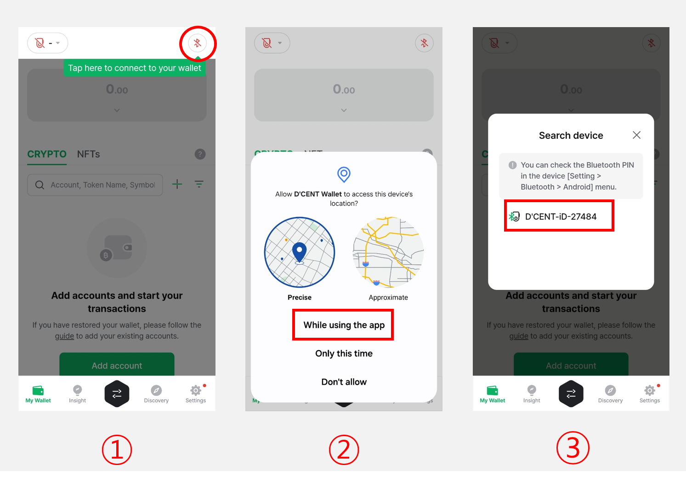

# Connect with Android phone

## Mobile App Download 

You can download the D'CENT Mobile App by clicking on this [link](https://play.google.com/store/apps/details?id=com.kr.iotrust.dcent.wallet).

<figure><figcaption></figcaption></figure>

## Mobile App basic setting 

### Select Wallet mode 

If you are installing the mobile app for the first time, you need to select a **wallet mode**. Please choose **'Biometric Cold Wallet'.**

<figure><figcaption></figcaption></figure>

You can change the **wallet mode** at any time from the **Settings** tab in the mobile app.\
If you are using a **biometric cold wallet**, make sure to set the wallet mode to '**Biometric Cold Wallet'** in the mobile app.


**How to Change Wallet Mode**

Go to **Settings** tab > Select **Change Wallet Mode >** Choose **Biometric Cold Wallet**


### **App Password Registration**

To protect your **D'CENT mobile app**, you must set a **6-digit password**. This **app password** will be required **every time you launch the D'CENT mobile app**, so be sure to remember it.

<figure><figcaption></figcaption></figure>


You can change your **app password** later through the app [**Settings** menu](../../mobile-app/mobile-app-setting-menu/).

In addition to the app password, you can also **enable fingerprint recognition** for added security.


### **Mobile App Permission Settings**

A **permission request popup** will appear when connecting with the **D'CENT Biometric Wallet**. Tap **"Allow"** to enable synchronization with your **cold wallet**.

If you **do not grant permissions**, the app **will not be able to sync with the cold wallet**, restricting its functionality. Please make sure to **allow the required permissions** for proper use.

<figure><figcaption></figcaption></figure>

If the **permission popup does not appear**, you can manually enable app permissions by following the steps shown in the image below.

<figure><figcaption></figcaption></figure>

## Bluetooth pairing with Cold Wallet

To use the **cold wallet** with the **mobile app**, **Bluetooth pairing** is required. This pairing process **only needs to be done once during the initial setup**.


If you prefer **not to use Bluetooth**, you can also connect your **cold wallet to an Android phone** using an **OTG cable**. For detailed instructions, **please refer to** [**this guide**](android-otg.md).


### Preparing for Cold Wallet Pairing

<figure><figcaption></figcaption></figure>

**1. Turn on the cold wallet**, authenticate using your **fingerprint or PIN**, then navigate to the **"Settings"** menu and press **OK**.

**2. Select the "Bluetooth" menu** and press **OK**.

<figure><figcaption></figcaption></figure>

**3.** Choose "**Android**" menu and press **OK**.

**4.** On the **cold wallet screen**, the message **"Connecting..."** will be displayed along with the **Device ID** and **Bluetooth password**.

The **D'CENT Device ID** is displayed in the format **D'CENT-iD-\<numbers or letters>**. The **Bluetooth password** is shown as a **6-digit number**.

If the **blue light blinks** at the **top-right corner** of the cold wallet, it indicates that the device is functioning properly.

Once the cold wallet enters **pairing mode**, you can connect it to your phone via **Bluetooth**.

## Connecting from your Android Phone 


This guide is based on the **D'CENT mobile app version v7.5.1.**


### Android Phone Bluetooth Settings

Open the Bluetooth settings on your Android phone and ensure that Bluetooth is turned on. If you're unsure how to access the Bluetooth menu, please refer to [**this guide**](./#android-phone-bluetooth-settings).

<figure><figcaption></figcaption></figure>

### Connecting with the D'CENT mobile app

<figure><figcaption></figcaption></figure>

**1.** Open the **D'CENT mobile app** and select **"Biometric Wallet"** at the top of the **"My Wallet"** tab.

**2.** A permission request popup will appear to access device's location for the D'CENT mobile app. Select the **"While using the app".**

**3.** A **"Search Device"** popup will appear, displaying the **device name** that matches the **Device ID** shown on your cold wallet screen.

<figure><figcaption></figcaption></figure>

**4.** Tap the **device name**, then enter the **6-digit Bluetooth password** displayed on your cold wallet screen when prompted.

**5.** Once you enter the **Bluetooth password** and the connection is complete, the **D'CENT mobile app** will automatically **synchronize** with your **cold wallet**. The app will **automatically start syncing** with the cold wallet, which may take a few seconds.

**6.** When synchronization is complete:

* A **connection indicator** will appear in the **top** of the **mobile app**.
* A **blue Bluetooth connection light** will stay turned on in the **top right corner** of the **cold wallet**.

Now, you can tap the **"Add Account"** button to add the necessary **coin accounts**. For detailed instructions on **adding coin accounts**, click [**here**](../../mobile-app/create-account/).
