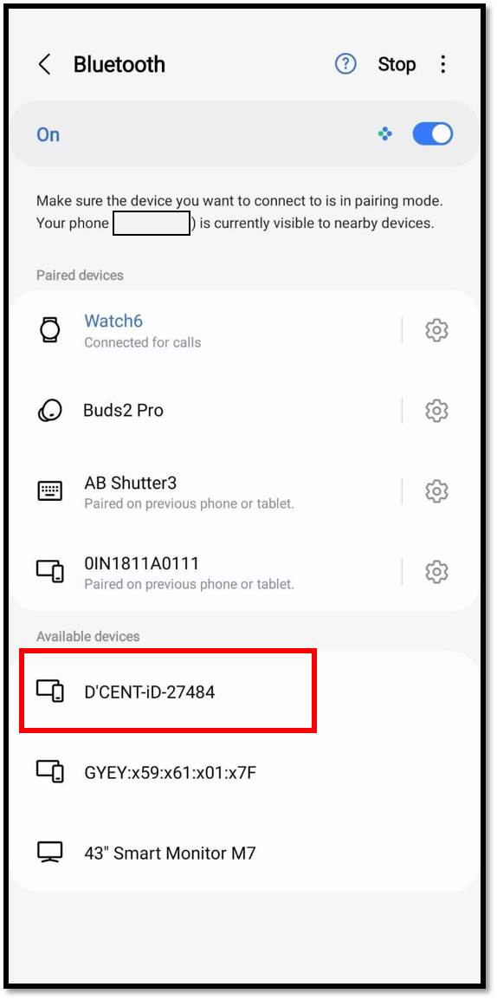
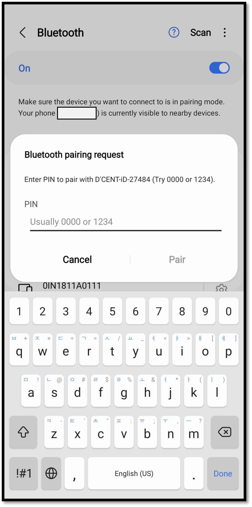
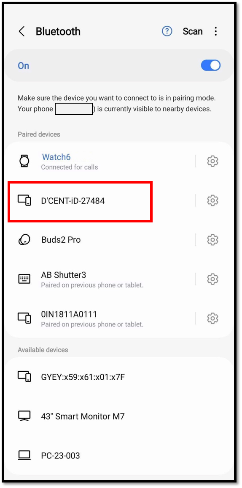
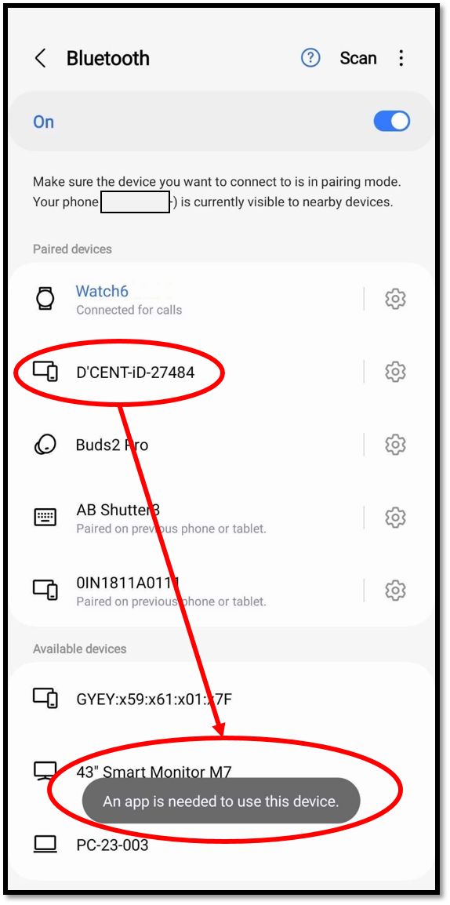
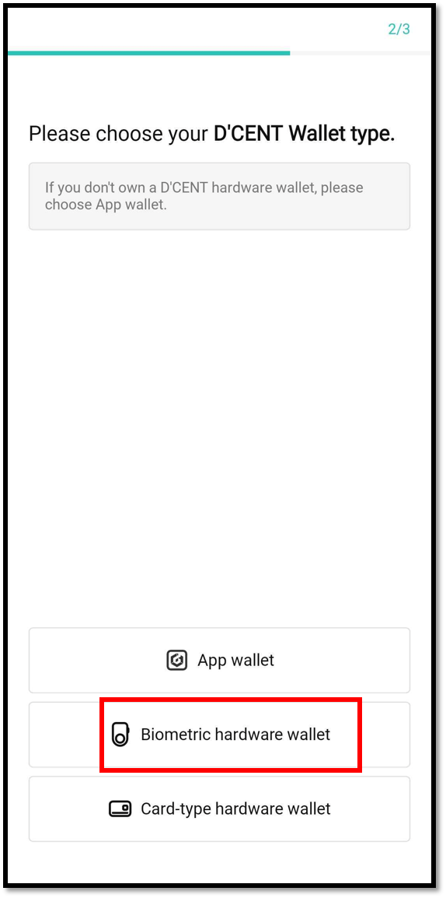
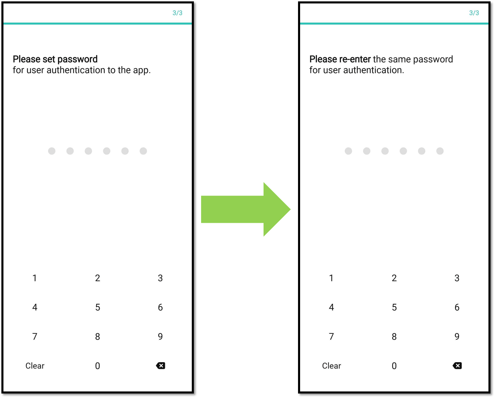
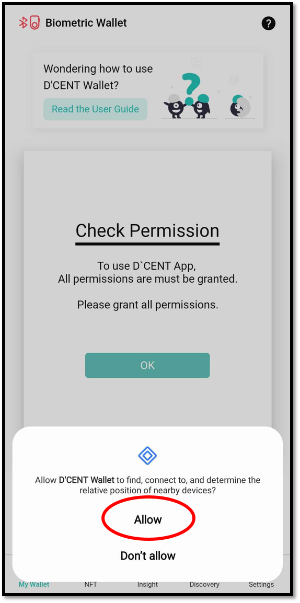
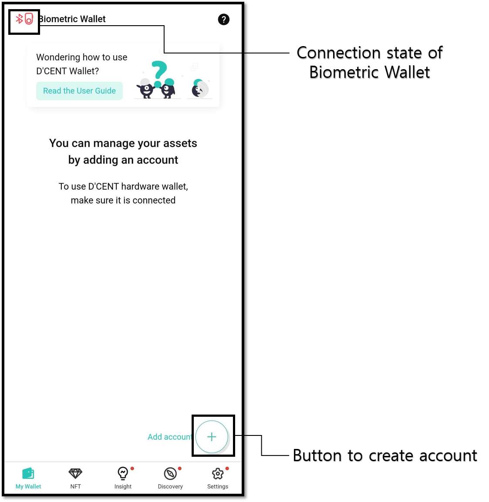
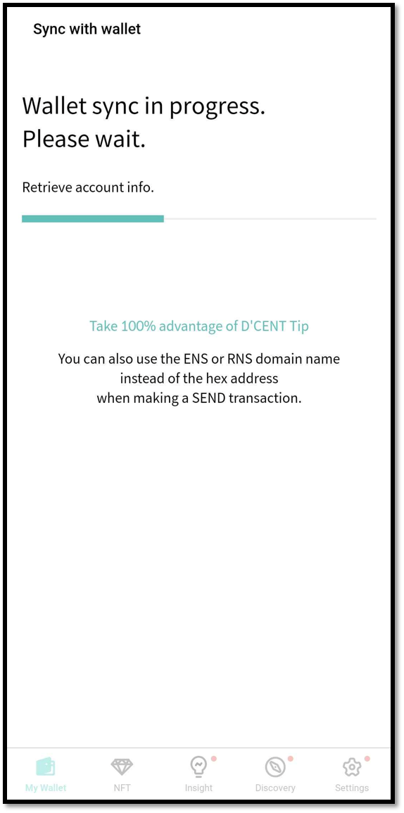
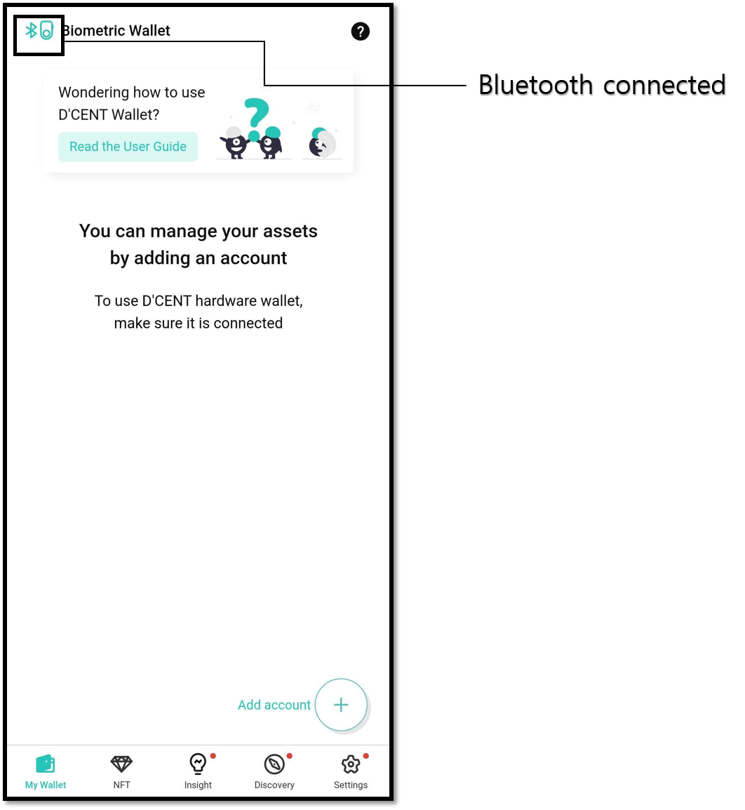

# Connect with Android phone

## Bluetooth pairing with Biometric Wallet 

In order to use the mobile app, you must first connect your mobile phone together with the Biometric Wallet via Bluetooth pairing. Bluetooth pairing is required only once during the initial connection setup.


Instead of using Bluetooth connection, you can also use the OTG cable to physically connect between mobile phone and the Biometric Wallet. More information can be found [here](android-otg.md).


### Prepare to pair your Biometric Wallet

1\) Power on your device and authenticate yourself to access the wallet.

2\) On your device, scroll down and choose the "**Setting**" menu.

3\) Choose "**Bluetooth**" menu.

4\) Choose "**Android**" menu.

5\) The screen will display the device ID and password for Bluetooth connection.

D'CENT device ID is in the format of **`D'CENT-iD-<number & characters>`**.

Bluetooth password is the 6-digit numbers displayed on the screen.

While on this screen, the Bluetooth LED will be lit which is located on the top right corner of the device body. It is normal that the blue LED light blinks.

### Connecting from the Android phone

1\) From your Android phone, go to the Bluetooth menu.\
For more information on how to find the Bluetooth menu, please refer to this [document](android-bluetooth-menu.md)**.** &#x20;

2\) If Bluetooth is disabled, please enable it.

3\) On the screen of your mobile phone, D'CENT device ID should appear.

4\) When you select the D'CENT device ID, you will be prompted to enter the 6-digit password.

5\) Enter the 6-digit Bluetooth password as shown on the screen of your D'CENT device.

When the two devices have been paired successfully, the blue LED light will stop blinking and stay lit.


It is normal to see the message "An app is need to use this device" when you click on the D'CENT iD-xxxxxx that is listed under the paired devices. Nothing happens.


If the biometric wallet device is registered on the mobile phone, the next time you use the D'CENT app, a Bluetooth connection between the mobile phone and the biometric wallet is automatically established.

## Mobile App download

Click to [install](https://play.google.com/store/apps/details?id=com.kr.iotrust.dcent.wallet) D'CENT mobile app.

### Install by searching from Google Play store

You can also search from the Google Play store to install D'CENT mobile app.

Search for "**D'CENT Wallet**" from the Google Play store.

## Basic setup for Mobile App

### Select wallet mode

If running the mobile app for the first time, you must choose a wallet mode. Choose "**Biometric hardware wallet**" as your choice.

Wallet mode can also be changed from the Settings tab on the bottom menu of D'CENT App. If you are using the Biometric hardware wallet, you must set the wallet mode on the D'CENT App to the Biometric Wallet mode.&#x20;


**How to change wallet mode**\
**Settings tab > Switch Wallet mode > Biometric Wallet**&#x20;


### Register password for Mobile App

Register mobile app password for access protection. To set the password, enter the same 6-digit number twice. Mobile App password is required every time you run the D'CENT mobile app. Make sure to remember it.

<figure><figcaption></figcaption></figure>


Mobile App password can be changed from the [App "Setting" menu](../../mobile-app/mobile-app-setting-menu/) at any time. Instead of password, you can also use biometric authentication to protect access to your wallet if your mobile phone supports the feature.


## Setting mobile app permissions

A pop-up will appear allowing the D'CENT mobile app to find nearby devices. You must press the "Allow" button to synchronize with Cold Wallet.

If you do not allow permission, Cold Wallet cannot be synchronized and use is restricted, so you must allow app permission.

<figure><figcaption></figcaption></figure>

If the pop-up does not appear, you can allow mobile app permissions as shown below.

<figure><figcaption></figcaption></figure>

### Completing the basic setup on mobile app

You are few steps away from start using the Biometric Wallet. First, you will need to synchronize the mobile app and the Biometric Wallet then add the coin accounts you want to manage.

## Synchronizing Mobile App and Biometric Wallet

After completing the basic setup on your mobile app, you will now proceed with synchronizing with the Biometric Wallet.

While your mobile app is opened, power on your Biometric Wallet. If you have already completed the step of [Bluetooth pairing](./#bluetooth-paring), synchronization will begin automatically. Synchronization will take few seconds to complete.


If synchronization does not begin, try turning off the power on your Biometric Wallet and power it back on to start the synchronization.


When the synchronization is complete, you will notice the Bluetooth icon(mint color) appear on the upper left corner of the screen on the mobile app. Also notice the Bluetooth LED stays lit on your Biometric Wallet.

You can now add a coin account to manage using your Biometric Wallet. More information on how to add coin account can be found [here](../../mobile-app/create-account/).
