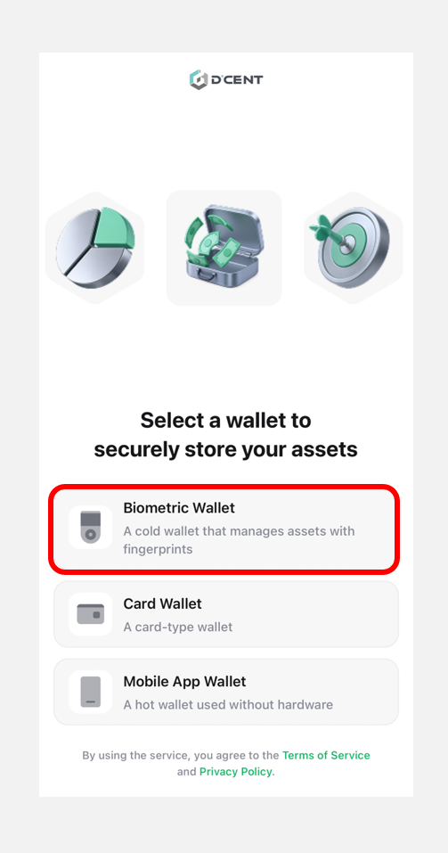

# Connect with Android phone

## Mobile App Download 

You can download the D'CENT Mobile App by clicking on this [**link**](https://play.google.com/store/apps/details?id=com.kr.iotrust.dcent.wallet).

<figure><figcaption></figcaption></figure>

## Mobile App basic setting 

### Select Wallet mode 

If you are launching the mobile app for the first time, you will need to go through the initial setup and select a wallet mode.


This guide is based on **D’CENT mobile app version 8.0.0**.


When the app launches, select **“Biometric Wallet”** as shown below.

<figure><figcaption></figcaption></figure>

You can change the **wallet mode** at any time from the **Settings** tab in the mobile app.\
If you are using a **biometric cold wallet**, make sure to set the wallet mode to **"Biometric"** in the mobile app. For instructions on how to change the wallet mode, [**refer to this guide**](../../mobile-app/mobile-app-setting-menu/mobile-app-dcent-walletmode/).

### **App Password Registration**

To protect your **D'CENT mobile app**, you must set a **6-digit password**. This **app password** will be required **every time you launch the D'CENT mobile app**, so be sure to remember it.

<figure><figcaption></figcaption></figure>


You can change your **app password** later through the app [**Settings menu**](../../mobile-app/mobile-app-setting-menu/)**.**

In addition to the app password, you can also **enable fingerprint recognition** for added security.


### **Mobile App Permission Settings**

A permission request popup will appear when you launch the D’CENT mobile app. Review the permissions being requested, then click **“Confirm”** button to proceed.

<figure><figcaption></figcaption></figure>

Next, click the **“Allow”** button for both the **Notification** and **Nearby Devices** permissions to continue.


The **Notification** permission is optional. You can click the **“Don’t allow” button** and still connect your wallet without any issues. However, the **Nearby Devices** permission is **required** for syncing with the cold wallet.\
If access is denied, the cold wallet cannot be synced, and usage will be restricted.\
Therefore, be sure to allow this permission.


<figure><figcaption></figcaption></figure>

If the permission popup does not appear, or if you accidentally clicked the **“Don’t allow”** button, you can manually enable the **Nearby Devices** permission by following the steps shown below.

<figure><figcaption></figcaption></figure>

## Bluetooth pairing with Cold Wallet

To use the **cold wallet** with the **mobile app**, **Bluetooth pairing** is required.&#x20;


If you prefer **not to use Bluetooth**, you can also connect your **cold wallet to an Android phone** using an **OTG cable**. For detailed instructions, **please refer to** [**this guide**](android-otg.md).


### Step 1 : Checking the Cold Wallet Device ID

You can check the device ID of your cold wallet using the following steps.

<figure><figcaption></figcaption></figure>

**1) Turn on the cold wallet**, authenticate using your **fingerprint or PIN**, then navigate to the **"Settings"** menu and press **"OK"** button.

**2) Select the "Bluetooth" menu** and press  **"OK"** button.

<figure><figcaption></figcaption></figure>

**3)** Choose **"Android**" menu and press  **"OK"** button.

**4)** On the **cold wallet screen**, the message **"Connecting..."** will be displayed along with the **Device ID** and **Bluetooth password**.

The **D'CENT Device ID** is displayed in the format **D'CENT-iD-\<numbers or letters>**.&#x20;

After checking the device ID, click the **Back (↩) button** on your cold wallet to return to the previous screen.


Starting from **D’CENT mobile app version 8.0.0**, the app no longer syncs with the cold wallet while it is in the **“Connecting...”** state.\
Therefore, after confirming the device ID, make sure to **exit the Connecting screen** by clicking the Back (↩) button on the cold wallet in order to proceed with synchronization properly.


### Step 2 : Connecting with the D'CENT mobile app


This guide is based on **D’CENT mobile app version 8.0.0**. To update to the latest version, **click** [**here**](https://play.google.com/store/apps/details?id=com.kr.iotrust.dcent.wallet).


<figure><figcaption></figcaption></figure>

**1)** Open the **D'CENT mobile app** and select **"Bluetooth icon"** at the top of the **"My Wallet"** tab.

**2)** A **"Search Device"** popup will appear, displaying the **device name** that matches the **Device ID(D'CENT-iD-\<numbers or letters>)** shown on your cold wallet screen.


If the device ID of your cold wallet does not appear in the **"Search Device"** popup, please make sure that **Bluetooth is enabled** in your Android phone’s settings. If you're unsure how to access the Bluetooth menu, please refer to [**this guide**](./#android-phone-bluetooth-settings).


<figure><figcaption></figcaption></figure>

**3)** When you tap the device ID, the cold wallet will sync automatically. It may take a few seconds for the synchronization to begin.

**4)** When synchronization is complete:

* A **connection indicator** will appear in the **top** of the **mobile app**.
* A **blue Bluetooth connection light** will stay turned on in the **top right corner** of the **cold wallet**.

<figure><figcaption></figcaption></figure>

Now, you can tap the **"Add Account"** button to add the necessary **coin accounts**. For detailed instructions on **adding coin accounts**, click [**here**](../../mobile-app/create-account/).

If you're having trouble connecting the cold wallet, please refer to the **Troubleshooting Guide** below.


[troubleshooting-guide-android-bluetooth-error.md](troubleshooting-guide-android-bluetooth-error.md)

