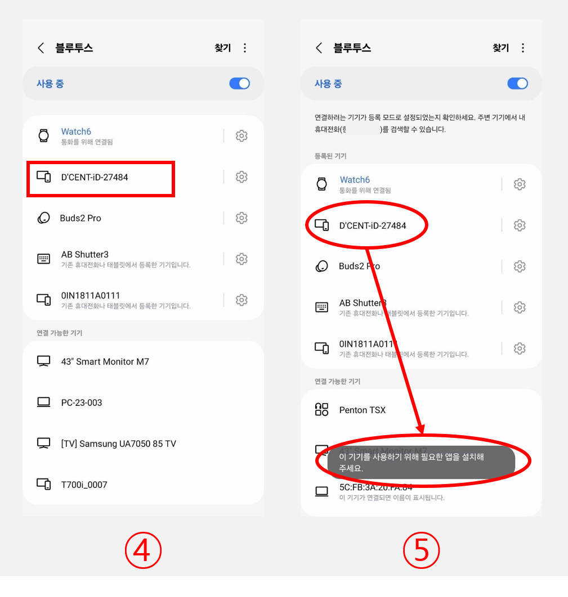

# 안드로이드 폰과 연결하기

## 앱 다운로드

디센트 모바일 앱 다운로드

[**링크**](https://play.google.com/store/apps/details?id=com.kr.iotrust.dcent.wallet)를 클릭하여 디센트 모바일 앱을 설치합니다.

### 구글 플레이 스토어에서 검색하여 설치 

구글 플레이 스토어에서 검색하여 디센트 모바일 앱을 설치할 수도 있습니다.

구글 플레이 스토어에서 **"디센트 월렛"** 또는 **"디센트 지갑"**&#xC744; 검색하세요.

<figure><figcaption></figcaption></figure>

## 모바일 앱 기본 설정 

### 지갑 모드 선택 

모바일 앱을 처음 설치하셨다면 지갑 모드를 선택해야 합니다. **"지문인증형 콜드월렛"**&#xC744; 선택해 주세요.

<figure><figcaption></figcaption></figure>

월렛(지갑) 모드는 모바일 앱 하단 메뉴인 **Settings** 탭에서도 변경이 가능합니다. 지문인증형 지갑을 사용하시는 분이라면 반드시 모바일 앱의 월렛 모드를 지문인증형 콜드월렛으로 설정하셔야 합니다.&#x20;


**지갑 모드 변경하는 방법**\
**Settings 탭** > **월렛모드 변경** > **지문인증형 콜드월렛**&#x20;


### 앱 비밀번호 등록 

디센트 모바일 앱 보호를 위한 6자리 비밀번호를 등록해야 합니다. 앱 비밀번호는 디센트 모바일 앱을 실행할 때마다 필요하니 반드시 기억해주시기 바랍니다.

<figure><figcaption></figcaption></figure>


앱 비밀번호는 [앱 설정 메뉴](../../mobile-app/mobile-app-setting-menu/)를 통해 나중에 변경하실 수 있습니다. 앱 비밀번호 이외에도 지문 인식을 통해 앱을 보호할 수 있습니다. 자세한 내용은 [앱 설정 메뉴 항목](../../mobile-app/mobile-app-setting-menu/)을 참고하세요.


### 모바일 앱 권한 설정 

디센트 모바일 앱 권한 허용 안내 팝업이 표시됩니다. **"허용"** 버튼을 눌러야 콜드월렛과 동기화를 할 수 있습니다.

만약, 이를 허용하지 않는다면 콜드월렛을 동기화 할 수 없어 사용이 제한되니 반드시 앱 권한을 허용해야 합니다.

<figure><figcaption></figcaption></figure>

팝업이 표시되지 않는다면 아래 그림과 같은 방법으로 모바일 앱의 권한 허용을 할 수 있습니다.

<figure><figcaption></figcaption></figure>

## 콜드월렛과 블루투스 페어링 

모바일 앱에서 콜드월렛을 사용하시려면 블루투스 페어링이 필요합니다. 블루투스 페어링은 초기 설정시 한번만 하면 됩니다.


블루투스를 이용하지 않고 OTG 케이블을 이용해서 안드로이드 폰과 콜드월렛을 연결할 수도 있습니다. 자세한 방법은 [여기](android-otg.md)를 참고하세요.


안드로이드 폰의 경우 블루투스 메뉴에서 연결하는 방법과 디센트 모바일 앱에서 직접 연결하는 방법이 있습니다.


디센트 모바일 앱에서 직접 페어링 지원은 **모바일 앱 버전 v7.4.2이상**부터 지원합니다.


블루투스 메뉴에서 연결하는 방법은 아래 가이드를 참고하세요.

### 콜드월렛 페어링 준비 

1\) 콜드월렛의 전원을 켠 후 지문 또는 PIN으로 인증한 뒤 "**설정"** 메뉴에서 OK 버튼을 누릅니다.

2\) **"블루투스"** 메뉴를 선택하고 OK 버튼을 누르세요.

3\) 콜드월렛의 **안드로이드** 메뉴를 선택하고 OK 버튼을 누르세요.

4\) 콜드월렛 화면에 **"연결 대기 중"** 글자와 함께 디바이스 아이디와 블루투스 비밀번호가 표시됩니다.

디센트 디바이스 아이디는 **`D'CENT-iD-<숫자 혹은 문자>`**&#xC640; 같은 형태로 표시됩니다. **블루투스 비밀번호는 6자리 숫자**로 표시됩니다.

이 때 콜드월렛의 오른쪽 상단에서 파란 빛이 깜빡이면 정상입니다.

### 안드로이드 폰 블루투스 메뉴에서 연결 

1\) 안드로이드 폰에서 블루투스 메뉴로 들어가세요. 블루투스 설정이 **"사용중"**&#xC73C;로 되어 있는 지 확인하세요.

블루투스 메뉴로 들어가는 방법을 모른다면 [**이 문서**](android-bluetooth-menu.md)를 참고하시길 바랍니다.

2\) "연결 가능한 기기" 목록에 콜드월렛 화면에 표시된 디바이스 아이디와 같은 장치 이름이 나타납니다.

3\) 장치 이름을 누르면 비밀번호를 입력하라는 창이 표시되며, 콜드월렛 화면에 표시된 **6자리의 블루투스 비밀번호**를 입력합니다.

이 때 콜드월렛의 오른쪽 상단에서 파란 빛이 깜빡이면 정상입니다.

4\) 페어링이 완료되면 **"등록된 기기"** 목록에 콜드월렛 장치가 표시됩니다.

5\) 참고로, 등록된 기기 목록에서 D’CENT ID-xxxxxx 를 누르면 **“이 기기를 사용하기 위해 필요한 앱을 설치해 주세요"**&#xB77C;는 메시지가 표시되며 이는 정상입니다.

<figure><figcaption></figcaption></figure>

6\) 콜드월렛의 페어링 완료된 후 디센트 모바일 앱을 실행하면 자동으로 동기화가 진행됩니다. 동기화가 시작되는데 수 초 정도 걸릴 수 있습니다.&#x20;

7\) 동기화가 완료되면 모바일 앱의 왼쪽 상단에 연결 표시가 나타나고, 콜드월렛의 오른쪽 상단에 푸른색의 블루투스 연결 상태등이 켜집니다.

_※ 동기화가 시작되지 않는다면, 콜드월렛의 전원을 껐다가 다시 켜면 동기화가 진행됩니다._

### 디센트 모바일 앱에서 직접 연결

안드로이드 OS 버전이 15 이상이고 디센트 모바일 앱 버전이 v7.4.2 이상이라면 모바일 앱에서 직접 페어링 할 수 있습니다.


안드로이드 OS 버전이 15 이하여도 모바일 앱 버전이 v7.4.2이상이라면 모바일 앱에서 직접 페어링을 지원합니다.


먼저 콜드월렛이 연결 대기 중 상태인 지 확인해주세요. 콜드월렛 페어링 준비 방법은 [**여기**](./#prepare-to-pair-your-biometric-wallet)를 클릭하시길 바랍니다.

<figure><figcaption></figcaption></figure>

1\)  디센트 모바일 앱을 실행하고 "My Wallet" 탭 상단의 **"지문인증형 지갑"**&#xC744; 선택하세요.

2\) **"장비 찾기"** 팝업이 나타나면 콜드월렛 화면에 표시된 디바이스 아이디와 같은 장치 이름이 나타납니다.

3\) 장치 이름을 누르면 비밀번호를 입력하라는 창이 표시되며, 콜드월렛 화면에 표시된 **6자리의 블루투스 비밀번호**를 입력합니다.

<figure><figcaption></figcaption></figure>

4\) 블루투스 비밀번호를 입력하여 페어링이 완료되면 디센트 모바일 앱과 자동으로 동기화가 진행됩니다.&#x20;

5\) 동기화가 완료되면 모바일 앱의 왼쪽 상단에 연결 표시가 나타나고, 콜드월렛의 오른쪽 상단에 푸른색의 블루투스 연결 상태등이 켜집니다.

이제 **"계정 추가"** 버튼을 눌러 필요한 코인 계정을 추가할 수 있습니다.

코인 계정 추가에 대한 자세한 안내는 [**여기**](../../mobile-app/create-account/)를 참고하세요.

