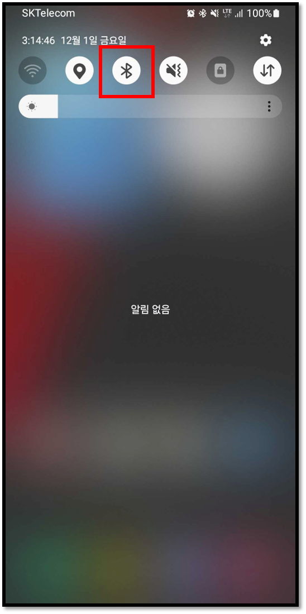
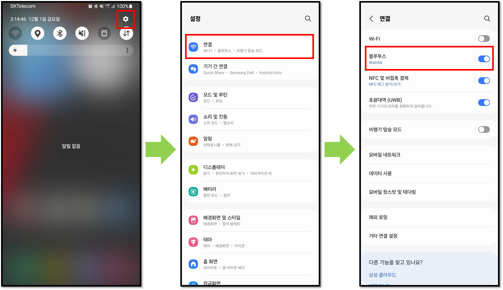

# 안드로이드 폰에서 블루투스 메뉴 찾기

안드로이드 폰마다 블루투스 메뉴를 찾는 방법은 조금씩 다를 수 있습니다.

## 상단 메뉴에서 블루투스 메뉴 찾기 

안드로이드의 상단 알림바를 아래로 드래그하면 블루투스 메뉴를 찾을 수 있습니다.

## 설정 메뉴에서 블루투스 메뉴 찾기 

설정 메뉴 > 연결 > 블루투스를 통해 블루투스 메뉴에 들어갈 수 있습니다.

