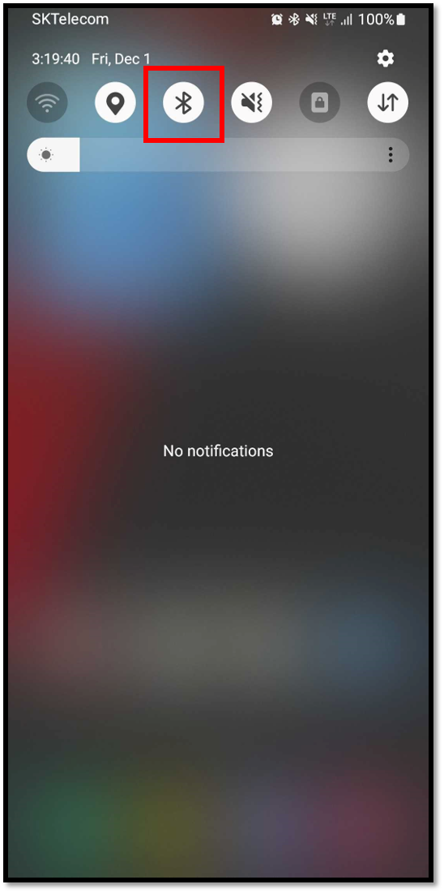
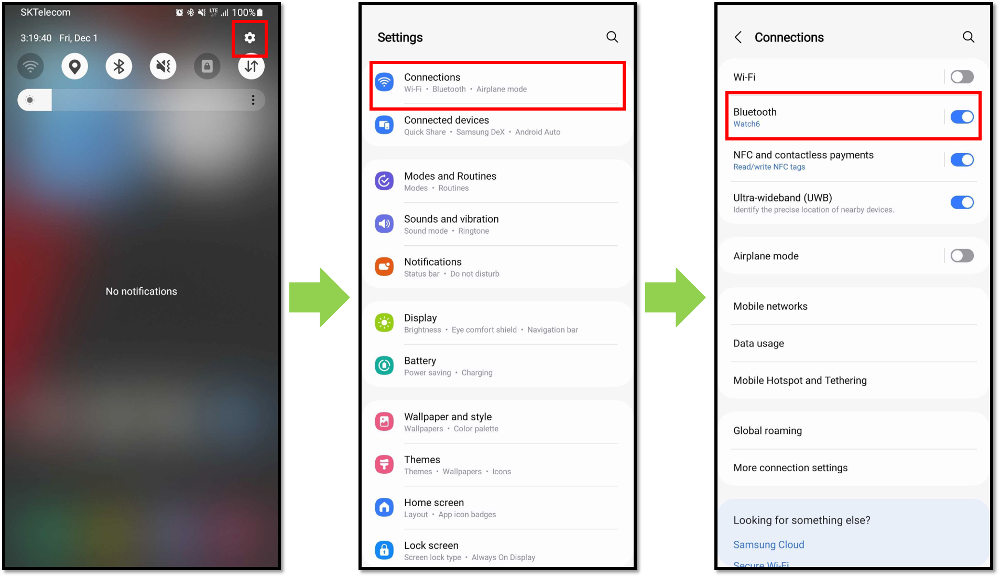

# Finding the Bluetooth menu on your Android phone

Depending on your Android phone model, finding the Bluetooth menu may be different.

## Find Bluetooth menu from the upper drag down menu

On your Android phone, Drag the notification bar at the top of the screen down to find the Bluetooth menu.

## Find Bluetooth menu from the "Settings"

Settings > Connections > Bluetooth, you can enable and enter the Bluetooth menu from here.

