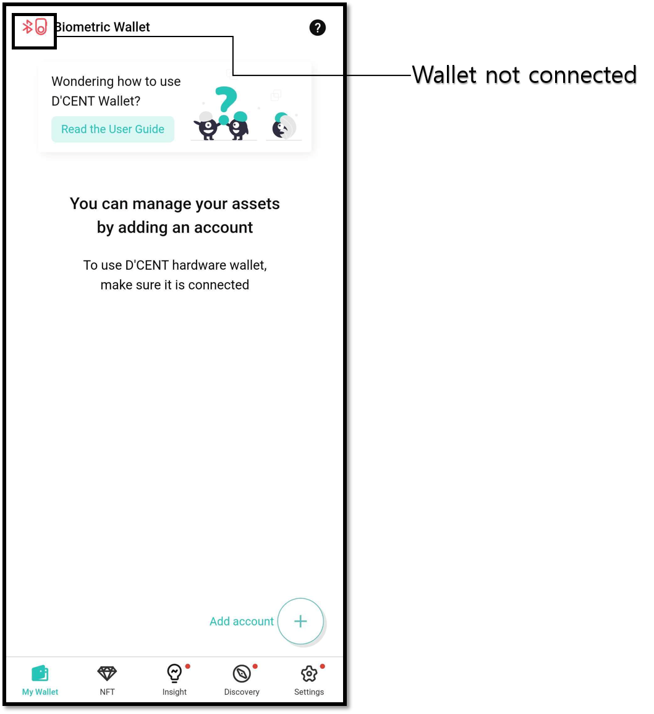
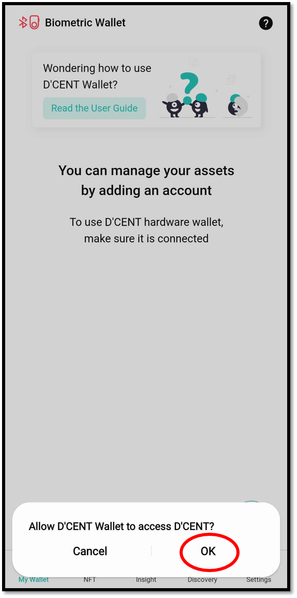
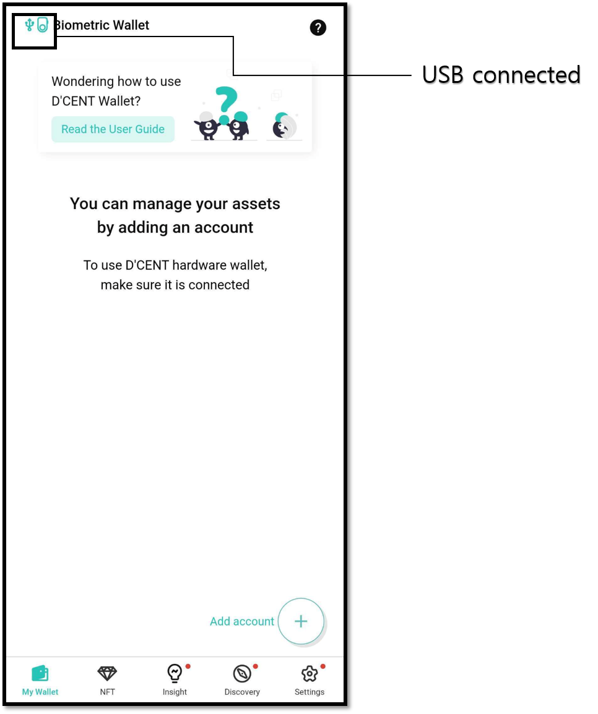

# Using OTG cable for physical connection

By connecting the mobile phone and OTG cable, you can communicate with the Biometric Wallet via USB instead of Bluetooth.


If you are using the OTG cable to connect, it is recommended to disable the Bluetooth function on your Android Phone.


## What is an OTG cable? 

This is a device that allows you to connect a USB device to a smartphone. One side is a micro 5 pin or USB C type, and the other side is a cable with a standard USB port. Just connect the OTG cable to your Android device.


The OTG cable is not included in the D'CENT Biometric Wallet package and must be purchased separately. Click [**here**](https://store.dcentwallet.com/products/2-in-1-otg-cable) to purchase genuine D'CENT OTG cable.


### Micro 5pin OTG cable 

If your Android device's charging port is micro 5 pin, you must use a micro 5 pin OTG cable.

### USB C type OTG cable 

If your Android device's charging port is USB C type, you must use a USB C type OTG cable.

### D'CENT 2 in 1 OTG Cable

D'CENT 2 in 1 OTG cable supports both micro 5-pin and USB C types as smartphone charging ports.

<figure><figcaption>
Example of D'CENT 2 In 1 OTG cable
</figcaption></figure>

## Using Biometric Wallet by connecting with an OTG cable 

### Launch the D'CENT mobile app

Please launch the descent mobile app first. (Biometric Wallet mode)\
\
Below is a picture showing that there is no connection to with the Biometric Wallet.

### Connect Android device and Biometric Wallet with OTG cable 

Connect the Biometric Wallet and the Android device as shown in the figure below.

### Allow USB access 

1\) When an OTG cable is connected, you will see the following pop-up. Press **"OK".**

2\) When connection is made, Synchronization will begin with the Biometric Wallet and you can start using it when it finishes.

