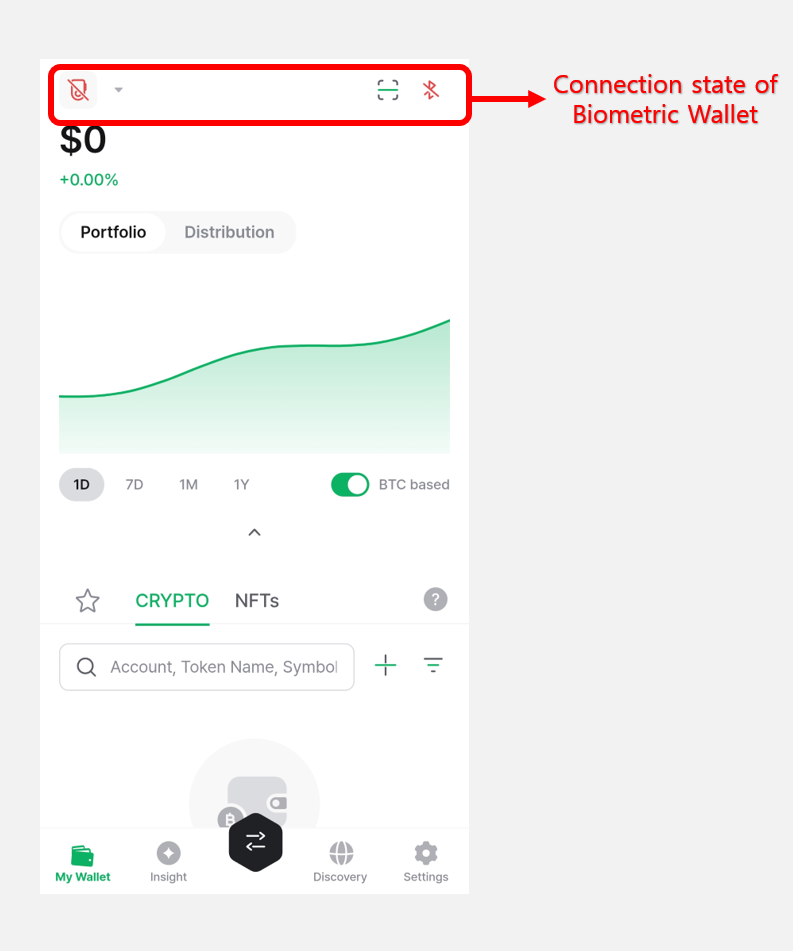
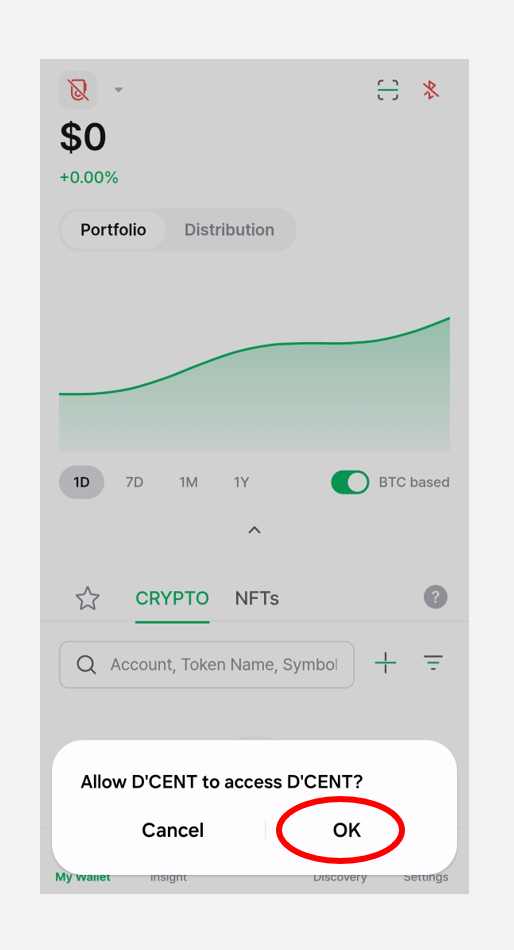
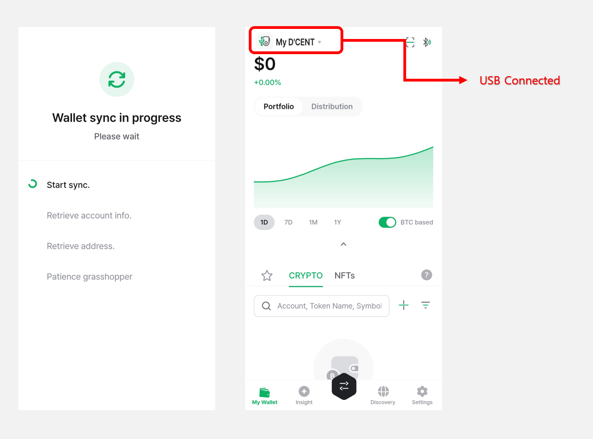

# OTG 케이블 연결

모바일 폰과 OTG 케이블을 연결하여 블루투스 대신에 USB로 콜드월렛과 통신할 수 있습니다.


OTG 케이블로 연결하여 사용하시는 경우, 안드로이드 기기의 블루투스를 끄고 사용하시는 것을 권장합니다.


## OTG 케이블이란

스마트폰에 USB기기를 연결하게 해주는 장치로 한쪽은 마이크로 5핀 혹은 USB C 타입으로 되어 있으며 반대쪽은 표준 USB포트가 있는 케이블입니다. 사용하는 안드로이드 기기에 맞는 OTG 케이블을 연결하면 됩니다.


OTG 케이블은 디센트 콜드월렛 패키지에 포함되어 있지 않으며, 별도로 구매하셔야 합니다. 디센트 정품 OTG 케이블을 구매하려면 [**여기**](https://store-kr.dcentwallet.com/collections/frontpage/products/2-in-1-otg-%EC%BC%80%EC%9D%B4%EB%B8%94)를 클릭하세요.


### 마이크로 5핀 OTG 케이블

사용하고 있는 안드로이드 기기의 충전 포트가 마이크로 5핀으로 되어 있다면 마이크로 5핀 OTG 케이블을 사용해야 합니다.

### USB C 타입  OTG 케이블

사용하고 있는 안드로이드 기기의 충전 포트가 USB C 타입으로 되어 있다면 USB C 타입 OTG 케이블을 사용해야 합니다.

### 디센트 정품 2 in 1 OTG 케이블

디센트 정품 2 in 1 OTG 케이블은 스마트폰 연결 단자가 마이크로 5핀과 USB C 타입을 모두 지원합니다.

<figure><figcaption>
디센트 정품 2 in 1 OTG 케이블 예시
</figcaption></figure>

## OTG 케이블로 연결하여 콜드월렛 사용하기&#x20;

### 디센트 모바일 앱 실행

디센트 모바일 앱을 먼저 실행해 주세요. (지문인증형 콜드월렛 모드)

콜드월렛과 연결되지 않았다는 표시가 나타납니다.

### 안드로이드 기기와 콜드월렛 OTG 케이블로 연결

다음 그림과 같이 콜드월렛과 안드로이드 기기를 연결해주세요.

### USB 접근 확인

1\) OTG 케이블이 연결되면 다음과 같은 팝업이 나타납니다. **"확인"**을 눌러주세요.

2\) 연결이 완료되면 콜드월렛과 동기화가 진행되고, 월렛을 사용할 수 있습니다.

