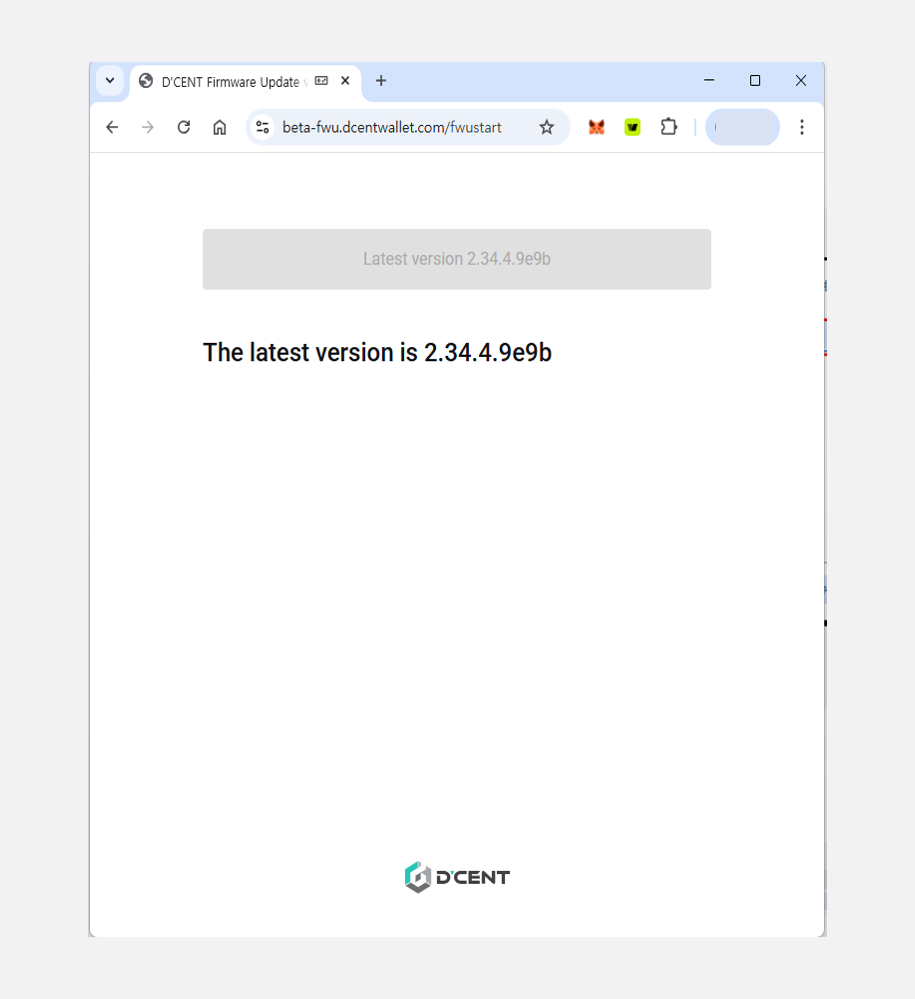
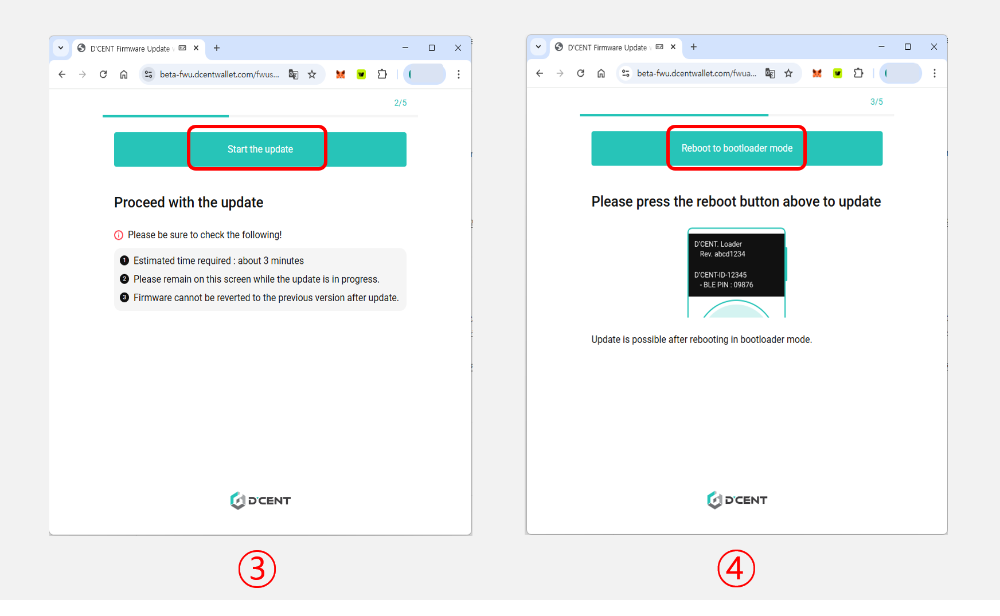
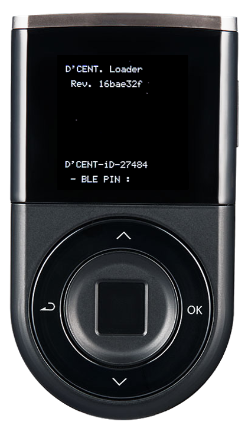
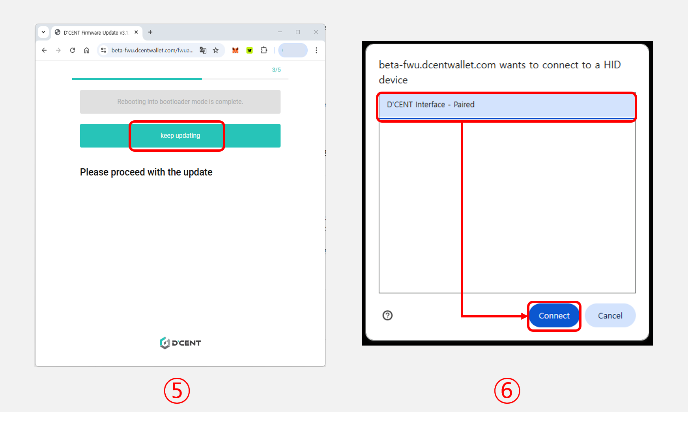
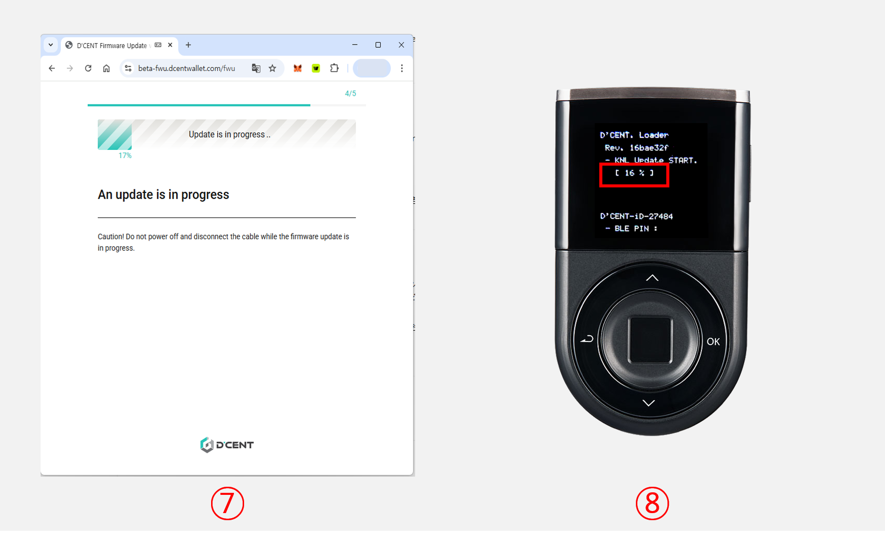
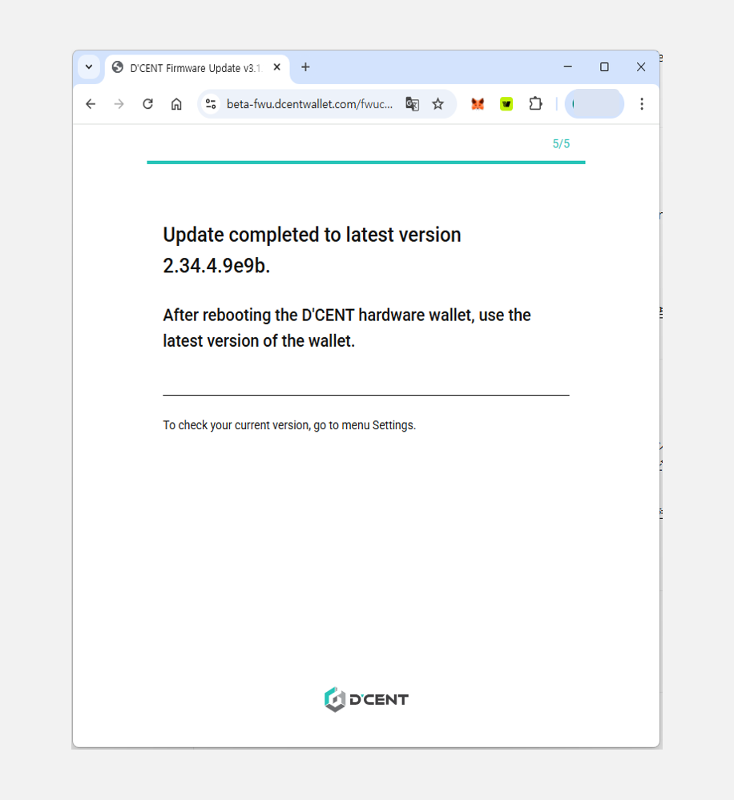

# Firmware Update (from computer)

## Firmware update indicator

Whenever new coin support is added or bug fix has been made, a new firmware will be available for installation. Your mobile app will show an indication when a newer version of the firmware is released.


Firmware update can be done from the PC or Mac.


<figure><figcaption></figcaption></figure>

## Before you update the firmware


**Make sure you have your Mnemonic Code (24 seeds/words) for recovery**


24 words were provided during the Initial Setup of your Biometric Wallet and you have written them down on the recovery card. Make sure you still have the recovery card. \
\
Unlike other products, your wallet will still remain safely intact inside the secure chip even after updating the firmware. This means that you don't need to recover your wallet every time you update the firmware as other products requires you to do. \
\
(Keep your recovery card secured and ready just in case your Biometric Wallet is no longer accessible, possibly due to "brick"ed device or something that went wrong during the update process.)  &#x20;


**After you update the firmware, you cannot roll-back to the previous version**


Firmware update will take approximately 3 minutes to complete.&#x20;


**It is recommended that the D'CENT mobile app is not running during the firmware update.**


## How to update firmware

### Requirements for the firmware update

✅ Firmware can ONLY be updated from using a personal computer running a **64bit OS (Windows or Mac).**

✅ Must use Google **Chrome browser**.

✅ Must use a USB cable that is **capable of data transfer**. \
&#xNAN;_(If your Biometric Wallet's charging port is Micro USB 5 PIN Type, we recommend using the USB cable included in the package box)_

If you are ready, click [**here**](https://fwu.dcentwallet.com/) to go to the Firmware Update homepage.

### Connect Biometric Wallet to your computer

**1)** Connect the computer and the Biometric Wallet using the USB cable&#x20;

**2)** Authenticate with fingerprint or PIN to unlock your Biometric Wallet

### Start the firmware update

**1)** On the firmware update page, click the **"Connect D'CENT hardware wallet"** button.&#x20;

**2)** When the browser prompts a connection popup, select the D'CENT device and click **"Connect."**

<figure><figcaption></figcaption></figure>

If the connected **Biometric Wallet** is already running the latest firmware version, the following screen will be displayed.

<figure><figcaption></figcaption></figure>

**3)** Click the **"Start the update"** button.

**4)** Click the **"Reboot to bootloader mode"** button. Biometric Wallet is automatically rebooting into bootloader mode.

<figure><figcaption></figcaption></figure>

When entering bootloader mode, the following screen appears on the display of the Biometric Wallet.

**5)** Once the Biometric Wallet has rebooted into bootloader mode, click the **"Keep updating"** button.

**6)** When the browser prompts a connection popup again, select the D'CENT device and click **"Connect."**

<figure><figcaption></figcaption></figure>

**7)** Firmware update from the webpage will take approximately 3 minutes to reach 100%. Please wait.&#x20;

**8)** From the Biometric Wallet, you can also check the progress of firmware update.

### Completing the firmware update

When the firmware update is completed, the Biometric Wallet will automatically reboot to its normal working mode.&#x20;


Depending on the firmware version of the **Biometric Wallet**, the update process may need to be performed twice in succession.


<figure><figcaption></figcaption></figure>

Now you can check the latest firmware information by running the D’CENT mobile app and connecting the Biometric Wallet.

<figure><figcaption></figcaption></figure>

If you are having trouble updating the firmware, please refer to the troubleshooting guide below.


[firmware-trouble-shooting-windows.md](firmware-trouble-shooting-windows.md)



[troubleshooting-guide-mac.md](troubleshooting-guide-mac.md)

