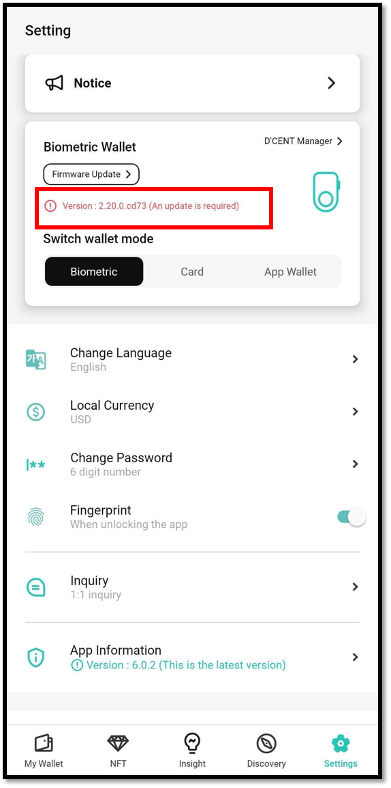
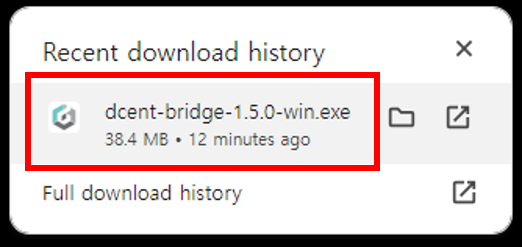
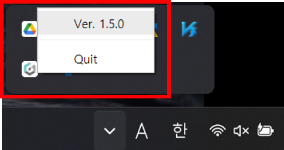
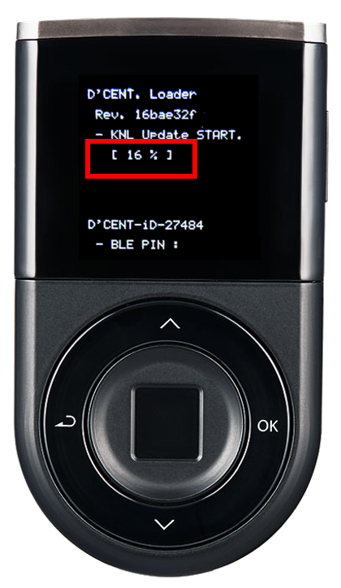
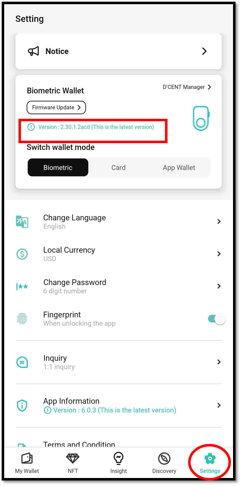

# Firmware Update (from computer)

## Firmware update indicator

Whenever new coin support is added or bug fix has been made, a new firmware will be available for installation. Your mobile app will show an indication when a newer version of the firmware is released.


Firmware update can be done only from the PC or Mac.


## Before you update the firmware


**Make sure you have your Mnemonic Code (24 seeds/words) for recovery**


24 words were provided during the Initial Setup of your Biometric Wallet and you have written them down on the recovery card. Make sure you still have the recovery card. \
\
Unlike other products, your wallet will still remain safely intact inside the secure chip even after updating the firmware. This means that you don't need to recover your wallet every time you update the firmware as other products requires you to do. \
\
(Keep your recovery card secured and ready just in case your Biometric Wallet is no longer accessible, possibly due to "brick"ed device or something that went wrong during the update process.)  &#x20;


**After you update the firmware, you cannot roll-back to the previous version**


To perform the firmware update, use the USB cable that came included inside the original D'CENT package. Firmware update will take approximately 10 minutes to complete.&#x20;


**It is recommended that the D'CENT mobile app is not running during the firmware update.**


## How to update firmware



### Requirements for the firmware update

✅ Firmware can ONLY be updated from using a personal computer running a **64bit OS (Windows or Mac).**

✅ Must use Google **Chrome browser**.

✅ Must use a USB cable that is **capable of data transfer**. \
&#xNAN;_(If your Biometric Wallet's charging port is Micro USB 5 PIN Type, we recommend using the USB cable included in the package box)_

✅ The **latest version** of D'CENT bridge program is installed and running on your computer.

If you are ready, click [**here**](https://fwu.dcentwallet.com/) to go to the Firmware Update homepage.

### Download D'CENT bridge program

If there is no D'CENT bridge program installed on your computer, download and install the latest version of the bridge program respective to the OS running on your computer.

D'CENT bridge program runs in the system background and is used for communication between your computer and Biometric Wallet.

If your computer is already installed with the latest version of D'CENT bridge program, this download page will not appear when you visit the firmware update site.

### Install D'CENT bridge program (Windows)

After finishing the download, click to install the bridge program.

In the **Windows** **Taskbar**, there should be a **D'CENT Bridge icon**, make sure to check that it is running the latest version.

<figure><figcaption></figcaption></figure>

When the installation is complete, click the **"Refresh page"** button at the bottom of the screen.

### Install D'CENT bridge program (Mac)

After finishing the download, click to install the bridge program.

Go to **Finder** and look under **Applications** to find **D'CENT Bridge Program**. Click **Open** to open the application.

In the **Taskbar**, there should be a **D'CENT Bridge icon**, make sure to check that it is running the latest version.

&#x20;When the installation is complete, click the **"Refresh page"** button at the bottom of the screen.

### Connect Biometric Wallet to your computer

1\) Connect the computer and the Biometric Wallet using the USB cable included in the original package

2\) Authenticate with fingerprint or PIN to unlock your Biometric Wallet

3\) After connecting, the firmware update page automatically detects your Biometric Wallet.

4\) If the biometric wallet is not connected properly, the screen below will appear. After checking each item according to the instructions, click the **"Confirm"** button.

<figure><figcaption></figcaption></figure>

### Check firmware version

1\) Check if the connected Biometric Wallet has the latest version. If it is not the latest version, the following screen appears.

2\) Press **"Start"** button.

3\) Biometric Wallet is automatically rebooting into bootloader mode.

When entering bootloader mode, the following screen appears on the display of the Biometric Wallet.

4\) Click the **"Update"** button.

<figure><figcaption></figcaption></figure>

### Start the firmware update

Firmware update from the webpage will take approximately 5\~10 minutes to reach 100%. Please wait.&#x20;

From the Biometric Wallet, you can also check the progress of firmware update.

### Completing the firmware update

When the firmware update is completed, the Biometric Wallet will automatically reboot to its normal working mode.&#x20;

<figure><figcaption></figcaption></figure>

Now you can check the latest firmware information by running the D’CENT mobile app and connecting the Biometric Wallet.

<figure><figcaption></figcaption></figure>

If you are having trouble updating the firmware, please refer to the troubleshooting guide below.


[firmware-trouble-shooting-windows.md](firmware-trouble-shooting-windows.md)



[troubleshooting-guide-mac.md](troubleshooting-guide-mac.md)

