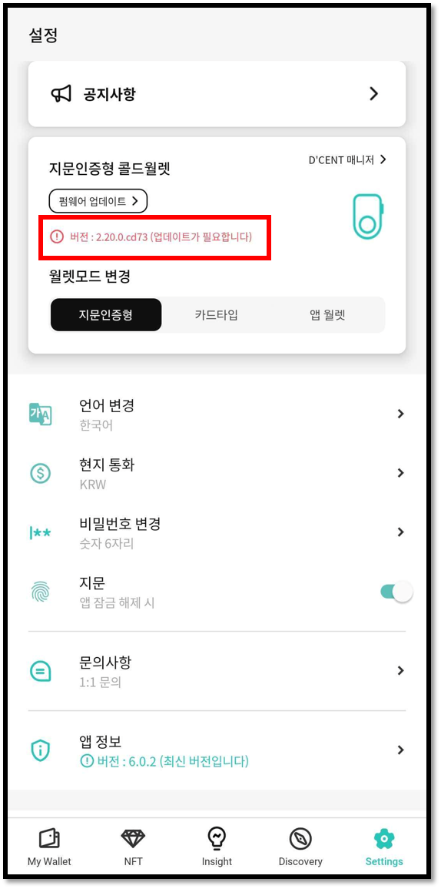
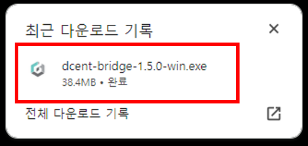
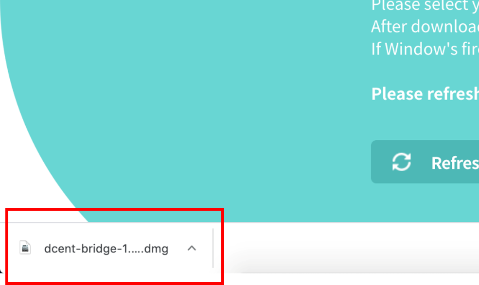
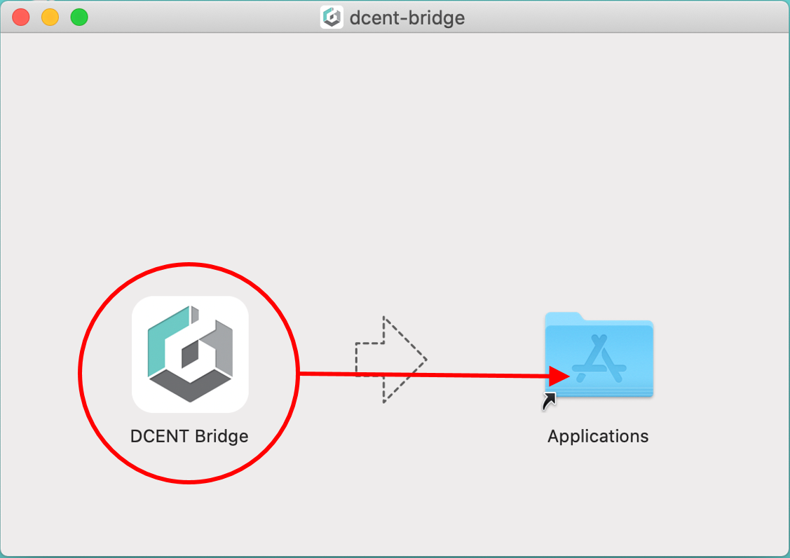
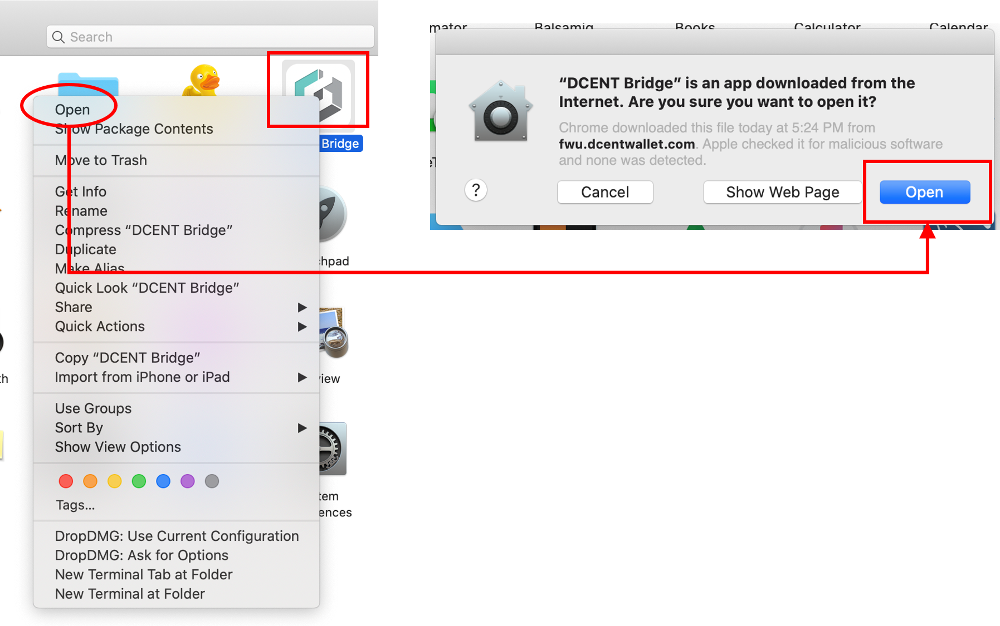
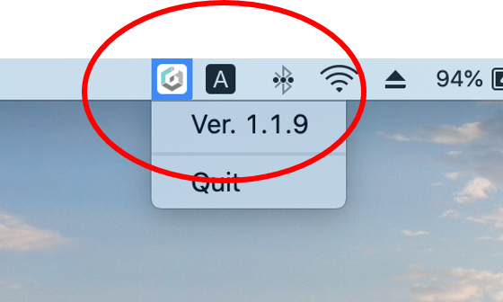
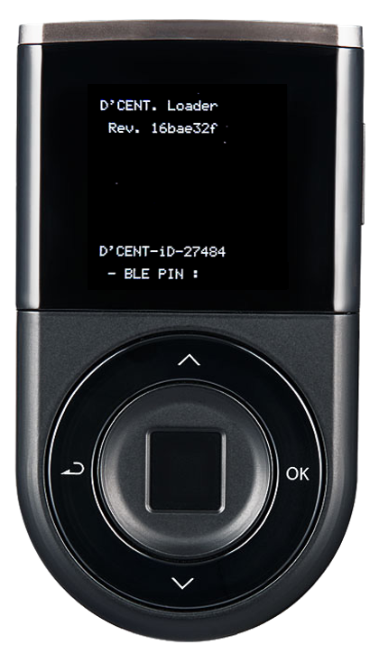
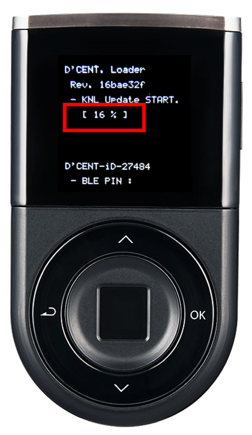
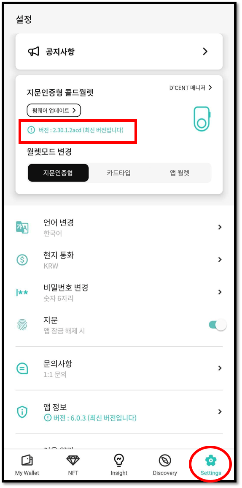

# 펌웨어 업데이트 (컴퓨터에서)

## 펌웨어 업데이트 표시

새로운 코인이 추가되거나, 버그 수정을 위해 펌웨어가 업데이트됩니다. 펌웨어 업데이트가 필요한 경우 모바일 앱에 다음과 같이 표시됩니다.


펌웨어 업데이트는 개인용 컴퓨터에서만 가능합니다.


## 펌웨어 업데이트 전 숙지 사항


**24개의 니모닉 코드 확인**


지갑 초기 셋업 시 기재해 두신 24개의 니모닉 코드를 보유하고 있는 지 다시 한번 확인해 주세요. (업데이트가 정상적으로 완료되면 복구 없이 고객님의 자산은 그대로 보관됩니다. 상기 내용은 만일의 경우를 대비한 안내임을 알려 드립니다.


**펌웨어 업데이트 이후 이전 버전으로 복구 불가**


업데이트를 진행하고 난 후에는 이전 버전으로 다시 돌아갈 수 없습니다.

펌웨어 업데이트 시간은 약 5\~10분 정도 소요됩니다.&#x20;


**펌웨어 업데이트 동안 디센트 모바일 앱은 종료해 놓는 것을 권장합니다.**


## 펌웨어 업데이트 방법



### 펌웨어 업데이트를 위한 요구사항

✅ 펌웨어 업데이트는 **64bit OS (Windows or Mac)**&#xB97C; 구동하는 컴퓨터에서만 가능합니다.

✅ 반드시 구글 **크롬 브라우저** 사용

✅ 반드시 **데이터 전송이 가능한** USB 케이블 사용\
&#xNAN;_(가지고 있는 콜드월렛의 충전단자가 Micro USB 5 PIN Type이라면 디센트 패키지 박스에 동봉된 USB 케이블_ _사용을 권장합니다)_

✅ PC에는 **최신 버전**의 디센트 브릿지 프로그램이 설치되었고 작동하고 있어야합니다.

준비가 되었다면 [**여기**](https://www.dcentwallet.com/ko/firmwareupdate)를 눌러 펌웨어 업데이트 홈페이지로 이동하세요.

### 디센트 브릿지 프로그램 다운로드

컴퓨터에 디센트 브릿지 프로그램이 없다면, 브릿지 프로그램을 다운로드합니다. 사용하시는 OS에 맞는 프로그램을 다운로드 받아 설치하세요.

디센트 브릿지 프로그램은 컴퓨터 시스템의 백그라운드에서 작동하는 프로그램으로 컴퓨터와 지문인증형 콜드월렛간의 통신을 위해 사용되는 프로그램입니다.

사용하시는 컴퓨터에 이미 최신 버전의 디센트 브릿지 프로그램이 설치되어 있다면, 펌웨어 업데이트 사이트를 방문할때 브릿지 다운로드 페이지는 나타나지 않습니다.

### 디센트 브릿지 프로그램 설치 (Windows)

다운로드가 완료된 파일을 클릭하여 브릿지 프로그램을 설치합니다.

설치가 완료되면 Windows 의 작업 표시줄 영역에 **디센트 브릿지 아이콘**이 표시됩니다. 최신 버전이 작동 중인지 확인하시기 바랍니다.

<figure><figcaption></figcaption></figure>

설치를 완료한 후 펌웨어 업데이트 페이지 화면 하단의 **"Refresh page"** 버튼을 클릭하세요.

### 디센트 브릿지 프로그램 설치 (Mac)

다운로드가 완료된 파일을 클릭하여 브릿지 프로그램을 설치합니다.&#x20;

**Finder**에서 **Applications** 메뉴로 이동하여 **D'CENT Bridge Program**을 확인합니다. 해당 프로그램을 클릭하고 **Open** 을 클릭합니다.

**Taskbar** 영역을 확인하면 **디센트 브릿지 아이콘**이 표시됩니다. 최신 버전이 작동중인지 확인하시기 바랍니다.

&#x20;설치가 완료되면 화면 하단의 **"Refresh page"** 버튼을 클릭하세요.&#x20;

### 컴퓨터와 콜드월렛 연결

1\) 디센트 지문인증형 콜드월렛을 USB 충전 케이블을 통해 PC에 연결합니다.

2\) 콜드월렛을 지문 또는 PIN 인증을 하여 잠금을 해제합니다.

3\) 연결 후 펌웨어 업데이트 페이지에서 자동으로 장치를 찾습니다.

4\) 콜드월렛이 정상적으로 연결되지 않은 상태라면 아래 화면과 같이 표시됩니다. 안내에 따라 조치 한 후 **"확인"** 버튼을 클릭합니다.

<figure><figcaption></figcaption></figure>

### 펌웨어 버전 확인

1\) 연결된 콜드월렛의 펌웨어가 최신 버전인지 확인합니다. 최신 버전이 아닌 경우 아래와 같은 화면이 나타납니다.

2\) **"시작하기"** 버튼을 클릭합니다.

3\) 콜드월렛이 부트로더 모드로 자동 재부팅 됩니다.

<figure><figcaption></figcaption></figure>

부트로더 모드로 진입하면 콜드월렛의 디스플레이에 다음과 같은 화면이 나옵니다.

4\) **"Update"** 버튼을 클릭하여 펌웨어 업데이트를 시작합니다.

### 펌웨어 업데이트 진행

페이지에서 펌웨어 업데이트가 시작되면, 100% 완료될 때 까지 약 5\~10분 간 기다려 주세요.&#x20;

콜드월렛에서도 펌웨어 업데이트 진행 상태를 확인할 수 있습니다.

### 펌웨어 업데이트 완료

펌웨어 업데이트가 완료되면 콜드월렛이 자동으로 재부팅 됩니다.

<figure><figcaption></figcaption></figure>

휴대폰의 디센트 모바일 앱을 실행하고 콜드월렛을 연결하면 최신 펌웨어 정보를 확인할 수 있습니다.

<figure><figcaption></figcaption></figure>

펌웨어 업데이트 진행에 문제가 있다면 아래 트러블 슈팅 가이드를 참고하여 주시기 바랍니다.


[firmware-trouble-shooting-windows.md](firmware-trouble-shooting-windows.md)



[firmware-trouble-shooting-mac.md](firmware-trouble-shooting-mac.md)

