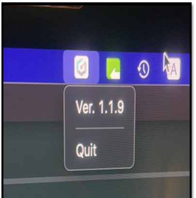

# 트러블 슈팅 가이드 (Mac)

## 컴퓨터에서 작동중인 디센트 브릿지 버전 확인.

**Mac PC**를 사용하는 경우 Taskbar 영역에서 현재 작동중인 디센트 브릿지 버전을 확인할 수 있습니다. 만일 구버전의 브릿지가 작동중이라면 "**Quit**" 버튼으로 종료하고 최신 버전의 브릿지 프로그램을 설치해야합니다. 새로운 버전을 설치 완료 후 다시 한번 버전을 확인하시기 바랍니다.

## 펌웨어 업데이트를 진행하다가 중간에 연결이 끊어졌어요. 콜드월렛이 정지된 화면에서 먹통 상태로 유지되고 전원도 꺼지지가 않아요. 어떻게 하면 될까요?

우선, 디센트 콜드월렛을 컴퓨터로부터 분리합니다.&#x20;

디센트 장치의 "Down 버튼" + "전원 버튼"을 동시에 누른 상태로 몇 초가 지나면 강제로 전원이 꺼지게 됩니다.&#x20;

만일 펌웨어 업데이트의 실패로 인해 벽돌(먹통) 상태가 되더라도 "OK 버튼" + "전원 버튼"을 동시에 누른 상태로 몇 초가 지나면 bootloader 모드로 진입이 가능합니다.&#x20;

Bootloader 모드에서 다시 펌웨어 업데이트를 진행하여 디센트 지갑을 복구할 수 있습니다.

## 디센트 펌웨어 업데이트 웹페이지에서 “Update Firmware” 버튼을 눌렀는데, 동글 접속이 차단되 어 업데이트가 취소되었다는 메시지가 나옵니다. 어떻게 하면 될까요?

Mac 시스템에서 디센트 콜드월렛을 인식하지 못하는 경우가 드물게 발생합니다. 해당 문제는 시스템 설정이 올바르게 설정되었는지 확인하시기 바랍니다.

1\) Go to About This Mac --> Overview --> System Report\
Hardware 장치에서 --> USB --> D'CENT가 표시되는지 확인하시기 바랍니다.

.png>)

2\) Go to System Preferences --> Security & Privacy\
D'CENT Bridge가 표시되는 부분에 System Events 박스가 체크되었는지 확인하시기 바랍니다.

