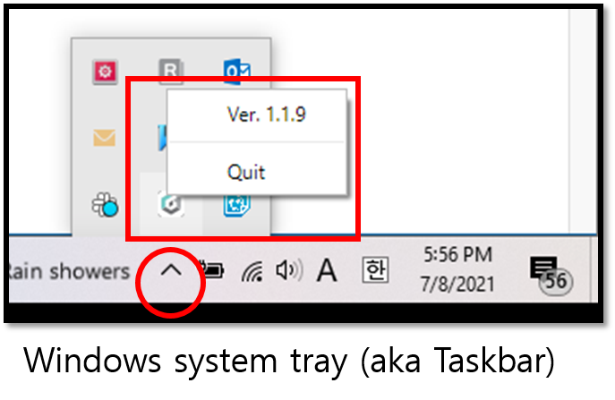
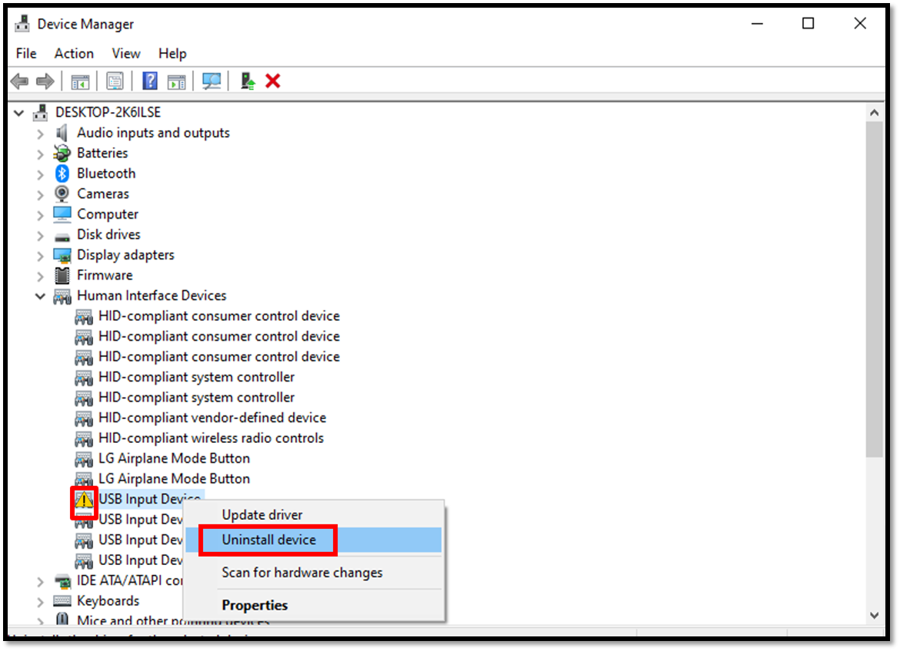

# 트러블 슈팅 가이드 (Windows)

## 컴퓨터에 설치된 디센트 브릿지 프로그램의 버전을 확인하세요. 

최신 버전의 디센트 브릿지 프로그램을 사용하고 있는지 확인하시기 바랍니다.

**Windows**의 경우 시스템 트레이 (혹은 Taskbar)에서 브릿지 버전을 확인하실 수 있니다.

## 펌웨어 업데이트를 진행하다가 중간에 연결이 끊어졌어요. 콜드월렛이 정지된 화면에서 먹통 상태로 유지되고 전원도 꺼지지가 않아요. 어떻게 하면 될까요? 

우선, 디센트 콜드월렛을 컴퓨터로부터 분리합니다.&#x20;

디센트 장치의 **"Down (v) 버튼" + "전원 버튼"**&#xC744; 동시에 누른 상태로 몇 초가 지나면 강제로 전원이 꺼지게 됩니다.&#x20;

만일 펌웨어 업데이트의 실패로 인해 벽돌(먹통) 상태가 되더라도 **"OK 버튼" + "전원 버튼"**&#xC744; 동시에 누른 상태로 몇 초가 지나면 Bootloader 모드로 진입이 가능합니다.&#x20;

Bootloader 모드에서 다시 펌웨어 업데이트를 진행하여 디센트 지갑을 복구할 수 있습니다.

<figure><figcaption></figcaption></figure>

## 디센트 펌웨어 업데이트 웹페이지에서 “Update Firmware” 버튼을 눌렀는데, 동글 접속이 차단되 어 업데이트가 취소되었다는 메시지가 나옵니다. 어떻게 하면 될까요? 

윈도우 시스템에서 디센트 콜드월렛을 인식하지 못하는 경우가 드물게 발생합니다. 해당 문제는 윈도우의 장치관리자를 통하여 오류로 표시된 장치를 삭제 후 다시 설치하여 해결이 가능합니다.

### 장치 관리자에 접근하는 방법1 

키보드에서 **Windows + R** 키를 함께 눌러 줍니다.

입력란에 "control panel"을 입력하고 Enter를 누르면 제어판이 실행됩니다.&#x20;

* Windows 11, 10 또는 Windows 8의 경우 **하드웨어 및 소리**를 선택합니다.
* Windows 7의 경우 **시스템 및 보안**을 선택합니다.

제어판 화면에서, 장치 관리자를 찾아 선택합니다.

* Windows 11, 10 및 Windows 8의 경우, **장치 및 프린터** 카테고리에서 찾을 수 있습니다.
* Windows 7의 경우 **시스템** 카테고리에서 찾을 수 있습니다.

### 장치 관리자에 빠르게 접근하는 방법2 

키보드에서 **Windows + R** 키를 함께 눌러 줍니다.

입력란에 "**cmd"**&#xB97C; 입력하고 Enter를 눌러주면 Command Prompt(검은색 창)이 실행됩니다.

입력란에 **devmgmt.msc**를 입력하고 **Enter**를 눌러줍니다.

장치 관리자 화면에서 **휴먼 인터페이스 장치**를 확인합니다.

**오류가 표시된** (노란색 삼각형) **USB 입력 장치**가 디센트 콜드월렛이 맞는지 확인합니다:

해당 장치에 오른쪽 마우스 클릭 후 **속성**을 선택합니다.

* USB 입력 장치 속성 창에서, 자세히 탭을 클릭 합니다.
* 속성아래에, 하드웨어 ID로 변경합니다.
* 디센트 콜드월렛의 올바른 장치 ID는 **PID\_2130** 또는 **PID\_2131** 입니다.&#x20;

오류로 표시된 **USB 입력 장치**를 오른쪽 마우스 클릭 후 디바이스 제거를 선택합니다.&#x20;

다음, **휴먼 인터페이스 장치**를 오른쪽 마우스 클릭 후 **하드웨어 변경 사항 검색**을 선택합니다. 장치 드라이버의 설치가 마무리되면 디센트 콜드월렛이 정상적으로 인식됩니다. 이후 펌웨어 업데이트를 다시 시도할 수 있습니다.&#x20;
