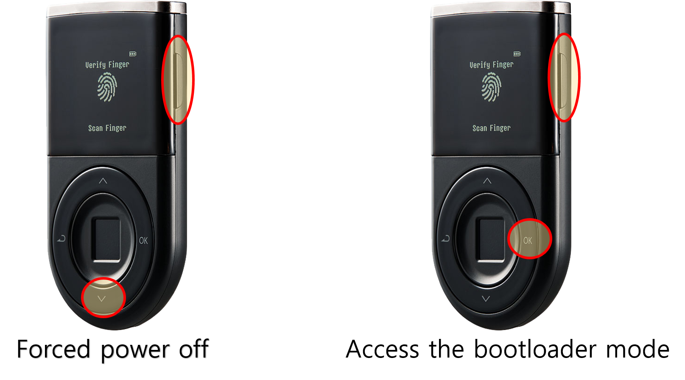

# Troubleshooting Guide (Windows)

## Check the version of the D'CENT bridge program running on your computer.

Make sure to check that your computer is installed with the latest version of the D'CENT bridge program.

For **Windows**, you can check the bridge version from the system tray.

## My D’CENT wallet was disconnected while the firmware was being updated. The device is stuck on a screen and it won’t turn off. What should I do?

First, disconnect your D’CENT wallet from your computer.&#x20;

Press and hold both the **"Down (v)"** button + **"Power"** button for few seconds to force the device to power off.\
\
If your device is "brick"ed during the firmware update, you can still access the bootloader mode by pressing and holding both **"OK"** button + **"Power"** button for 10 seconds.&#x20;

From the bootloader mode, you can try updating the firmware to recover your Biometric Wallet.

<figure><figcaption></figcaption></figure>

## From the D'CENT firmware update webpage, I pressed "Update Firmware" button, but I get the following message; "Your D'CENT is disconnected. Firmware Update process is cancelled". What should I do?

In rare cases, Windows system fails to recognize the D’CENT wallet even though it was recognized before. This issue can be solved by uninstalling the device driver and reinstalling it again from the Windows Device Manager.

### How to access Device Manager (method #1)

Press **Windows+R** on your keyboard.

Type in "**control panel"** and press **Enter** to access the Control Panel.&#x20;

* For Windows 11, 10 or Windows 8, choose **"Hardware and Sound"**.
* For Windows 7, choose **"System and Security"**.

From this Control Panel screen, look for and choose **"Device Manager"**.

* For Windows 11, 10 or Windows 8, check under the **"Devices and Printers"**.
* For Windows 7, check under **"System"**.

### How to quickly access Device Manager (method #2)

Press **Windows+R** on your keyboard.

Type in "**cmd**" and press **Enter** to run the Command Prompt (a black window).

Type in "**devmgmt.msc"** and press **Enter**.

### What should I do from the Device Manager?

From the Device Manager screen, look for **"Human Interface Devices"**.

Check if there is a **"USB Input Device"** marked as **error** (yellow triangle with exclamation mark). You will need to check if this is indeed a D'CENT device.

Right Mouse Click on this device and select **"Properties"**.

* From the USB Input Device Properties window, select **"Details"**.
* Under Property, choose **"Hardware Ids"**.
* Correct device ID for D'CENT is **"PID\_2130", "PID\_2131" or "PID\_2141"**.

From the **"Device Manager"**, Right Mouse Click on the error marked device and select **"Uninstall device"**.

On the top menu of Device Manager, press **Action** then select **"Scan for hardware changes"**. This will scan for any new devices attached and will automatically install the driver to detect your Biometric Wallet.
