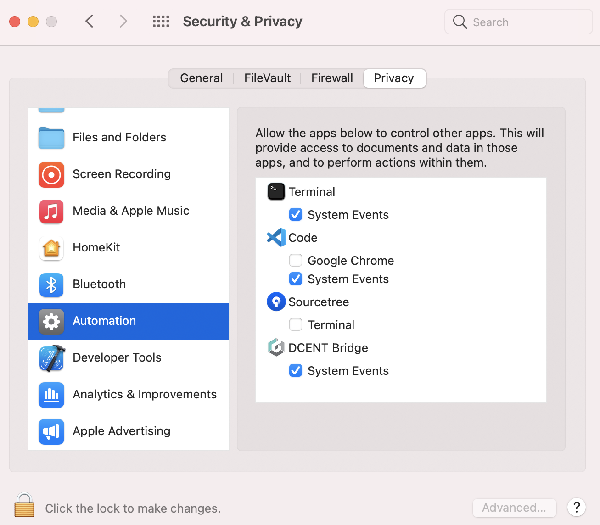

# Troubleshooting Guide (Mac)

## Check the D'CENT bridge program version running on your computer.

For **Mac**, you can check the bridge version that appears on the taskbar. If the older version of the D'CENT bridge is running already, you will need to "**Quit**" the program and install the newest version. Make sure to check the version **again** after installing the latest version.

## My D’CENT wallet was disconnected while the firmware was being updated. The device is stuck on a screen and it won’t turn off. What should I do?

First, disconnect your D’CENT wallet from your computer.&#x20;

Press and hold both the **"Down (v) button"** + **"Power button"** for few seconds to force the device to power off.\
\
If your device is "brick"ed during the firmware update, you can still access the bootloader mode by pressing and holding both **"OK button"** + **"Power button"** for 10 seconds.&#x20;

From the bootloader mode, you can try updating the firmware to recover your Biometric Wallet.

<figure><figcaption></figcaption></figure>

## From the D'CENT firmware update webpage, I pressed "Update Firmware" button, but I get the following message; "Your D'CENT is disconnected. Firmware Update process is cancelled". What should I do?

In rare cases, Mac OS system fails to recognize the D’CENT wallet even though it was recognized before. This issue can be solved by checking the following in the system's settings.

**1)** Go to About This Mac > Overview > System Report\
Look under Hardware > USB > See if D'CENT is shown as in the picture below

.png>)

**2)** Go to System Preferences > Security & Privacy\
Check to see that System Events box is ticked on for the D'CENT Bridge

