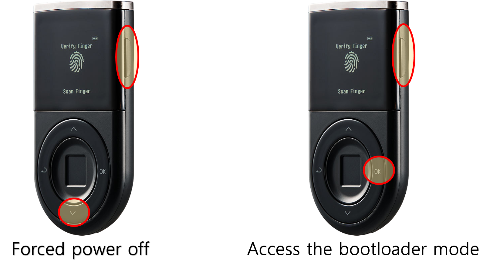

# Troubleshooting Guide (Mac)

## What to do when the Biometric Wallet screen gets stuck during a firmware update 

First, disconnect your D’CENT wallet from your computer.&#x20;

Press and hold both the **"Down (v)"** button + **"Power" button** for few seconds to force the device to power off.\
\
If your device is "brick"ed during the firmware update, you can still access the bootloader mode by pressing and holding both **"OK"** button + **"Power"** button for 10 seconds.&#x20;

From the bootloader mode, you can try updating the firmware to recover your Biometric Wallet.

<figure><figcaption></figcaption></figure>

## **What to do when the Biometric Wallet is not recognized by the Mac** 

In rare cases, Mac OS system fails to recognize the D’CENT wallet even though it was recognized before. This issue can be solved by checking the following in the system's settings.

**1)** Go to About This Mac > Overview > System Report\
Look under Hardware > USB > See if D'CENT is shown as in the picture below

.png>)

**2)** Go to System Preferences > Security & Privacy\
Check to see that System Events box is ticked on for the D'CENT Bridge


If the Biometric Wallet is still not recognized, the issue may be caused by a faulty USB charging cable or a problem with the USB port on your PC.

Please try using a different USB charging cable, switching to another USB port on your PC, or connecting to a different PC. When changing the USB charging cable, make sure it supports data transfer.

