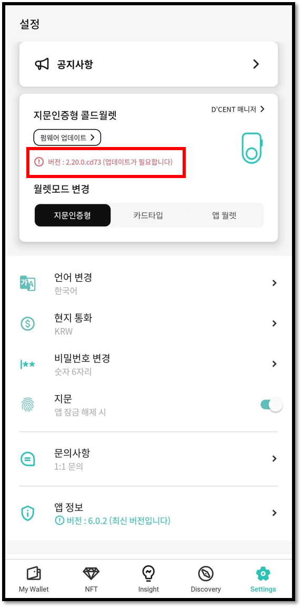
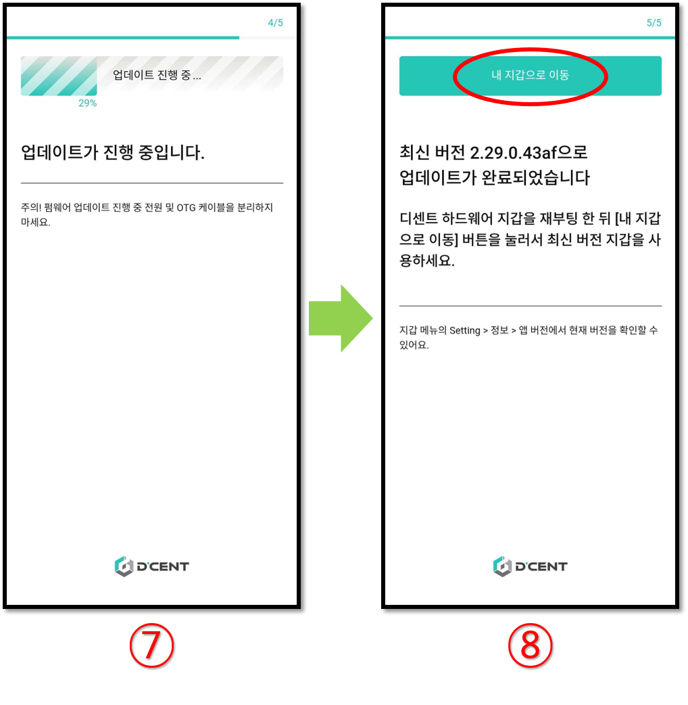

# 펌웨어 업데이트 (모바일에서)

## 모바일 펌웨어 업데이트


**현재 모바일 펌웨어 업데이트는 안드로이드 폰에서만 가능합니다.**&#x20;

안드로이드 폰 사용자는 **OTG 케이블**을 보유한 경우 핸드폰에서 바로 펌웨어 업데이트가 가능합니다.

**모바일 펌웨어 업데이트는 디센트 앱 v5.15.0 이상에서 지원됩니다.**


### 디센트 정품 OTG 케이블

OTG 케이블은 안드로이드 폰이 지문인증형 지갑(슬레이브 장치)의 펌웨어를 업데이트할 수 있는 호스트(마스터) 장치로 작동하도록 하는 특수한 유형의 USB 케이블입니다.

 (1).png>)

디센트 정품 OTG 케이블은 아래 디센트 홈페이지에서 구매가 가능합니다.

{% embed url="https://store-kr.dcentwallet.com/collections/frontpage/products/2-in-1-otg-%EC%BC%80%EC%9D%B4%EB%B8%94" %}



## 펌웨어 업데이트 표시

새로운 코인이 추가되거나, 버그 수정을 위해 펌웨어가 업데이트됩니다. 펌웨어 업데이트가 필요한 경우 모바일 앱에 다음과 같이 표시됩니다.

### 펌웨어 업데이트 전 숙지 사항


**24개의 니모닉 코드 확인**


지갑 초기 셋업 시 기재해 두신 24개의 니모닉 코드를 보유하고 있는 지 다시 한번 확인해 주세요. (업데이트가 정상적으로 완료되면 복구 없이 고객님의 자산은 그대로 보관됩니다. 상기 내용은 만일의 경우를 대비한 안내임을 알려 드립니다.


**펌웨어 업데이트 이후 이전 버전으로 복구 불가**


업데이트를 진행하시고 난 후에는 이전 버전으로 다시 돌아갈 수 없습니다.

안드로이드 폰에서 펌웨어 업데이트를 진행할 경우 반드시 디센트 정품 OTG 케이블을 사용하시길 권장합니다. 펌웨어 업데이트 시간은 약 5\~10분 정도 소요됩니다.

## 안드로이드 폰에서 펌웨어 업데이트하기

### OTG 케이블을 사용하여 안드로이드 폰과 콜드월렛 연결

디센트 지문인증형 지갑을 OTG 케이블로 안드로이드 폰과 연결하면 폰 화면에 팝업이 표시되며 이때 반드시 "**확인"** 버튼을 눌러주세요.

Settings 탭으로 이동하여 **펌웨어 업데이트**를 누릅니다.

### 펌웨어 업데이트 진행

**1. "업데이트"** 버튼을 누릅니다.&#x20;

**2.** 지문인증형 지갑을 찾을 때 까지 기다립니다.&#x20;

**3.** 다음 화면에서 "**업데이트 시작"** 버튼을 누릅니다.

**4.** "**부트로더 모드로 재부팅"** 버튼을 누릅니다.&#x20;

**5.** 지문인증형 지갑이 자동으로 재부팅되며 폰 화면에 팝업이 표시되면 이때 반드시 "**확인"** 버튼을 눌러주세요.&#x20;

**6.** **"업데이트 계속"** 버튼을 눌러주세요.

**7.** 펌웨어 업데이트가 완료될 때 까지 (약 10분 소요) 기다려주세요. 업데이트가 완료되면 지문인증형 지갑이 자동으로 정상 모드로 재부팅됩니다.&#x20;

**8.** "**내 지갑으로 이동"** 버튼을 눌러주세요.
