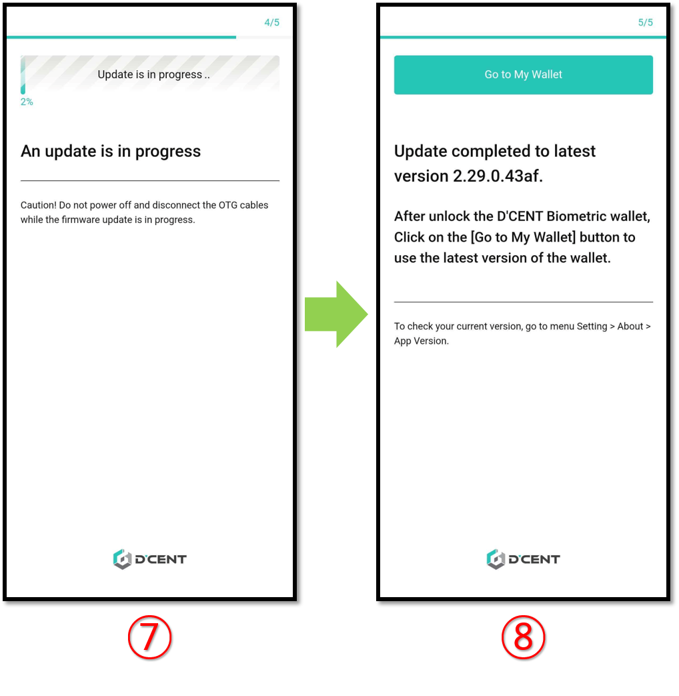

# Firmware Update (from mobile)

## Mobile Firmware update


**Currently the mobile firmware update is only possible for the Android Phones.**&#x20;

Android users with an **OTG cable** can perform firmware update directly from their phone.&#x20;


### OTG cable

OTG cable is an adapter or cable-type device that can update the firmware of the Biometric wallet on an Android phone. Please use an OTG cable that is compatible with your Android phone or Biometric Wallet charging port.


In order to update the firmware, your OTG device must capable of data transfer.


If your Biometric Wallet's charging port is **Micro USB 5 PIN Type**, you can update using D'CENT Genuine OTG cable.

D'CENT Genuine OTG cable can be purchase from D'CENT official website.



## Firmware update indicator

When D'CENT adds support to a new blockchain network, a new firmware will be available for installation. Your mobile app will show an indication when a newer version of the firmware is released.

<figure><figcaption></figcaption></figure>

## Before you update the firmware


**Make sure you have your Mnemonic Code (24 seeds/words) for recovery**


24 words were provided during the Initial Setup of your Biometric Wallet and you have written them down on the recovery card. Make sure you still have the recovery card before you proceed with the firmware update. \
\
Unlike other products, your wallet will still remain safely intact inside the secure chip even after updating the firmware. This means that you don't need to recover your wallet every time you update the firmware as other products requires you to do.&#x20;


**After you update the firmware, you cannot roll-back to the previous version**


If you use a separate OTG device, it must be capable of data transfer.\
Firmware update will take approximately 5\~10 minutes to complete.&#x20;

## Updating the firmware from an Android phone

### Connect Biometric Wallet with Android Phone using an OTG cable

Depending on the OTG cable you own, connect the Biometric Wallet and the Android device as shown in the picture below.

<figure><figcaption></figcaption></figure>

When the Biometric Wallet is connected with Android phone using the OTG device, a pop-up will show up on the phone's screen. Make sure you press **"OK"** to allow connection.

<figure><figcaption></figcaption></figure>

From the Settings Tab, click on **Firmware Update**.

<figure><figcaption></figcaption></figure>

### Proceed with the firmware update

**1)** Click on **"Update"** button.&#x20;

**2)** Wait until the **Biometric Wallet** is detecte&#x64;**.**&#x20;

**3)** Click on **"Start the update"** button.&#x20;

**4)** Click on **"Reboot in bootloader mode"** button.&#x20;

**5)** Biometric Wallet will automatically reboot. When the pop-up shows up on your Phone's screen, make sure to press **"OK"** to allow connection.&#x20;

**6)** Click on **"Keep updating"** button.

**7)** Wait patiently (approximately 10 minutes) for the firmware update to complete. When the firmware update has completed, the Biometric Wallet will automatically reboot to its normal working mode.&#x20;

**8)** Click on **"Go to My Wallet"** button to finish.
