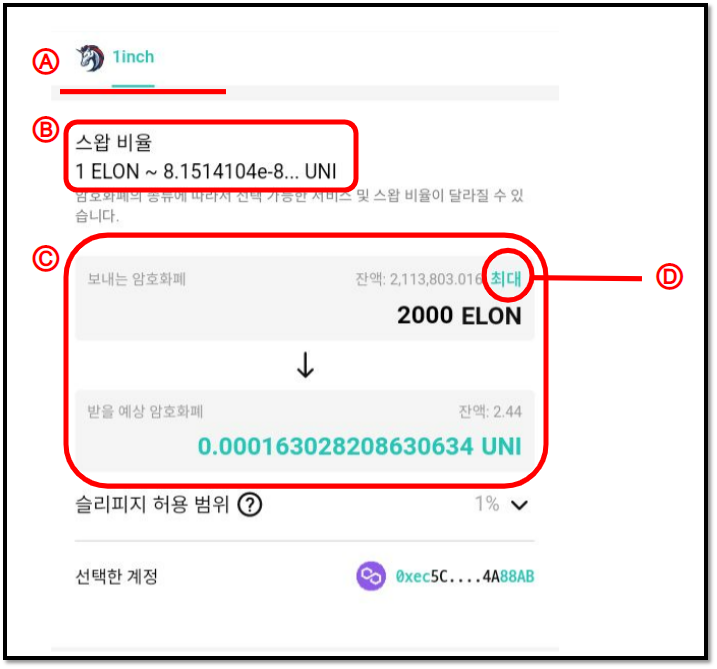
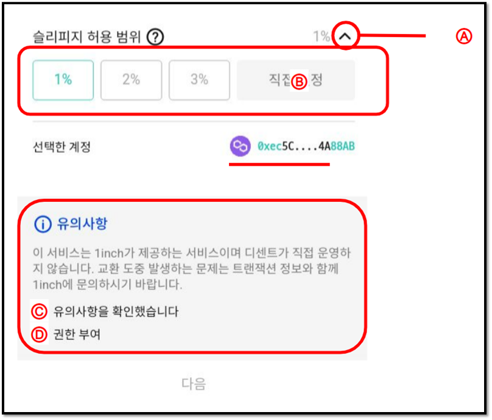
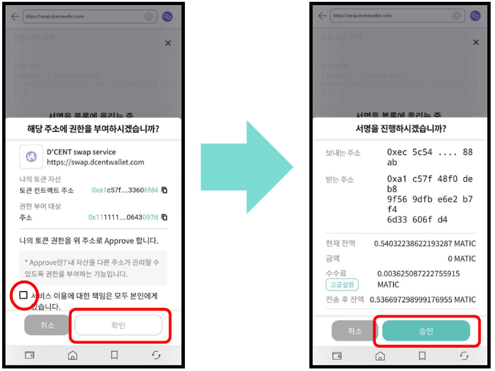

# Firmware Update (from mobile)

## Firmware update indicator


**Currently the mobile firmware update is only possible for the Android Phones.**&#x20;

Android users with an **OTG cable** can perform firmware update directly from their phone.&#x20;


When D'CENT adds support to a new blockchain network, a new firmware will be available for installation. Your mobile app will show an indication when a newer version of the firmware is released.

.png>)

## Before you update the firmware


Make sure you have your Mnemonic Code (24 seeds/words) for recovery


24 words were provided during the Initial Setup of your Biometric Wallet and you have written them down on the recovery card. Make sure you still have the recovery card before you proceed with the firmware update. \
\
Unlike other products, your wallet will still remain safely intact inside the secure chip even after updating the firmware. This means that you don't need to recover your wallet every time you update the firmware as other products requires you to do.&#x20;


After you update the firmware, you cannot roll-back to the previous version


To perform the firmware update, it is recommended to use the original D'CENT OTG cable. Firmware update will take approximately 10 minutes to complete.&#x20;

## Updating the firmware from an Android phone

### Connect Biometric Wallet with Android Phone using OTG cable

When the Biometric Wallet is connected with Android phone using the OTG cable, a message will show up on the phone's screen. Make sure you press **OK** to allow connection.

From the Manager Tab, click on **Firmware Update**.

### Proceed with the firmware update

**1.** Click on **FIRMWARE UPDATE** button.&#x20;

**2.** Wait until the **Biometric Wallet** is detected**.**&#x20;

**3.** Click on **Go to update** button.&#x20;

**4.** Click on **Reboot in bootloader mode** button.&#x20;

**5.** Biometric Wallet will automatically reboot. When the message shows up on your Phone's screen, make sure to press **OK** to allow connection.&#x20;

**6.** Click on **Update to the latest version** button.

.png>)

**7.** Wait patiently (approximately 10 minutes) for the firmware update to complete. When the firmware update has completed, the Biometric Wallet will automatically reboot to its normal working mode.&#x20;

**8.** Click on **Go to My Wallet** button to finish.
