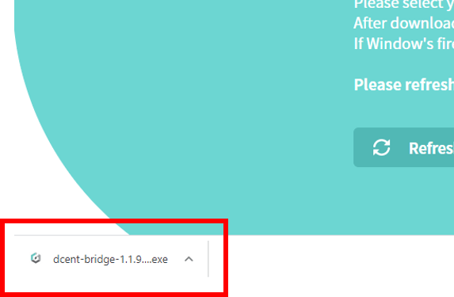
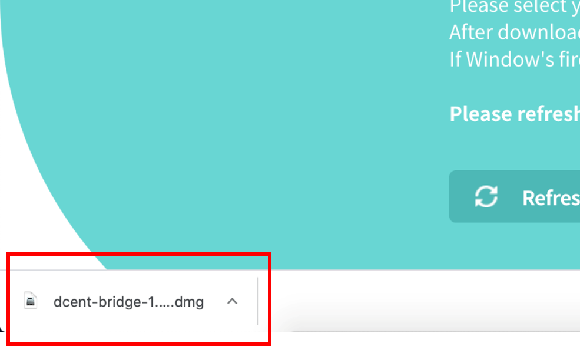
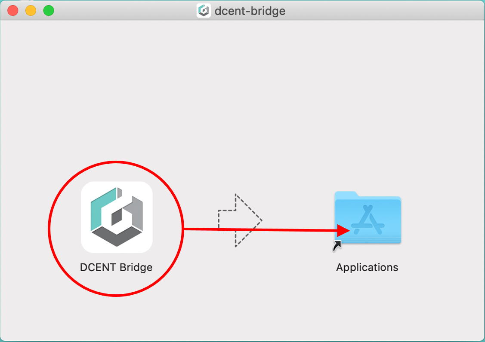
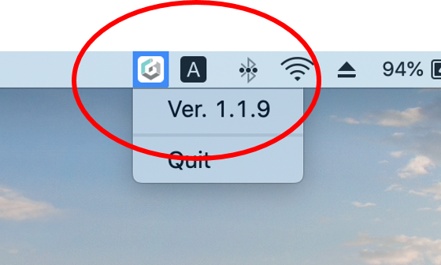

# Firmware Update

## Firmware update indicator

Whenever new coin support is added or bug fix has been made, a new firmware will be available for installation. Your mobile app will show an indication when a newer version of the firmware is released.


Firmware update can be done only from the PC.


## Before you update the firmware


Make sure you have your Mnemonic Code \(24 seeds/words\) for recovery


24 words were provided during the Initial Setup of your Biometric Wallet and you have written them down on the recovery card. Make sure you still have the recovery card.   
  
Unlike other products, your wallet will still remain safely intact inside the secure chip even after updating the firmware. This means that you don't need to recover your wallet every time you update the firmware as other products requires you to do.   
  
\(Keep your recovery card secured and ready just in case your Biometric Wallet is no longer accessible, possibly due to "brick"ed device or something that went wrong during the update process.\)   


After you update the firmware, you cannot roll-back to the previous version


To perform the firmware update, use the USB cable that came included inside the original D'CENT package. Firmware update will take approximately 10 minutes to complete. 


It is recommended that the D'CENT mobile app is not running during the firmware update.


## How to update firmware



### Requirements for the firmware update

✅ Firmware can ONLY be updated from using a PC running a **64bit OS \(Windows or Mac\).**

✅ Must use Google **Chrome browser**.

✅ Must use a USB cable that is **capable of data transfer**. It is highly recommended to use the USB cable that came together in the original box package.

✅ The **latest version** of D'CENT bridge program is installed and running on your PC.

If you are ready, click [here](https://fwu.dcentwallet.com/) to go to the Firmware Update homepage.

### Download D'CENT bridge program

If there is no D'CENT bridge program installed on your PC, download and install the latest version of the bridge program respective to the OS running on your PC.

The D'CENT bridge program runs in the system background and is used for communication between your PC and Biometric Wallet.

If your PC is already installed with the latest version of D'CENT bridge program, this download page will not appear when you visit the firmware update site.

### Install D'CENT bridge program \(Windows PC\)

After finishing the download, click to install the bridge program.

When the installation is complete, click the "Refresh page" button at the bottom of the screen.

### Install D'CENT bridge program \(Mac PC\)

After finishing the download, click to install the bridge program.

Go to **Finder** and look under **Applications** to find **D'CENT Bridge Program**. Click **Open** to open the application.

In the **Taskbar**, there should be a **D'CENT Bridge icon**, make sure to check that it is running the latest version.

 When the installation is complete, click the "Refresh page" button at the bottom of the screen.

### Connect Biometric Wallet to your PC

1\) Connect the PC and the Biometric Wallet using the USB cable included in the original package

2\) Authenticate with fingerprint or PIN to unlock your Biometric Wallet

3\) After connecting, you should see the following screen appears, click the "Retry to find device" button.

### Check firmware version

1\) Check if the connected Biometric Wallet has the latest version. If it is not the latest version, the following screen appears.

2\) Press "Update to version ..." button.

### Changing to bootloader mode

Follow the instructions and proceed as described.

1\) Separate your Biometric Wallet from the PC.

2\) Power off your Biometric Wallet.

3\) To enter bootloader mode, press and hold both the "OK" button and "Power" button on the Biometric Wallet for 10 seconds. When entering bootload mode, the following screen appears on the display of the Biometric Wallet.

4\) Plug the Biometric Wallet to the USB cable to reconnect with your PC.

5\) Press "Update Firmware" button.

### Start the firmware update

Firmware update from the webpage will take approximately 3 minutes to reach 100%. Please wait. 

From the Biometric Wallet, you can also check the progress of firmware update.

### Completing the firmware update

When the firmware update is completed, reboot your Biometric Wallet.

