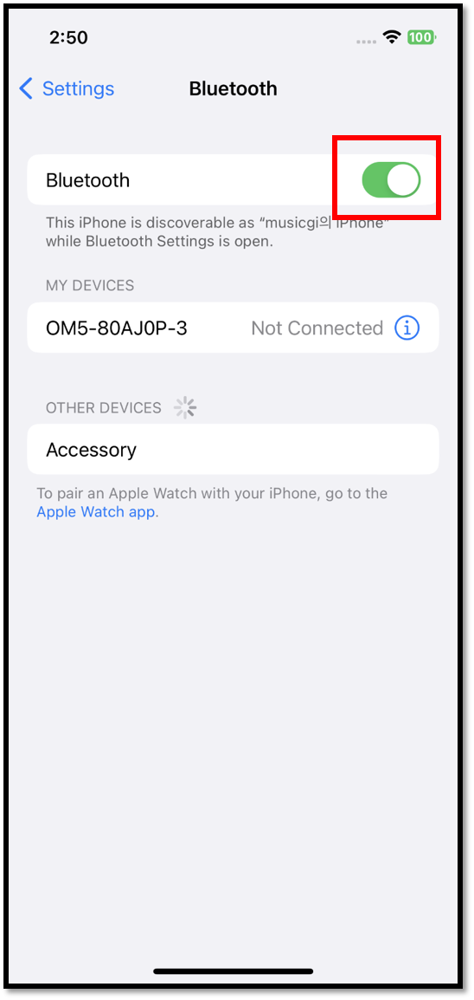

# Connect with iOS phone

## Mobile App Download

Click to [install](https://apps.apple.com/kr/app/dcent-hardware-wallet/id1447206611) D'CENT mobile app.

### Install by searching from the App store

You can also search from the App store to install D'CENT mobile app.

Search for "**D'CENT wallet**" from the App store.

<figure><figcaption></figcaption></figure>

## Basic setup for Mobile App

### Select wallet mode

If running the mobile app for the first time, you must choose a wallet mode. Choose "**Biometric hardware wallet**" as your choice.

<figure><figcaption></figcaption></figure>

Wallet mode can also be changed from the Settings tab on the bottom menu of D'CENT App. If you are using the Biometric hardware wallet, you must set the wallet mode on the D'CENT App to the Biometric Wallet mode.&#x20;


**How to change wallet mode**\
**Settings tab > Switch Wallet mode > Biometric Wallet**&#x20;


### Register password for Mobile App

Register mobile app password for access protection. To set the password, enter the same 6-digit number twice. Mobile App password is required every time you run the D'CENT mobile app. Make sure to remember it.

<figure><figcaption></figcaption></figure>


Mobile App password can be changed from the [App "Setting" menu](../mobile-app/mobile-app-setting-menu/) at any time. Instead of password, you can also use biometric authentication to protect access to your wallet if your mobile phone supports the feature.


### Bluetooth setting

From the iPhone Setting menu, turn on Bluetooth.

## Bluetooth connection with Biometric Wallet

### Connecting from your iPhone

1\) Go to the main tab(My Wallet) of D'CENT mobile app. Notice the Bluetooth icon (red color) located on the top left corner of the screen. Red color indicates Bluetooth connection is not established. Click on this icon to connect with Biometric Wallet.

<figure><figcaption></figcaption></figure>

2\) When you clicked on the icon, you will see a list of devices available to connect via Bluetooth. Find your D'CENT device and click to initiate Bluetooth pairing.

<figure><figcaption></figcaption></figure>

3\) When your D'CENT device is selected, your wallet will start the synchronization automatically. Synchronization will take few seconds to complete.&#x20;

<figure><figcaption></figcaption></figure>

You will notice that the Bluetooth icon is now in mint color, which indicates the Bluetooth connection is now established with your Biometric Wallet.

<figure><figcaption></figcaption></figure>

You can now add a coin account to manage using your Biometric Wallet. More information on how to add coin account can be found [here](../mobile-app/create-account/)**.**
