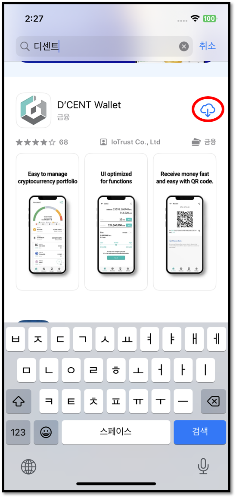

# 아이폰과 연결하기

## 앱 다운로드

[**링크**](https://apps.apple.com/kr/app/dcent-hardware-wallet/id1447206611)를 클릭하여 디센트 모바일 앱을 설치합니다.

### 앱 스토어에서 검색하여 설치

앱 스토어에서 검색하여 디센트 모바일 앱을 설치할 수도 있습니다.

앱 스토어에서 **"디센트"** 또는 **"D'CENT"**&#xB97C; 검색하세요.

## 모바일 앱 기본 설정

### 지갑 모드 선택

모바일 앱을 처음 설치하셨다면 지갑 모드를 선택해야 합니다. **"지문인증형 콜드월렛"**&#xC744; 선택해 주세요.

<figure><figcaption></figcaption></figure>

월렛(지갑) 모드는 디센트앱 하단 메뉴인 Settings 탭에서도 변경이 가능합니다. 지문인증형 지갑을 사용하시는 분이라면 반드시 디센트앱의 월렛 모드를 지문인증형 콜드월렛으로 설정하셔야 합니다.&#x20;


**지갑 모드 변경하는 방법**\
**Settings 탭** > **월렛모드 변경** > **지문인증형 콜드월렛**&#x20;


### 앱 비밀번호 입력

디센트 모바일 앱 보호를 위한 6자리 비밀번호를 등록해야 합니다. 앱 비밀번호는 디센트 모바일 앱을 실행할 때마다 필요하니 반드시 기억해주시기 바랍니다.

<figure><figcaption></figcaption></figure>


앱 비밀번호는 [앱 설정 메뉴](../mobile-app/mobile-app-setting-menu/)를 통해 나중에 변경하실 수 있습니다. 앱 비밀번호 이외에도 TouchID나 FaceID를 통해 앱을 보호할 수 있습니다. 자세한 내용은 [앱 설정 메뉴 항목](../mobile-app/mobile-app-setting-menu/)을 참고하세요.


### 블루투스 설정

아이폰의 설정 메뉴에서 블루투스를 켜주세요.

## 콜드월렛과 블루투스로 연결

### 콜드월렛 전원 켜기

먼저 콜드월렛의 전원을 켜고 지문인증을 진행해주세요.

### 아이폰에서 연결



1\) 디센트 앱 My Wallet 탭의 왼쪽 위에 블루투스 연결 아이콘을 확인하세요. 아래와 같이 빨간색 아이콘이면 연결이 안되어 있다는 의미이니 아이콘을 클릭하세요

<figure><figcaption></figcaption></figure>

2\) 아이콘을 클릭하여 연결 가능한 디센트 디바이스를 선택하세요

<figure><figcaption></figcaption></figure>

3\) 디센트 디바이스 선택 후 지갑 동기화가 자동으로 진행됩니다. 동기화가 시작되는데 수 초 정도 걸릴 수 있습니다.

<figure><figcaption></figcaption></figure>

동기화가 완료되면 모바일 앱의 왼쪽 상단에 연결 표시가 나타나고, 콜드월렛의 오른쪽 상단에 푸른색의 블루투스 연결 상태등이 켜집니다.

<figure><figcaption></figcaption></figure>

이제 가지고 계신 코인 계정을 추가하여 디센트 월렛을 사용할 수 있습니다. 코인 계정 추가에 대한 자세한 안내는 [**여기**](../mobile-app/create-account/)를 참고하세요.
