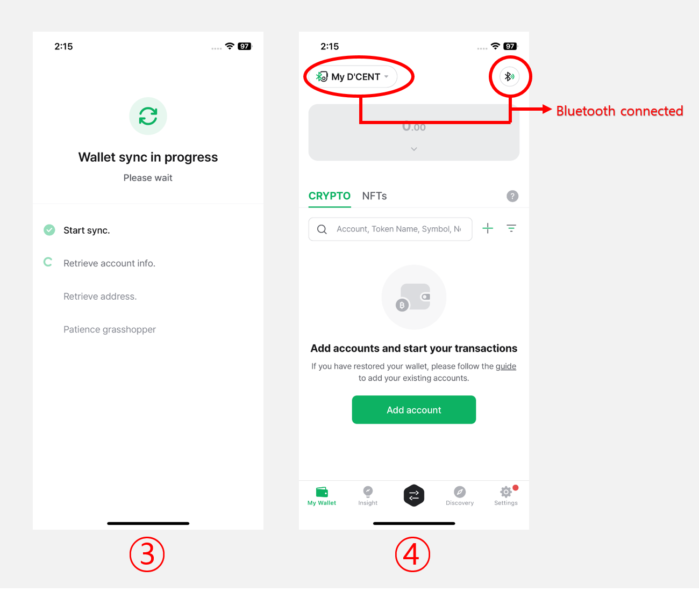

# Connect with iOS phone

## Mobile App Download

Click to [install](https://apps.apple.com/kr/app/dcent-hardware-wallet/id1447206611) D'CENT mobile app.

### Install by searching from the App store

You can also search from the App store to install D'CENT mobile app.

Search for "**D'CENT wallet**" from the App store.

<figure><figcaption></figcaption></figure>

## Basic setup for Mobile App

### Select wallet mode

If running the mobile app for the first time, you must choose a wallet mode. Choose "**Biometric hardware wallet**" as your choice.

<figure><figcaption></figcaption></figure>

Wallet mode can also be changed from the Settings tab on the bottom menu of D'CENT App. If you are using the Biometric hardware wallet, you must set the wallet mode on the D'CENT App to the Biometric Wallet mode.&#x20;


**How to change wallet mode**\
**Settings tab > Switch Wallet mode > Biometric Wallet**&#x20;


### Register password for Mobile App

Register mobile app password for access protection. To set the password, enter the same 6-digit number twice. Mobile App password is required every time you run the D'CENT mobile app. Make sure to remember it.

<figure><figcaption></figcaption></figure>


Mobile App password can be changed from the [App "Setting" menu](../mobile-app/mobile-app-setting-menu/) at any time. Instead of password, you can also use biometric authentication to protect access to your wallet if your mobile phone supports the feature.


### **Mobile App Permission Settings** 

A **permission request popup** will appear when connecting with the **D'CENT Biometric Wallet**. Tap **"Allow"** to enable synchronization with your **cold wallet**.

If you **do not grant permissions**, the app **will not be able to sync with the cold wallet**, restricting its functionality. Please make sure to **allow the required permissions** for proper use.

<figure><figcaption></figcaption></figure>

## Bluetooth connection with Biometric Wallet

To use the **cold wallet** with the **mobile app**, **Bluetooth pairing** is required.

### Preparing for Cold Wallet Pairing

<figure><figcaption></figcaption></figure>

**1. Turn on the cold wallet**, authenticate using your **fingerprint or PIN**, then navigate to the **"Settings"** menu and press **OK**.

**2. Select the "Bluetooth" menu** and press **OK**.

<figure><figcaption></figcaption></figure>

**3.** Choose **"iOS"** menu and press **OK**.

**4.** On the **cold wallet screen**, the message **"Connecting..."** will be displayed along with the **Device ID.** The **D'CENT Device ID** is displayed in the format **D'CENT-iD-\<numbers or letters>**.

Once the cold wallet enters **pairing mode**, you can connect it to your phone via **Bluetooth**.

## Connecting from your iPhone


This guide is based on the **D'CENT mobile app version v7.5.2.**


### Bluetooth setting

From the iPhone Setting menu, turn on Bluetooth.

<figure><figcaption></figcaption></figure>

### Connecting with the D'CENT mobile app

<figure><figcaption></figcaption></figure>

**1)** Open the **D'CENT mobile app** and select **"Bluetooth icon"** at the top of the **"My Wallet"** tab.

**2)** A **"Search Device"** popup will appear, displaying the **device name** that matches the **Device ID** shown on your cold wallet screen.

<figure><figcaption></figcaption></figure>

**3)** When your D'CENT device is selected, your wallet will **start the synchronization automatically.** Synchronization will take few seconds to complete.&#x20;

**4)** When synchronization is complete a **connection indicator** will appear in the **top** of the **mobile app**.

Now, you can tap the **"Add Account"** button to add the necessary **coin accounts**. For detailed instructions on **adding coin accounts**, click [**here**](https://userguide.dcentwallet.com/mobile-app/create-account).
