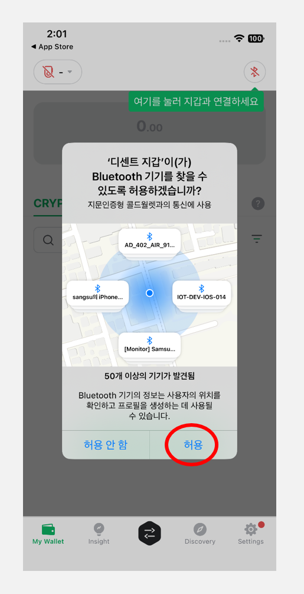
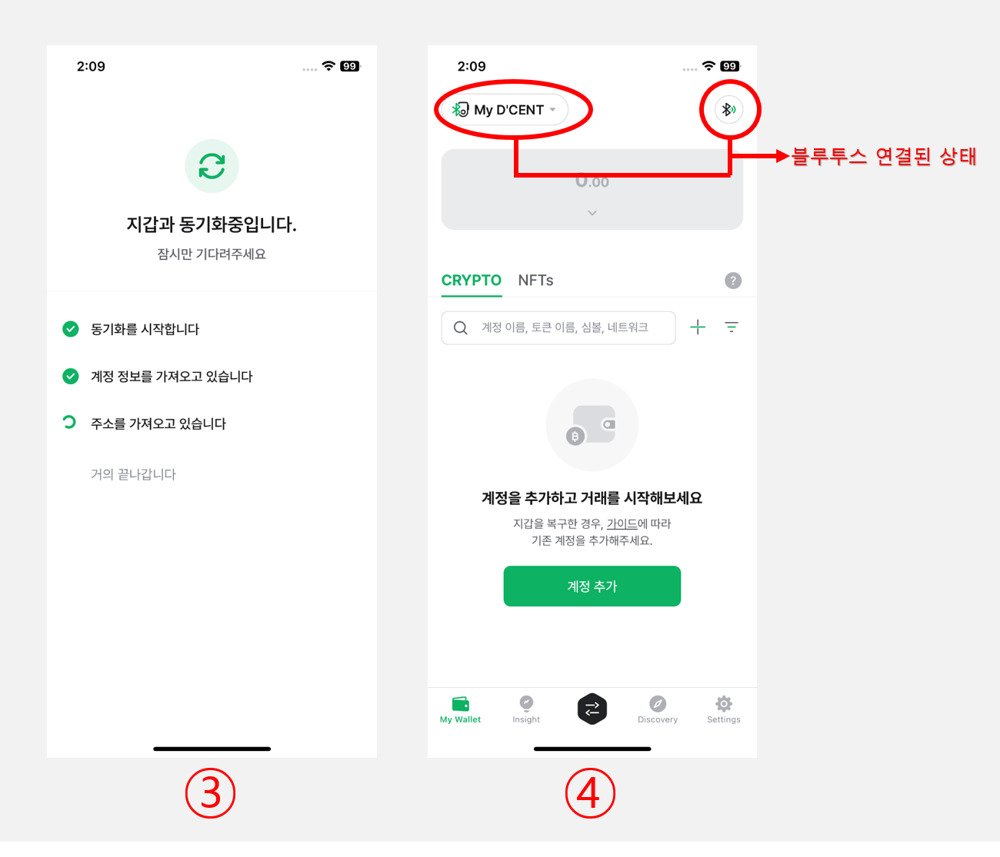

# 아이폰과 연결하기

## 앱 다운로드 

[**링크**](https://apps.apple.com/kr/app/dcent-hardware-wallet/id1447206611)를 클릭하여 디센트 모바일 앱을 설치합니다.

### 앱 스토어에서 검색하여 설치 

앱 스토어에서 검색하여 디센트 모바일 앱을 설치할 수도 있습니다.

앱 스토어에서 **"디센트"** 또는 **"D'CENT"**&#xB97C; 검색하세요.

<figure><figcaption></figcaption></figure>

## 모바일 앱 기본 설정 

### 지갑 모드 선택 

모바일 앱을 처음 설치하셨다면 지갑 모드를 선택해야 합니다. **"지문인증형 콜드월렛"**&#xC744; 선택해 주세요.

<figure><figcaption></figcaption></figure>

월렛(지갑) 모드는 디센트앱 하단 메뉴인 Settings 탭에서도 변경이 가능합니다. 지문인증형 지갑을 사용하시는 분이라면 반드시 디센트앱의 월렛 모드를 지문인증형 콜드월렛으로 설정하셔야 합니다.&#x20;


**지갑 모드 변경하는 방법**\
**Settings 탭** > **월렛모드 변경** > **지문인증형 콜드월렛**&#x20;


### 앱 비밀번호 입력 

디센트 모바일 앱 보호를 위한 6자리 비밀번호를 등록해야 합니다. 앱 비밀번호는 디센트 모바일 앱을 실행할 때마다 필요하니 반드시 기억해주시기 바랍니다.

<figure><figcaption></figcaption></figure>


앱 비밀번호는 [앱 설정 메뉴](../mobile-app/mobile-app-setting-menu/)를 통해 나중에 변경하실 수 있습니다. 앱 비밀번호 이외에도 TouchID나 FaceID를 통해 앱을 보호할 수 있습니다. 자세한 내용은 [앱 설정 메뉴 항목](../mobile-app/mobile-app-setting-menu/)을 참고하세요.


### 모바일 앱 권한 설정

디센트 모바일 앱 권한 허용 안내 팝업이 표시됩니다. **"허용"** 버튼을 눌러야 콜드월렛과 동기화를 할 수 있습니다.

만약, 이를 허용하지 않는다면 콜드월렛을 동기화 할 수 없어 사용이 제한되니 반드시 앱 권한을 허용해야 합니다.

<figure><figcaption></figcaption></figure>

## 콜드월렛과 블루투스로 연결

모바일 앱에서 콜드월렛을 사용하시려면 블루투스 페어링이 필요합니다.

### 콜드월렛 페어링 준비

<figure><figcaption></figcaption></figure>

**1)** 콜드월렛의 전원을 켠 후 지문 또는 PIN으로 인증한 뒤 "**설정"** 메뉴에서 OK 버튼을 누릅니다.

**2) "블루투스"** 메뉴를 선택하고 OK 버튼을 누르세요.

<figure><figcaption></figcaption></figure>

**3)** 콜드월렛의 **iOS** 메뉴를 선택하고 OK 버튼을 누르세요.

**4)** 콜드월렛 화면에 **"연결 대기 중"** 글자와 함께 디바이스 아이디가 표시됩니다. 디센트 디바이스 아이디는 **`D'CENT-iD-<숫자 혹은 문자>`**&#xC640; 같은 형태로 표시됩니다.&#x20;

콜드월렛이 연결 대기 중 상태가 되면 콜드월렛을 휴대폰과 블루투스로 연결할 수 있습니다.

## 아이폰에서 연결 


이 가이드는 **디센트 모바일 앱 v7.5.2 버전**을 기준으로 작성되었습니다.


### 블루투스 설정 

아이폰의 설정 메뉴에서 블루투스를 켜주세요.

<figure><figcaption></figcaption></figure>

### 디센트 모바일 앱에서 연결하기

<figure><figcaption></figcaption></figure>

**1)** 디센트 모바일 앱을 실행하고 "My Wallet" 탭 우측 상단의 **블루투스 아이콘**을 선택하세요.

2\) **"장비 찾기"** 팝업이 나타나면 콜드월렛 화면에 표시된 디바이스 아이디와 같은 장치 이름이 나타납니다.

<figure><figcaption></figcaption></figure>

**3)** 디센트 디바이스 선택 후 지갑 동기화가 자동으로 진행됩니다. 동기화가 시작되는데 수 초 정도 걸릴 수 있습니다.

**4)** 동기화가 완료되면 모바일 앱의 왼쪽 상단에 연결 표시가 나타나고, 콜드월렛의 오른쪽 상단에 푸른색의 블루투스 연결 상태등이 켜집니다.

이제 **"계정 추가"** 버튼을 눌러 필요한 코인 계정을 추가할 수 있습니다.

코인 계정 추가에 대한 자세한 안내는 [**여기**](https://userguide.dcentwallet.com/kr/mobile-app/create-account)를 참고하세요.
