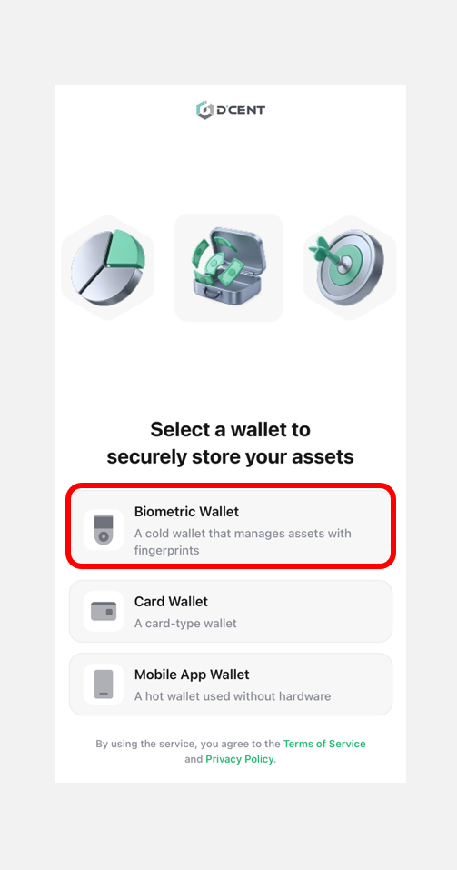
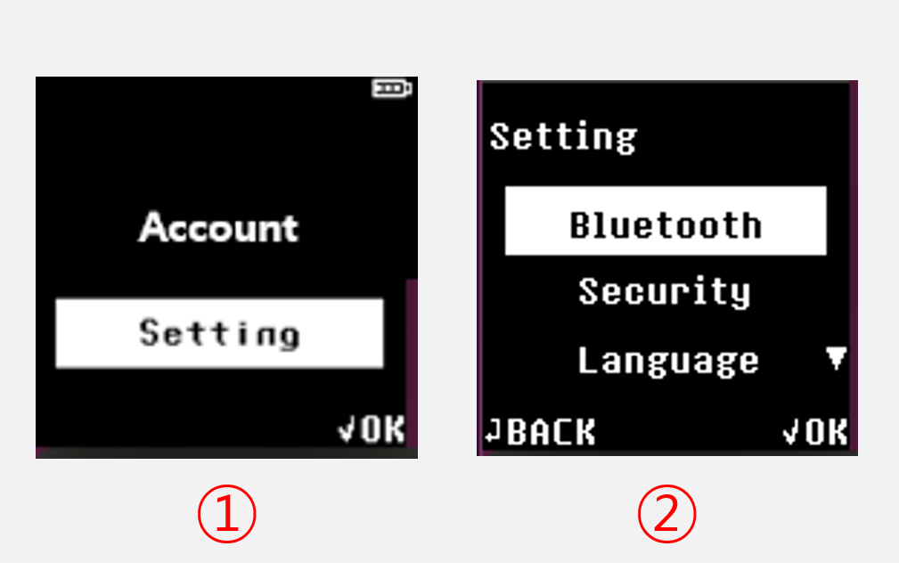

# Connect with iOS phone

## Mobile App Download

Click to [**install**](https://apps.apple.com/kr/app/dcent-hardware-wallet/id1447206611) D'CENT mobile app.

### Install by searching from the App store

You can also search from the App store to install D'CENT mobile app.

Search for **"D'CENT wallet**" from the App store.

<figure><figcaption></figcaption></figure>

## Basic setup for Mobile App

### Select wallet mode


This guide is based on **D’CENT mobile app version 8.0.0**.


If you are launching the mobile app for the first time, you will need to go through the initial setup and select a wallet mode. When the app launches, select **“Biometric Wallet”** as shown below.

<figure><figcaption></figcaption></figure>

You can change the **wallet mode** at any time from the **Settings** tab in the mobile app. If you are using a **biometric cold wallet**, make sure to set the wallet mode to **"Biometric"** in the mobile app. For instructions on how to change the wallet mode, [**refer to this guide**](https://userguide.dcentwallet.com/mobile-app/mobile-app-setting-menu/mobile-app-dcent-walletmode).

### Register password for Mobile App

Register mobile app password for access protection. To set the password, **enter the same 6-digit number twice.** Mobile App password is required every time you run the D'CENT mobile app. Make sure to remember it.

<figure><figcaption></figcaption></figure>


Mobile App password can be changed from the [**App "Setting" menu**](../../mobile-app/mobile-app-setting-menu/) at any time. Instead of password, you can also use biometric authentication to protect access to your wallet if your mobile phone supports the feature.


### **Mobile App Permission Settings** 

A permission request popup will appear when you launch the D’CENT mobile app. Review the permissions being requested, then click **“Confirm”** button to proceed.

<figure><figcaption></figcaption></figure>

Next, click the **“Allow”** button for both the **Notification** and **Find Bluetooth Devices** permissions to continue.


The **Notification** permission is optional. You can click the **“Don’t allow” button** and still connect your wallet without any issues. However, the **Find Bluetooth Devices** permission is **required** for syncing with the cold wallet. If access is denied, the cold wallet cannot be synced, and usage will be restricted. **Therefore, be sure to allow this permission.**


<figure><figcaption></figcaption></figure>

## Bluetooth pairing with Biometric Wallet

**First, turn on the cold wallet, unlock using your fingerprint or PIN authentication.**

You can connect your cold wallet to the D'CENT mobile app via Bluetooth using the following steps.

<figure><figcaption></figcaption></figure>

**1)** Open the **D'CENT mobile app** and select **"Bluetooth icon"** at the top of the **"My Wallet"** tab.

**2)** A **"Search Device"** popup will appear, displaying the **device name** that matches the **Device ID(D'CENT-iD-\<numbers or letters>)**  shown on your cold wallet screen.

If you have multiple cold wallets, please refer to [**this guide**](./#how-to-check-the-device-id-when-you-have-multiple-cold-wallets) to check the device ID of each wallet.


If the device ID of your cold wallet does not appear in the **"Search Device"** popup, please make sure that **Bluetooth is enabled** in your iPhone’s settings. If you're unsure how to access the Bluetooth menu, please refer to [**this guide**](iphone-bluetooth-menu.md).


<figure><figcaption></figcaption></figure>

**3)** When your D'CENT device is selected, your wallet will **start the synchronization automatically.** Synchronization will take few seconds to complete.&#x20;

**4)** When synchronization is complete a **connection indicator** will appear in the **top** of the **mobile app**.

<figure><figcaption></figcaption></figure>

Now, you can tap the **"Add Account"** button to add the necessary **coin accounts**. For detailed instructions on **adding coin accounts**, click [**here**](https://userguide.dcentwallet.com/mobile-app/create-account).

### **How to Check the Device ID When You Have Multiple Cold Wallets** 

Each biometric cold wallet has a unique device ID. If you have multiple cold wallets, you can check the device ID of each device using the following steps.

<figure><figcaption></figcaption></figure>

**1) Turn on the cold wallet**, authenticate using your **fingerprint or PIN**, then navigate to the **"Settings"** menu and press  **"OK"** button.

**2) Select the "Bluetooth" menu** and press  **"OK"** button.

<figure><figcaption></figcaption></figure>

**3)** Choose **"iOS"** menu and press  **"OK"** button.

**4)** On the cold wallet screen, the **Device ID(`D'CENT-iD-<numbers or letters>`)** will be displayed above the message "Connecting...".

**After checking the device ID, press the Back (↩) button on your cold wallet to return to the previous screen.**
