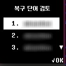

# 콜드월렛 복구하기

## 시작하기 전에

새로운 새로운 기기를 구입하거나 기기가 초기화 되었을 때에 사용하던 기존 지갑을 복구할 수 있습니다. 

지갑 복구는 초기화 과정에서 기록해 놓은 복구 카드 \(Recovery Card\)의 24개 복구용 단어를 순서에 맞게 입력하여 수행할 수 있습니다. 

### 사용하던 콜드월렛을 이용하여 복구

[콜드월렛의 설정의 메뉴를 통해 기기를 초기화](setting-menu.md#undefined-8) 한 후 지갑을 복구할 수 있습니다. 초기화 후에는 아래의 설명을 따라 복구하실 수 있습니다. 


**"기기초기화"** 를 수행하면 현재 사용하던 지갑이 모두 삭제됩니다. 삭제 전에 복구 카드를 확인 하세요. 


## 1단계 : 언어 선택 및 지갑 복구



### 전원 켜기

기기 옆 파워 버튼을 3초 이상 눌러 전원을 켭니다.

### 언어 선택

∨ 버튼을 눌러 원하는 언어로 이동 후 OK 버튼을 누릅니다.

### "지갑 복구" 선택

지갑을 복구하기 위하여 "지갑 복구" 메뉴를 선택합니다.

## 2단계 : PIN \(4~8자리\) 및 지문 등록

지갑 접근을 관리하기 위한 PIN과 지문을 등록합니다.

### PIN 설정

∧\(위, 숫자 증가\) 또는 ∨\(아래, 숫자 감소\) 버튼을 이용하여 4~8자리 PIN을 설정
합니다. 원하는 숫자값이 정해지면 OK버튼을 눌러 해당 숫자를 입력합니다.

4자리를 입력하였다면 화면에 'OK' 텍스트가 표시됩니다. 4자리 PIN 등록을 원하는 경우 하드웨어 지갑의 OK버튼을 눌러줍니다.

만약 4자리 이상의 PIN으로 설정을 원한다면 위/아래 버튼을 눌러서 \(OK 텍스트\)값을 변경해주세요. **PIN은 4자리에서 최대 8자리까지 설정이 가능합니다.**

PIN을 입력 후 '보안이 낮다는' 메세지가 표시될 수 있습니다. 이는 입력된 PIN의 보안 강도가 낮은 경우 표시되며 이와 상관없이 입력한 PIN을 사용하길 희망하는 경우 하드웨어 지갑의 OK버튼을 눌러주세요. ****

### 설정한 
PIN 확인

위에서 설정한 값과 같은 PIN을 입력합니다.

 
※ 입력한 두 개의 PIN이 다른 경우 PIN 설정을 다시 해야 됩니다.

PIN 값은 초기화가 끝난 이후에 [설정 메뉴](setting-menu.md)를 통해 변경할 수 있습니다.

### 지문 등록

1\) 지문 센서에 등록하실 손가락을 지문센서 위에 터치
합니다.

지문 센서는 콜드월렛 하단의 버튼 가운데에 있습니다. [지문센서의 위치](setting-up.md#before-start)를 확인해주세요.

2\) 같은 손가락을 100%가 될 때까지 위치를 조금씩 옮겨가며 터치합니다. \(약 8회\)

### 지문 등록 확인

등록한 손가락을 지문센서 위에 터치하여 지문 등록이 잘 되었는지 확인합니다.

※ 지문 등록이 실패한 경우에는 처음부터 지문 등록 프로세스를 시작
합니다.

※ 지문을 재등록 할 때는 다른 손가락을 사용하는 것이 좋습니다.

※ 지문 등록이 실패한 경우에는 지문 등록을 건너뛸 수 있습니다. 나중에 [설정 메뉴](setting-menu.md)에서 등록할 수 있습니다.

※ 지문 등록 확인이 실패한 경우에 지문은 저장되지 않습니다.

## 3단계 : 복구 단어 입력

1\) 복구 카드에 기록해 둔 24개의 복구 단어를 1번부터 차례대로 24번까지 입력합니다.

2\) 아래\(∨\) 버튼을 눌러 24개의 복구단어를 순서대로 잘 입력하였는지 검토합니다.

3\) 모든 단어가 올바르게 입력되었다면 검토 메뉴 가장 아래에 있는 "I am ready"를 선택합니다.


복구단어나 복구카드를 사진을 찍거나 이미지로 저장하지 마십시오. 사용자는 복구 단어를 안전하게 취급할 책임이 있습니다. 디센트는 복구카드 도난 또는 이미지 파일 저장과 같은 사용자의 부주의로 인한 암호 자산의 손상 또는 손실에 대해 배상 책임을 지지 않습니다. 

안전한 보관을 위해 \(화재, 물, 햇빛 또는 애완동물로부터 멀리\) 각별한 주의가 필요합니다.


## 4단계 : 지갑 복구 완료

지갑 복구가 완료되었습니다. 이제 콜드월렛에서 코인 리스트를 확인할 수 있습니다. 이제 모바일 앱을 이용해서 지갑을 사용해보세요.

* [안드로이드 폰과 연결해서 사용하기](android-connect/)
* [아이폰과 연결해서 사용하기](iphone-connect.md)


※ 디센트 지문인증형 콜드월렛에서 지원하는 전체 코인 리스트는 [https://dcentwallet.com/SupportedCoin](https://dcentwallet.com/SupportedCoin) 에서 확인할 수 있습니다.



모바일 앱 v5.3.1 이후 부터 Klaytn\(클레이튼\), Ethereum Classic\(이더리움 클래식\), RSK\(루트스탁\) 계정을 생성할 경우 이더리움 주소와 동일한 주소를 가진 계정이 생성되도록 변경되었


### 펌웨어 확인

디센트 콜드월렛 세팅이 끝난 후에는 홈페이지를 통해 하드웨어 업데이트를 꼭 확인해 보시기 바랍니다. 추가 코인, 콜드월렛 기능 추가 등 펌웨어가 업데이트 되었을 수 있습니다.

펌웨어 업데이트에 대한 자세한 내용은 [여기를 참조](firmware-update/)하세요.

## 레거시 주소 확인

모바일 앱 버전 v5.3.1 업데이트에서 Klaytn\(클레이튼\), Ethereum Classic\(이더리움 클래식\), RSK\(루트스탁\)과 같이 이더리움과 같은 형식의 주소를 사용하는 자산은  계정을 생성시 이더리움 주소와 동일한 주소를 가진 계정이 생성되도록 변경되었습니다. 

자세한 내용은 아래 내용을 확인하세요.



