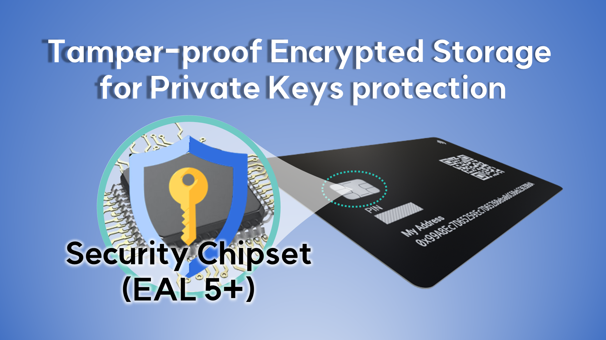

# 렛저 지갑의 복구 코드를 사용하여 디센트 지갑에서 복구하는 방법

렛저 지갑과 디센트 지갑 모두 지갑 복구 방식에 대해 동일한 BIP 표준을 따릅니다. 그러나 각 지갑 서비스는 현재 지원하는 디지털 자산 유형별로 개인 키를 생성하기 위해 사용되는 지갑 생성 경로가 동일하지 않을 수 있습니다.

아래는 렛저 지갑과 디센트 지갑의 계정 주소(예: BSC & ETH)를 비교한 스크린샷입니다. 이 예제에서는 렛저 지갑의 니모닉 코드(복구 단어)를 사용하여 디센트 지갑을 복구한  경우입니다. 이 두 지갑 서비스 간에 지갑 생성 경로가 동일하기 때문에 BSC 및 ETH 계정의 주소가 동일하게 생성되었습니다.

<figure><figcaption></figcaption></figure>

## 복구 호환 자산 목록&#x20;

아래 암호화폐의 지갑 생성 경로는 렛저 지갑과 디센트 지갑에서 서로 **동일**합니다. **이는 렛저의 니모닉 코드 (복구 단어)를 이용하여 동일한 계정(개인 키)을 디센트 지갑에 생성할 수 있음을 의미합니다.**&#x20;

* 바이낸스 스마트체인 (BSC - BNB)
* 비트코인 캐시 (BCH)&#x20;
* 코스모스 (ATOM)&#x20;
* 대시 (DASH)&#x20;
* 도지코인 (DOGE)&#x20;
* 이더리움 (ETH)&#x20;
* 이더리움 클래식 (ETC) - 디센트 지갑에서 계정추가 시 '<mark style="background-color:blue;">Ethereum Classic - Legacy</mark>'를 선택하세요.&#x20;
* 호라이젠 (ZEN)&#x20;
* 폴리곤 (MATIC)&#x20;
* 솔라나 (SOL)&#x20;
* 스텔라 (XLM)&#x20;
* 리플 (XRP)&#x20;
* 지캐시 (ZEC)&#x20;
* 트론 (TRX)
