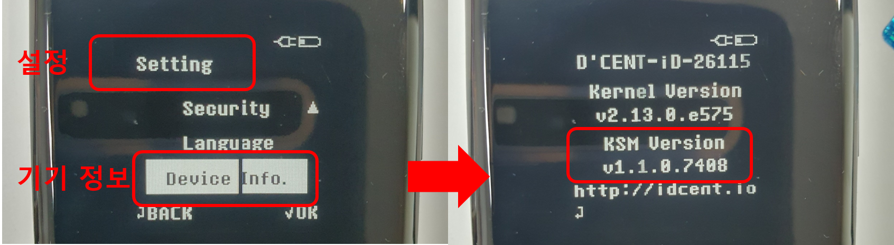
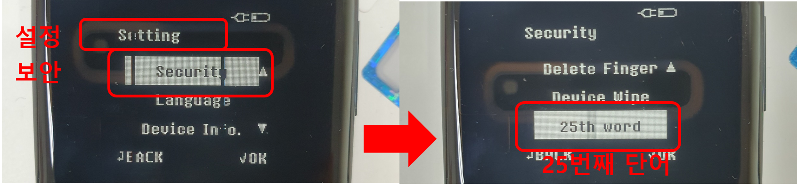
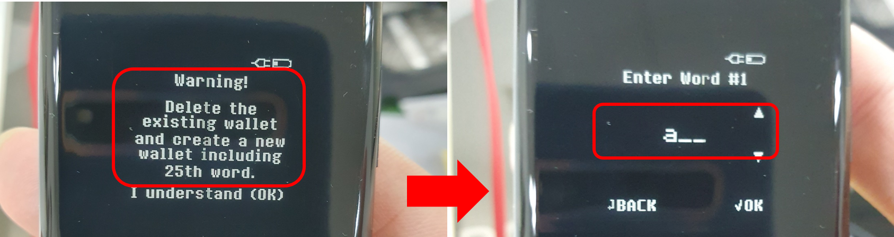
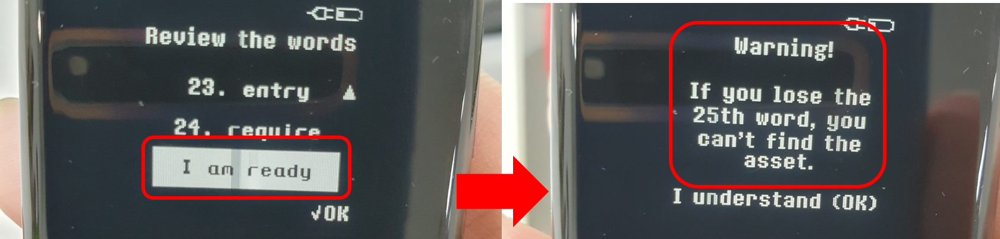
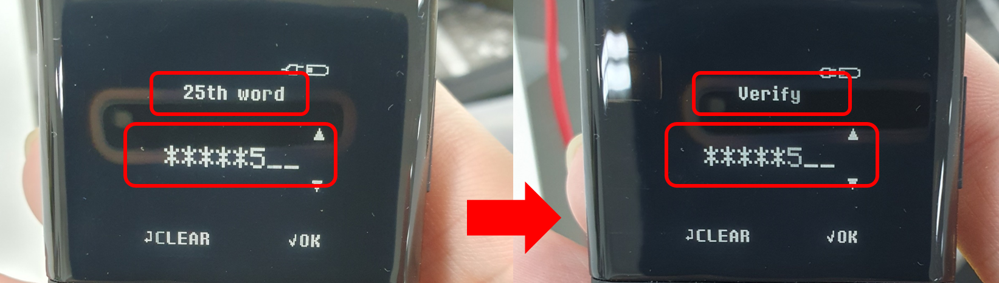

# 25번째 단어 (the Passphrase)

기억하고 계신가요? 누군가 니모닉 코드(24단어)에 접근할 수 있다면, 그들은 완전히 같은 지갑을 만들어서 모든 암호화폐 자산을 훔칠 수 있습니다.&#x20;

**25번째 단어**는 디센트 지문인증형 하드웨어 지갑의 고급 보안 기능입니다. 기존 니모닉 코드(24단어)에 추가 단어를 추가하여 완전히 새로운 개인 키(계정) 세트를 생성합니다. 즉, 니모닉 코드가 누군가에게 노출되더라도 그 사람이 25번째 단어를 모르면 내가 가지고 있는 동일한 지갑을 다시 만들 수 없습니다. 25번째 단어는 사용자가 선택한 단어로 숫자 또는 알파벳을 포함하여 최대 8자까지 가능합니다. **완벽하게 기억할 수 있는 25번째 단어를 신중하게 선택하세요.**

## 25번째 단어 설정하기

### 요구 사항

25번째 단어 기능은 디센트 지문인증형 지갑의 보안 칩셋에 **KSM 버전 1.1 이상**의 소프트웨어를 탑재한 기기에서 사용이 가능합니다. 요구 사항보다 낮은 KSM 버전을 탑재한 이전 모델의 지문인증형 지갑은 25번째 단어 기능을 지원하지 않습니다.

KSM 버전 확인은 **설정 >> 기기 정보** 메뉴를 통해 확인이 가능합니다.

<figure><figcaption></figcaption></figure>

### **25번째 단어 설정**

**Step 1)** 25번째 단어 메뉴로 진입하기:  **설정 >> 보안 >> 25번째 단어**

<figure><figcaption></figcaption></figure>

**Step 2) 경고 문구를 확인해주세요.** 25번째 단어 설정을 진행하는 경우 기기에 존재하는 기존 지갑이 완전히 삭제됩니다.&#x20;

기기의 "**OK**" 버튼을 클릭하여 진행합니다. 보유한 기존 지갑의 니모닉 코드(24개 복구 단어)를 모두 입력합니다.

<figure><figcaption></figcaption></figure>

**Step 3)** 24개 단어를 모두 입력한 후 리뷰 화면에서 "**I am ready**"를 클릭하여 진행합니다. 경고 문구를 확인해주세요. 계속하려면 "**OK**" 버튼을 클릭하세요. 다음 단계에서는 자신만의 25번째 단어를 선택하라는 메시지가 표시됩니다.&#x20;

<figure><figcaption></figcaption></figure>

**Step 4)** 자신의 25번째 단어를 입력합니다. 25번째 단어는 길이가 1\~8자이며 숫자 또는 알파벳으로 구성될 수 있습니다. **완벽하게 기억할 수 있는 25번째 단어를 신중하게 선택하세요. 25번째 단어가 없으면 지갑을 복구할 수 없습니다.** 25번째 단어를 입력하고 확인을 위해 동일한 25번째 단어를 입력합니다.

<figure><figcaption></figcaption></figure>

**Step 5)** 위의 4단계를 완료하면 지문인증형 지갑의 전원이 자동으로 꺼집니다. 지문인증형 지갑의 전원을 켜면 기존 지갑과 완전히 다른 새로운 지갑(새로운 개인 키)가 생성된 것을 확인할 수 있습니다.
