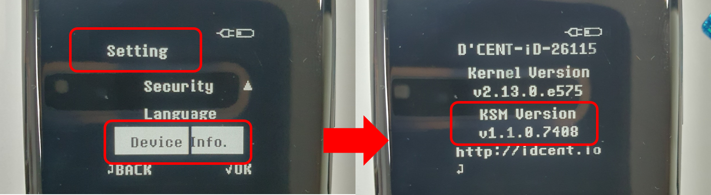
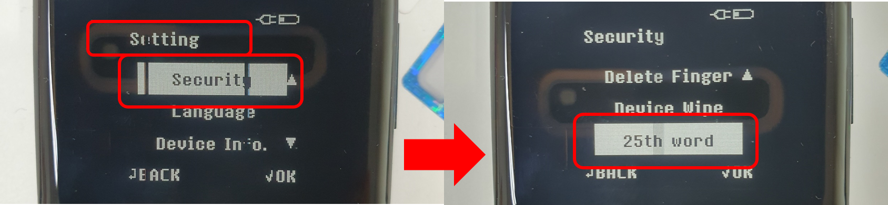

# 25th Word (the Passphrase)

Do you remember? If anyone gets access to your mnemonic code (24 words), they can steal all of your cryptocurrencies by simply creating the exact same wallet. &#x20;

The passphrase (25th word) is an advanced security feature on the D’CENT Biometric hardware wallet. It adds an extra word to your existing mnemonic code (24 words) to create an entirely new set of private keys (accounts). This means that even if your mnemonic code is exposed to someone, that person cannot recreate the same wallet that you have without knowing the 25th word.

The passphrase is a word that is chosen by you and can be up to 8 characters consisting of numbers and or alphabets. **Please carefully choose your 25th Word which you can remember perfectly.**

## How to set up the 25th word (Passphrase)

### Requirements

To use the passphrase feature, the D’CENT Biometric Wallet device must have a security chipset with **KSM version 1.1 or higher**. An older model of the Biometric wallet with the KSM version below the requirement does not support the passphrase feature.

KSM version can be checked from the **Setting >> Device Info**

<figure><figcaption></figcaption></figure>

### **Set up the 25th Word**

**Step 1)** To access the 25th Word menu, go to **Setting >> Security >> 25th Word**

<figure><figcaption></figcaption></figure>

**Step 2) Read the Warning carefully.** Performing the setup of the 25th Word will completely delete your existing wallet on the device.

Click on the "**OK**" button on the device to proceed. You will be prompted to enter all 24 words from your mnemonic code.

<figure><figcaption></figcaption></figure>

**Step 3)** After entering all 24 words, click on "**I am ready**" on the review screen to proceed. **Read the Warning carefully.** In the next step, you will be asked to choose your own 25h Word. Click on the "**OK**" button to proceed.

<figure><figcaption></figcaption></figure>

**Step 4)** Choose your own 25th Word (the Passphrase). The 25th Word can be 1 to 8 characters in length and can consist of numbers and or alphabets. **Please carefully choose your 25th Word which you can remember perfectly. Without your 25th Word, you cannot recover your wallet.** Enter your 25th Word and verify by entering the exact same 25th Word.&#x20;

<figure><figcaption></figcaption></figure>

**Step 5)** After completing Step 4 above, your Biometric wallet will power down automatically. Power on your Biometric wallet and your wallet will have an entirely new set of private keys (accounts).

****
