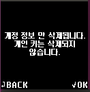

# 콜드월렛 설정 메뉴

## 블루투스 메뉴

안드로이드 또는 아이폰의 블루투스 연결을 위한 메뉴입니다. 안드로이드의 경우 [여기](../android-connect/)를 참조하시고 아이폰을 사용하는 경우 모바일 앱에서만 찾기를 하시면 됩니다. 자세한 내용은 [여기](../iphone-connect.md)를 참조하세요.&#x20;

## 보안 메뉴

### 비밀번호 변경

(4\~8)자리의 비밀번호는 지문 인증이 실패할 경우 인증을 대체하는 데 사용되며, 지문 정보를 추가하거나 삭제할 때도 비밀번호가 요구 됩니다. 신중하게 변경하시고 꼭 기억하셔야 합니다.&#x20;

기존 비밀번호를 입력하시고 새로운 비밀번호를 두 번 입력하여 비밀번호를 변경할 수 있습니다. 비밀번호 설정에 대한 설명은 [여기](https://userguide.dcentwallet.com/v/kr/biometric-wallet/setting-up#pin)를 참고하세요.&#x20;

### 지문 추가

초기에 설정한 지문 외에 하나의 지문을 추가하여 최대 2개까지 설정할 수 있습니다.&#x20;

비밀번호를 입력하시고 지문을 추가하세요.


추가한 지문도 기본 지문과 동일한 권한이 있습니다. 코인 전송도 가능하니 각별히 유의하셔서 지문을 추가하세요.


### 지문 삭제

등록한 지문이 삭제됩니다. 비밀번호를 입력한 후 삭제를 클릭하시면 기존에 등록한 모든 지문이 삭제됩니다. 2개를 등록한 경우 2개 모두 삭제되니 유의하세요.&#x20;

### 계정 삭제

사용하지 않는 계정이 너무 많아 계정 정보를 삭제하고 싶은 경우 "계정 삭제" 메뉴를 이용하면 됩니다. 이 경우 콜드월렛에 동기화되어 있는 모든 계정 정보가 삭제 됩니다.

계정 삭제를 하더라도 콜드월렛에 있는 개인키가 삭제되지는 않습니다.

콜드월렛에서 계정 삭제 후 [모바일 앱과 동기화](../synch-with-app.md)하면 모바일 앱에 있던 계정도 삭제됩니다.

관리하고 싶은 계정만 새로 생성하여 사용가능합니다.

### 기기 초기화

기기 초기화 메뉴를 클릭하시면 지갑의 키가 삭제되고 초기화 됩니다. 비밀번호 (4\~8자리)를 입력한 후에 보이는 경고 메시지를 읽으신 뒤 `OK` 버튼을 눌러 확인 하시면 기기의 전원이 꺼집니다. 다시 전원 켜면 공장 초기화 상태에서 시작합니다.

기기 초기화 이후의 세팅 방법에 대해선 [콜드월렛 초기 설정](../setting-up.md)을 참고하세요.


기기초기화를 OK\&OFF 하시면 지갑의 모든 정보 및 키가 삭제됩니다. 복구 카드를 잘 보관하고 있는 지 꼭 확인하신 후 삭제하시기 바랍니다.&#x20;


### 25번째 단어 (the Passphrase)

25번째 단어는 디센트 지문인증형 하드웨어 지갑에서 사용할 수 있는 고급 보안 기능입니다. 기존 니모닉 코드(24단어)에 추가 단어를 추가하여 완전히 새로운 개인 키(계정) 세트를 생성합니다. 자세한 내용은 아래 링크에서 확인하실 수 있습니다.


[25th-word-the-passphrase.md](25th-word-the-passphrase.md)


### 니모닉 확인

니모닉 확인 메뉴는 사용자가 보유하고 있는 24개 단어 혹은 25번째 단어가 현재 사용 중인 지갑의 니모닉 코드와 일치하는 지 확인할 수 있는 기능입니다.

24 단어 : 24개의 단어를 모두 입력 후 다음 검토 화면에서 "I am ready" 에서 "OK" 버튼을 누르면 확인이 진행됩니다.\
입력한 24개의 단어와 현재 사용중인 기기의 니모닉 코드가 일치하는 경우 "일치"로 표시됩니다.

25 단어 : 25번째 단어를 설정한 경우에만 해당됩니다. 먼저 24개의 단어를 모두 입력 후 25번째 단어로 설정한 단어를 입력하여 확인할 수 있습니다.

## 언어 메뉴

콜드월렛의 언어 설정을 변경할 수 있습니다.

지원 언어 : 영어, 한국어, 중국어, 일본어, 스페인어

## 기기 정보 메뉴

콜드월렛의 기기 정보를 확인할 수 있습니다.

