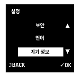
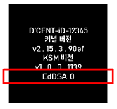
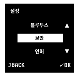
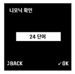
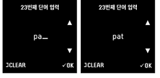
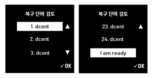
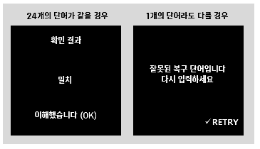

# 콜드월렛 복구 단어 확인하기

## 요구사항

### **펌웨어 버전 확인**

콜드월렛 펌웨어 버전 v2.15.3.90ef 부터 복구 단어 확인이 가능합니다. 펌웨어를 업데이트하는 방법은 아래 링크를 참고해주세요.



### EdDSA 마스터 키 활성화 상태 확인&#x20;

1.  콜드월렛의 설정 메뉴를 선택해주세요.

    .PNG>)

2.  콜드월렛의 기기 정보 메뉴를 선택해주세요.

    

3.  복구 단어 확인을 위해서는 맨 하단 EdDSA 마스터키 활성화 상태 표시가 '**0**'으로 되 있어야 합니다.

    

## 복구단어가 일치하지 확인하는 방법

### **적어놓은 복구 단어 입력**

1.  콜드월렛의 설정 메뉴를 선택해주세요.

    .PNG>)

2.  콜드월렛의 보안 메뉴를 선택해주세요.

    

3.  콜드월렛의 니모닉 확인 메뉴를 선택해주세요.

    .PNG>)

4.  24 단어 메뉴를 선택해주세요.

    

5.  적어놓은 복구 단어를 1번째 단어부터 24번째 단어까지 입력해주세요.&#x20;

    **3개 알파벳 찾기**

    &#x20;.PNG>)

    ※ 입력방법 : ∧(a에서 z로 이동) 또는 ∨(z에서 a로 이동) 버튼을 이용

    첫번 알파벳 이동 후 ‘OK’ 버튼 -> 두번째 알파벳 이동 후 ‘OK’ 버튼 -> 세번째 알파벳 이동 후 ‘OK’ 버튼

    첫번째 알파벳 입력화면에서 'BACK' 버튼을 누르면 메뉴 화면으로 돌아갑니다.

    두번째와 세번째 알파벳 입력화면에서 'CLEAR' 버튼을 누르면 이전에 입력한 알파벳을 수정할 수 있습니다.

    **단어 찾기**

    &#x20;.png>)

    3개 알파벳 기반 단어 리스트에서 ∧/∨ 버튼을 이용하여 맞는 단어를 찾은 후 ‘OK’버튼을 눌러주세요.

    ※ 알파벳을 잘못 입력하여 단어 리스트에서  원하는 단어를 찾을 수 없는 경우, 우선 24개의 단어를 모두 입력하면 나타나는 복구 단어 검토 화면에서 잘못 입력한 단어를 수정하세요.&#x20;

6.  입력하신 24개의 복구 단어를 검토 후 맨 아래 \[I am ready] 메뉴에서 ‘OK’ 버튼을 눌러주세요.&#x20;

    

    ※ 입력 단어를 수정하고 싶은 경우, 해당 단어에서 ‘OK’ 버튼을 누른 후 단어를 다시 입력합니다.

7.  입력한 단어가 콜드월렛에 현재 설정되어 있는 복구 단어와 일치하는지에 대한 확인 결과 화면을 보여줍니다.

    

    **확인 결과 24개의 단어가 같을 경우,** '일치' 문구 나타나며 'OK' 버튼을 누르면 메뉴 화면으로 돌아갑니다.

    **확인 결과 1개 단어라도 다를 경우,** '잘못된 복구 단어입니다 다시입력하세요' 문구가 나타나며 ‘OK’ 버튼을 누르면 복구 단어 검토 화면으로 돌아가 단어 수정 후 다시 시도 할 수 있습니다.

