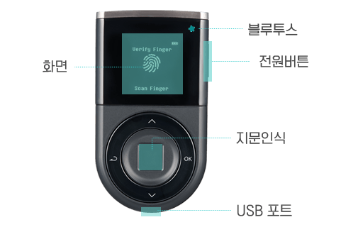

# 콜드월렛 초기 설정



## 시작하기 전에 

디센트 지문인증형 콜드월렛은 4개의 네비게이션 버튼으로 구성되어 있습니다.

* 위(∧)/아래(∨) 버튼 : 메뉴를 이동하거나 글자를 변경합니다.
* OK 버튼 : 메뉴를 선택합니다.
* Back 버튼 : 선택을 취소하거나 이전 화면으로 돌아갑니다.

## 1단계 : 언어 선택 및 지갑 생성 



### 전원 켜기 

기기 오른쪽 옆 전원 버튼을 3초 이상 눌러 전원을 켭니다.


전원이 켜지질 않는다면 가지고 있는 USB 충전 케이블을 통해 콜드월렛의 배터리를 충전한 후 전원을 켜주시기 바랍니다.


### 언어 선택 

∨ 버튼을 눌러 원하는 언어로 이동 후 OK 버튼을 누릅니다.

지원 언어 : 영어, 한국어, 중국어, 일본어, 스페인어


초기화가 끝난 후에도 콜드월렛의 [설정 메뉴](setting-menu/)를 통해 언어를 변경할 수 있습니다.


### "지갑 생성" 선택 

새로운 지갑을 생성하기 위하여 "지갑 생성" 메뉴를 선택합니다.


지갑 생성을 선택하면 새로운 키로 지갑이 생성됩니다. 예전에 생성했던 지갑을 복구하시려면 [여기](recovery/)를 참고하세요.


## 2단계 : PIN (4\~8자리) 및 지문 등록 

지갑 접근을 관리하기 위한 PIN과 지문을 등록합니다. \
&#xNAN;_&#xD38C;웨어 2.5.5 이하 버전에서는 4자리 PIN만 지원합니다._

### PIN 설정 (4\~8자리) 

∧(위, 숫자 증가) 또는 ∨(아래, 숫자 감소) 버튼을 이용하여 4\~8자리 PIN을 설정
합니다. 원하는 숫자값이 정해지면 OK버튼을 눌러 해당 숫자를 입력합니다.

.png>)

4자리를 입력하였다면 화면에 "OK" 텍스트가 표시됩니다. 4자리 PIN 등록을 원하는 경우 하드웨어 지갑의 OK버튼을 눌러줍니다.

만약 4자리 이상의 PIN으로 설정을 원한다면 위/아래 버튼을 눌러서 (OK 텍스트)값을 변경해주세요. **PIN은 4자리에서 최대 8자리까지 설정이 가능합니다.**

.png>)

PIN을 4자리로 등록한다면 "보안이 낮다는" 메세지가 표시됩니다. 이와 상관없이 입력한 PIN을 사용하길 희망하는 경우 하드웨어 지갑의 OK버튼을 눌러주세요.&#x20;

### 설정한 &#xD;PIN 확인 

위에서 설정한 값과 같은 PIN을 입력합니다.

.png>)

&#x20;
※ 입력한 두 개의 PIN이 다른 경우 PIN 설정을 다시 해야 됩니다.

PIN 값은 초기 설정 완료 후에 [설정 메뉴](setting-menu/)를 통해 변경할 수 있습니다.

### 지문 등록&#xD; 

1\) 지문 센서에 등록하실 손가락을 지문 센서 위에 터치
합니다.

지문 센서는 콜드월렛 하단의 버튼 가운데에 있습니다. [지문 센서의 위치](setting-up.md#before-start)를 확인해주세요.

2\) 같은 손가락을 100%가 될 때까지 위치를 조금씩 옮겨가며 터치합니다. (약 8회)

### 지문 등록 확인 

등록한 손가락을 지문 센서 위에 터치하여 지문 등록이 잘 되었는지 확인합니다.

※ 지문 등록이 실패한 경우에는 처음부터 지문 등록 프로세스를 시작
합니다.

※ 지문을 재등록 할 때는 다른 손가락을 사용하는 것이 좋습니다.

※ 지문 등록이 실패한 경우에는 지문 등록을 건너뛸 수 있는 옵션이 제공됩니다. 나중에 [설정 메뉴](setting-menu/)에서 등록할 수 있습니다.

※ 지문 등록 확인이 실패한 경우에 지문은 저장되지 않습니다.

## 3단계 : 지갑 복구 단어 저장 

### 시작하기 전에 - 복구 단어(니모닉 코드)란? 

복구 단어는 사용자의 지갑을 복구할 수 있는 코드입니다.&#x20;

디센트 콜드월렛을 손실, 분실한 경우 지갑을 기존 상태로 복구할 수 있는 유일한 방법입니다.

> **복구 카드(Recovery Card)에 꼭 해당 단어들을 적어 두신 후 안전하게 보관하시기 바랍니다.**
>


지갑 복구를 위한 복구 단어는 최초 생성 이후 절대 확인할 수 없습니다. 복구 카드 분실 시 본사에서 지원해 드릴 수 없으며, 분실 등에 따른 책임은 사용자에게 있습니다.


복구 카드 분실 시 지갑을 복구하지 못할 뿐 아니라 콜드월렛에 있는 자산이 위험할 수 있습니다.

### 지갑 복구 단어 리스트 작성 

1\) 위 내용이 설명된 안내문을 읽고 이해하셨다면 "OK" 버튼을 눌러주세요.

2\) 콜드월렛에 표시되는 단어를 복구카드에 기재한 후 "OK" 버튼(NEXT)을 눌러 다음 페이지로 이동합니다.

복구 단어는 한 페이지 당 4개 단어씩 총 6페이지에 24개 단어가 표시됩니다.


복구단어의 **스펠링을 정확하게 확인**하여 적으시기 바랍니다.



복구단어나 복구카드를 사진을 찍거나 이미지로 저장하지 마십시오. 사용자는 복구 단어를 안전하게 취급할 책임이 있습니다. 디센트는 복구카드 도난 또는 이미지 파일 저장과 같은 사용자의 부주의로 인한 암호 자산의 손상 또는 손실에 대해 배상 책임을 지지 않습니다.&#x20;

안전한 보관을 위해 (화재, 물, 햇빛 또는 반려동물로부터 멀리) 각별한 주의가 필요합니다.


3\) 복구 단어를 다 적으셨다면 안내 문구 확인 후 ‘OK’ 버튼을 눌러 다음 페이지로 이동
합니다.

### &#xD;적어놓은 단어 확인 

복구 단어를 다 적으셨다면, 복구 단어를 확인하는 절차를 거치게 됩니다. 복구 카드에 적어놓은 24개 단어를 모두 입력하여 복구 단어를 정확하게 적었는 지 확인합니다.

#### 알파벳 첫 3개 입력 

※ 입력방법 : **∧(a에서 z로 이동)** 또는 **∨(z에서 a로 이동)** 버튼을 이용

예시로 복구 단어가 "patch" 인 경우 첫 번째 알파벳 "p" 입력 후 "OK" 버튼 > 두 번째 알파벳 "a" 입력 후 "OK" 버튼 > 세 번째 알파벳 "t" 입력 후 "OK" 버튼

#### 단어 찾기 

3개 알파벳 기반 단어 리스트에서 ∧/∨ 버튼을 이용하여 맞는 단어(_patch_)를 찾은 후 "OK" 버튼을 누릅니다.

※ 복구 단어와 입력 단어가 틀린 경우, "OK" 버튼(RETRY)을 눌러 복구 단어를 다시 입력할
&#x20;수 있습니다.

해당 방법으로 24개 단어를 모두 입력하여 검토를 완료합니다.

## 4단계 : 지갑 생성 완료 

축하합니다. 지갑 생성이 완료되었습니다. 이제 콜드월렛에 코인 계정을 추가하여 자산을 관리할 수 있습니다. 모바일 앱을 이용해서 지갑을 사용해보세요.

* [안드로이드 폰과 연결해서 사용하기](android-connect/)
* [아이폰과 연결해서 사용하기](iphone-connect.md)


※ 디센트 지문인증형 콜드월렛에서 지원하는 전체 코인 리스트는 [https://www.dcentwallet.com/ko/supportedcoin](https://www.dcentwallet.com/ko/supportedcoin) 에서 확인할 수 있습니다.


### 펌웨어 확인 

디센트 콜드월렛 세팅이 끝난 후에는 홈페이지를 통해 하드웨어 업데이트를 꼭 확인해 보시기 바랍니다. 추가 코인, 콜드월렛 기능 추가 등 펌웨어가 업데이트 되었을 수 있습니다.

펌웨어 업데이트에 대한 자세한 내용은 [여기를 참조](firmware-update-from-computer/)하세요.
