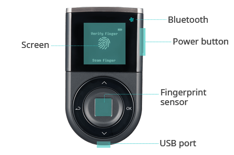

# Initial Setup

## Before you begin 



D'CENT Biometric Wallet is equipped with 4-buttons for navigation.

* **Up(∧)/Down(∨) buttons** : Move between selectable items  or change value of numbers or characters.
* **OK button** : Confirm selected item or input value.
* **Back button** : Move to previous menu or cancel the current input value.

## Step-1 : Select Language & Create Wallet



### Power on D'CENT Biometric Wallet

To power on the device, press and hold the **"Power"** button for 3 seconds, which is located on the right-side.


If the cold wallet does not power on, **please charge its battery using the USB cable** you have, and then turn it on.


### Select Language

Use **"Up(∧) or Down(∨)"** button to select your language and press **"OK"** button.

Language support : English, Korean, Chinese, Japanese, Spanish


After setting up your cold wallet, you can change the Language from the [**Setting**](setting-menu/) menu.


### Select "Create Wallet"

To create a new wallet, select **"Create Wallet"** from the menu.


Selecting "Create Wallet" will create a wallet from a new private key. \
If you wish to recover an existing wallet, please refer [**here**](recovery/).


## Step-2 : Register PIN & Fingerprint

To protect accessing your wallet, register a new PIN and your fingerprint. \
&#xNAN;_&#x46;irmware below v.2.5.5 only supports 4-digit PIN length._

### Register a new PIN (4 to 8 digits)

Use **"Up(∧, increase number value)"** or **"Down(∨, decrease number value)"** button to input your PIN. Pressing the **"OK"** button on the cold wallet will confirm the input.

.png>)

When you have entered 4 digits, you will see **"OK"** text on the screen. If you wish to set your PIN to 4-digits long, then press the **"OK"** button on the hardware wallet.&#x20;

If you wish to set the PIN to a longer digit, you can change the (**"OK"** text) value on the screen by pressing the **"Up(∧) or Down(∨)"** button. **Your PIN can be set to 4, 5, 6, 7, or 8 digits long**.   &#x20;

.png>)

If you register a 4-digit PIN, you will see a **"Security level is low"** warning on the screen. If you wish to use such a PIN, press the **"OK"** button on the cold wallet to continue.&#x20;

### Verify your &#xD;PIN

Re-enter the same PIN you have set in the previous step to verify for correctness.

.png>)

&#x20;
※ If the PIN numbers do not match, you will have to restart the PIN registration.


After setting up your cold wallet, you can change the PIN value from the Biometric Wallet [**Setting**](setting-menu/) menu.


### Register Fingerprint&#xD;

**1)** To register your fingerprint, touch your finger on the sensor to scan.

Fingerprint sensor is located in the middle of where the navigational buttons are located. \
Check the location of [**fingerprint sensor**](setting-up.md#before-start).

**2)** Slightly change the angular positioning of the same finger when scanning and repeat until 100% (8 correct scans) is reached.

### Verify Fingerprint

Scan your fingerprint one last time to verify registered fingerprint.&#x20;

※ If the fingerprint does not match, you will have to restart the Fingerprint registration.
.

※ If re-registering fingerprint, try using a different finger instead.

※ If unable to register your fingerprint for any reason, you will be given an option to skip the fingerprint registration. Fingerprint can be registered from the [**Setting**](setting-menu/#enroll-finger) menu at a later time.

※ If fingerprint verification fails, your fingerprint will not be saved.

## Step-3 : Write down the recovery seeds

### Before you begin - What are recovery seeds(Mnemonic code)?

Recovery seeds are the codes that you use to recover your wallet.

If your D'CENT Cold Wallet is ever lost, stolen, damage, or wiped and you no longer have any access to your wallet, **using recovery seeds is the only method of recovering your existing wallet**.

> **You MUST write down all the recovery seeds on the Recovery Card and keep it secured in a safe place.**
>

Recovery seeds required for recovering your existing wallet is shown only once during initial setup. If you lose your recovery card, there is nothing we can do to help you recover your funds. You are solely responsible to secure your recovery card in all events.


**If you lose your recovery card, there is no other way to recover your existing wallet and your funds will be lost.**


### Write down the recovery seeds from the lists

**1)** Press **"OK"** button only when you have fully understood the WARNING notice.

**2)** Write down all the recovery seeds (words) shown on the screen of your cold wallet. Press **"OK"** button to see the next list of words.&#x20;

There are 6 lists with total of 24 words and each list has 4 words shown. Make sure you write them down correctly and in the exact same order as shown.


When writing down the recovery words, **make sure to check that the spelling is correct**


**3)** When you have written down all 24 words, press **"OK"** button to continue.


**Do not take pictures or save images of your recovery words or recovery cards**. You are responsible for securely handling your recovery words. D'CENT is not liable for any damage or loss of crypto assets resulting from user negligence, such as the theft of recovery cards or the storage of image files.&#x20;

**Special care must be taken to ensure safe storage (away from fire, water, sunlight or pets).**


### Recovery Seeds Verification

Enter all 24 words written on the recovery card to proceed with verification.

#### Enter the first 3 characters

※ How to input : Use the **"Up(∧)/Down(∨)"** buttons - **∧(increase value from a to z)** or **∨(decrease value z to a)**&#x20;

For example, if the recovery word is **"patch"**, enter the first character **"p"** and press the **"OK"** button > enter the second character **"a"** and press the **"OK"** button > enter the third character **"t"** and press the **"OK"** button.

#### Finding suggestion from the list shown

From the list of words available, select the correct word(_patch_) using **"Up(∧)/Down(∨)"** buttons and press **"OK"** button to choose as the answer.

※ If you find yourself having written down the words incorrectly, you can press **"OK"** button(RETRY) to re-enter the recovery seeds from the lists for review.

Complete your review by entering all 24 words this way.

## Step-4 : Completing the Initial Setup

Congratulation, you have passed the quiz and your new wallet is created. From your cold wallet, you can check the lists of coin accounts available. You are now ready to use your new wallet together with the mobile application.

* [**How to connect with Android phone**](android-connect/)
* [**How to connect with iOS phone**](iphone-connect/)


You can find the complete list of cryptocurrency assets supported on D'CENT Biometric Wallet from [**https://www.dcentwallet.com/en/supportedcoin**](https://www.dcentwallet.com/en/supportedcoin)


### Check for the latest Firmware

Once you have completed the Initial Setup, make sure to visit D'CENT Wallet homepage and check for the latest firmware available. Newer version of firmware may include additional support for cryptocurrency assets and new wallet features.

More information on firmware update can be found from [**here**](firmware-update-from-computer/).
