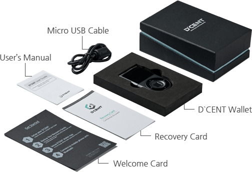

# Unboxing

## Check external package

### Make sure the package Seal\(Authenticity Sticker\) is intact on both sides

Before you use the wallet, you must check the product is authentic.

#### Normal package

#### Abnormal package


Double-check that the package is not damaged and make sure that the Seal is not torn or missing. 


## Inside the package

A package with D'CENT Wallet contains the following:

* D'CENT Biometric Wallet \(main device\)
* USB cable \(USB 5-pin\)
* Mnemonic code card for Recovery
* User Manual

