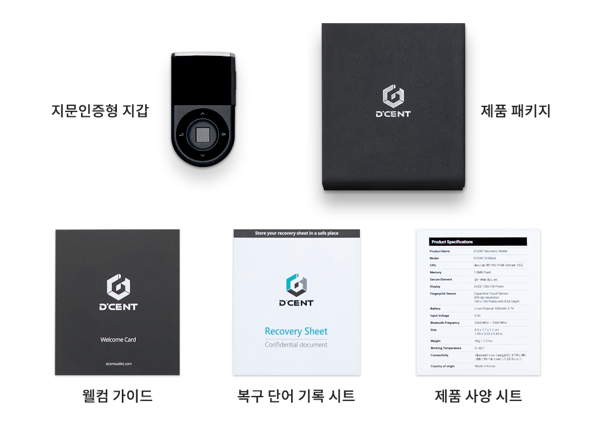

# 언박싱

## 제품 외부 확인

### 패키지 Seal(정품 스티커)가 정상적으로 붙어 있는지 확인&#xD;

지갑을 사용하시기 전에 정상 제품인지 먼저 확인하는 것이 필요합니다.

#### 정상&#xD; 패키지

#### 비정상 패키지


Seal이 뜯어져 있거나 없는 경우 제품에 훼손이 있을 수 있습니다. 패키지 상태를 꼭 확인하세요.


## 제품 구성

디센트 지문인증형 콜드월렛은 다음과 같이 구성되어 있습니다.

* 디센트 지문인증형 콜드월렛 장치 (본체)
* 복구 단어 기록 시트
* 웰컴 가이드
* 제품 사양 시트

<figure><figcaption></figcaption></figure>

## 배터리 충전 시 주의 사항

출력 전압 6V 이상인 충전기 및 5V를 초과하여 가변하는 일부 고속 충전기(PD Charger 포함)를 사용할 경우 제품 고장의 원인이 될 수 있습니다.
