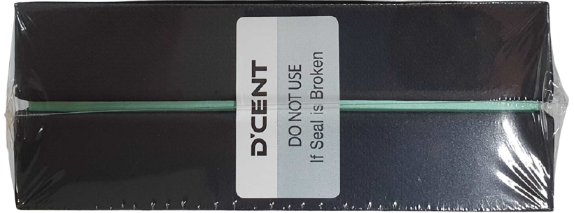
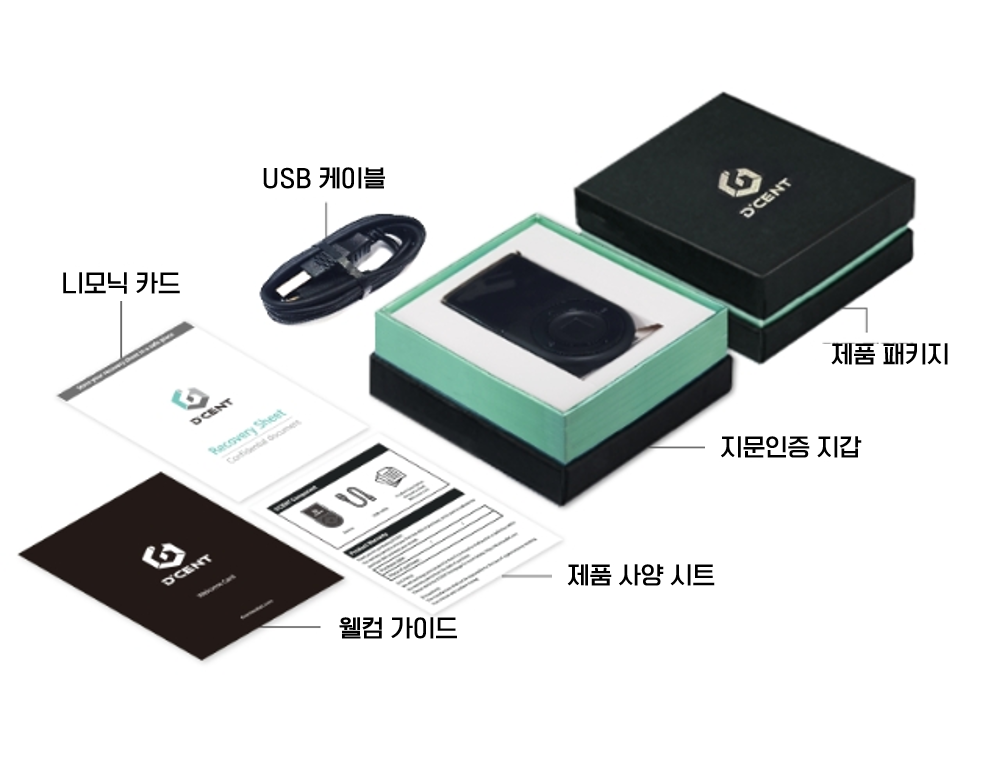

# 언박싱

## 제품 외부 확인

### 패키지 Seal\(정품 스티커\)가 정상적으로 붙어 있는지 확인

지갑을 사용하시기 전에 정상 제품인지 먼저 확인하는 것이 필요합니다.

#### 정상
 패키지

#### 비정상 패키지


Seal이 뜯어져 있거나 없는 경우 제품에 훼손이 있을 수 있습니다. 패키지 상태를 꼭 확인하세요.


## 제품 구성

디센트 지문인증형 콜드월렛은 다음과 같이 구성되어 있습니다.

* 디센트 지문인증형 콜드월렛 장치 \(본체\)
* USB 케이블 \(USB 마이크로 5핀\)
* 복구용 니모닉 코드 작성 카드
* 웰컴 가이드
* 제품 사양 시트

