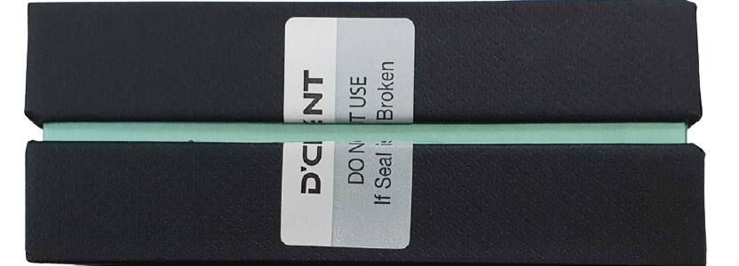

# Unboxing

## Check external package

### Make sure the package Seal(Authenticity Sticker) is intact on both sides

Before you use the wallet, you must check the product is authentic.

#### Normal package

#### Abnormal package


Double-check that the package is not damaged and make sure that the Seal is not torn or missing.&#x20;


## Inside the package

A package with D'CENT Wallet contains the following:

* D'CENT Biometric Wallet (main device)
* Recovery phrase record sheet
* Welcome Card
* Specification sheet

## Precautions when charging the battery&#x20;

Using chargers with an output voltage of 6V or higher and some high-speed chargers (including PD chargers) with a variable output voltage exceeding 5V may cause product failure.
