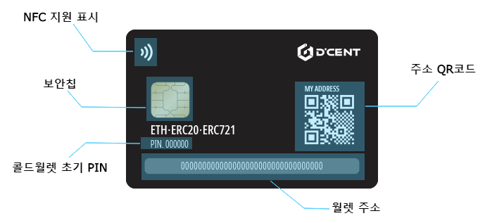

# 카드 타입 콜드월렛 구성

## 앞면

코인 가격이 오르길 바라는 디센트팀의 마음을 담아 만들었습니다.

더 다양한 에디션으로 찾아갑니다.

## 뒷면

카드타입 콜드월렛의 뒷면에는 다음과 같은 정보가 포함되어 있습니다.

### NFC 지원 표시

카드타입 콜드월렛은 무선 통신 방식인 NFC를 이용하여 모바일 폰과 통신합니다. 간편한 태깅 방식으로 콜드월렛을 사용할 수 있습니다.

### 보안칩

카드타입 콜드월렛은 신용카드에서 사용하는 보안칩을 사용하므로 안심하고 사용할 수 있습니다.

### 콜드월렛 초기 PIN

콜드월렛에 설정된 초기 PIN입니다. 스크래치 스티커로 보호되어 있으며 스크래치를 긁으면 나타납니다. 실제 콜드월렛을 사용하기 위해서는 초기 PIN을 업데이트해야 합니다.

### 월렛 주소

이더리움, ERC20 토큰, ERC721 \(NFT\) 토큰의 주소. 하나의 주소로 토큰과 이더리움을 관리합니다.

ERC20 토큰이 궁금하시다면? [ERC20 설명 바로가기](../cryptocurrency-basic/erc20.md)

ERC721 토큰이 궁금하시다면? [ERC721 설명 바로가기](../cryptocurrency-basic/erc721-nft.md)

### 주소 QR 코드

QR 스캐너를 통해 월렛 주소를 읽을 수 있습니다. 디센트 모바일 앱이 없는 경우에도 간편하게 코인을 받을 수 있습니다.

