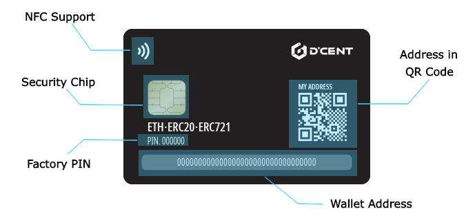

# Specifications

## Front

The design on the front reflects the hearts of the D'CENT team wishing for the cryptocurrency value to go "**To the Moon**".

More design editions are coming soon.

## Back

On the back of the Card type Wallet contains the following information.

### NFC Support

Card type wallet works in tandem to your mobile phone through NFC communication.  
The card type wallet offers the simplest way of using hardware wallet by Tagging.

### Security Chip

The card type wallet has a bank-grade certified security chip which offers highest security for protecting your private keys.

### Factory PIN

This is the factory\(default\) PIN for the hardware wallet. Factory PIN is concealed by ribbon masking for protection and scratch it off to reveal. To use the Card type Wallet, you must first update this factory PIN to your own password.

### Wallet Address

One address for your Ethereum, ERC20 Token, ERC721 \(NFT\) Token.

Curious about ERC20 Tokens? Read more from [ERC20 basics](https://app.gitbook.com/@dcentwallet/s/userguide/~/drafts/-M5WGuJ-_4SqNkNoTnIi/cryptocurrency-basic/erc20/@drafts).

Curious about ERC721 \(NFT\) Tokens? Read more from [ERC721 basics](https://app.gitbook.com/@dcentwallet/s/userguide/~/drafts/-M5WGuJ-_4SqNkNoTnIi/cryptocurrency-basic/erc721-nft/@drafts).

### Address in QR Code

Wallet address can be scanned using the QR scanner. You can present the code to your sender and receive your coin without the D'CENT mobile app.

