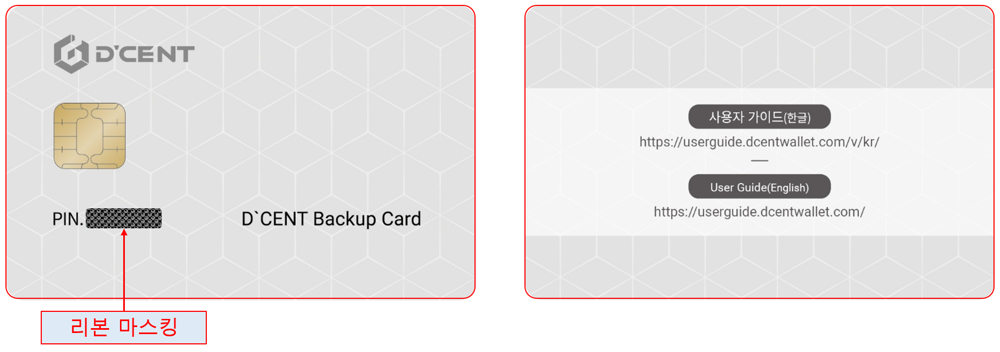

# 디센트 백업카드 사용법 \(신버전\)

현재 사용하시고 계신 카드 타입 콜드월렛의 백업카드를 만드는 방법입니다.

## 디센트 백업용 카드란?

디센트 백업용 카드는 처음 구매시 보안칩 내부에 지갑 정보가 존재하지 않는 하드웨어 지갑으로, 안전한 암호화 기술을 통해 원본 카드 지갑의 백업 사본을 만드는데 사용할 수 있습니다. 이는 원본 카드 지갑의 정보를 사용자의 비밀번호로 암호화하고 백업용 카드로 전송하여 기존의 원본 카드 지갑과 동일한 백업카드를 생성 할 수 있습니다.

백업 이미지를 생성하는 방법과 백업된 이미지를 백업카드에 복구하는 방법은 다음 섹션에서 확인이 가능합니다.

