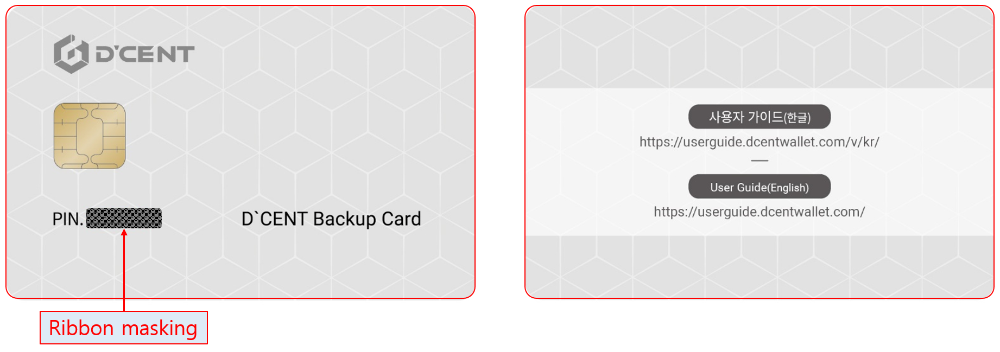

# D'CENT Backup Card Guide \(New version\)

This is a guide to creating a copy of your original card wallet to a **D'CENT Backup card**.

## What is a D'CENT Backup card?

D'CENT Backup Card is a hardware wallet with **no data** inside the security chip, which can be used to make a backup copy of your original card type wallet through secure encryption technology. This means that the data from your original card wallet is encrypted with the user's password and can be transferred to the Backup Card to create an exact same copy of your existing wallet.

Continue to the next sections to find out how you can create a backup image and how it can be recovered on a Backup Card.

## How to create & recover backup image





