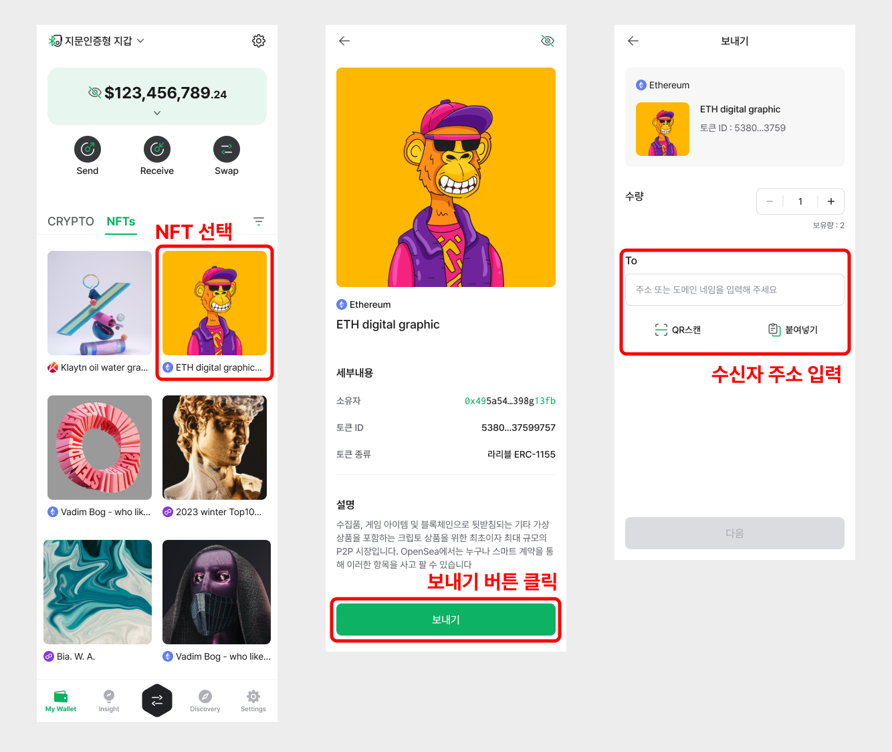
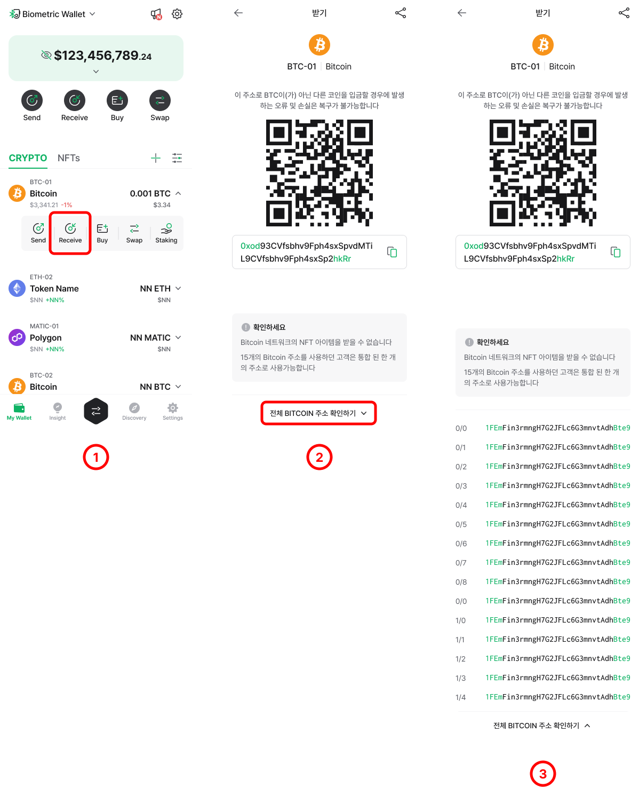

# 백업 이미지 복구

## 백업 이미지를 백업카드에 복구하는 방법


시작하기 전에 백업 카드의 초기 PIN을 변경했는지 확인하세요. 백업 카드 표면의 마스킹을 긁어 내면 초기 PIN을 찾을 수 있습니다. 

Manager 탭에서 '**카드 PIN 변경**'을 선택하여 초기 PIN을 변경할 수 있습니다.


백업 이미지를 복구하려면 백업 카드를 준비해주세요.  
여러 단계로 설명된 가이드를 반드시 따라하세요.

**Step 1\) Manager** 탭에서 '**카드 백업 및 복구**'를 선택합니다.

**Step 2\)** '**카드 복하기**'를 선택하고 '**시작하기**'를 눌러줍니다.

**Step 3\)** **백업카드**를 태깅하고 '**다음**' 버튼을 누릅니다. 

**Step 4\)** 미리 생성한 백업 이미지를 '**붙여넣기**'를 눌러서 입력합니다. 

**Step 5\)** '**다음**' 버튼을 눌러주세요.

**Step 6\)** 백업 이미지의 암호화를 위해 설정한 패스워드를 입력합니다. 오른쪽에 표시된 눈 모양의 아이콘을 눌러서 패스워드가 올바르게 입력되었는지 다시 확인하시기 바랍니다.

**Step 7\)** '**다음**' 버튼을 눌러주세요.

**Step 8\)** 백업 카드의 PIN을 입력하고 **백업 카드**를 태깅합니다.

**Step 9\)** '**완료**'를 누르면 복구 과정이 마무리됩니다.


백업 카드가 정상적으로 복구되었는지 다시 한 번 확인하십시오. 

**Manager** 탭의 '**새 카드 스캔**' 기능을 사용하여 백업 카드가 제대로 작동하는지 확인하세요. 


