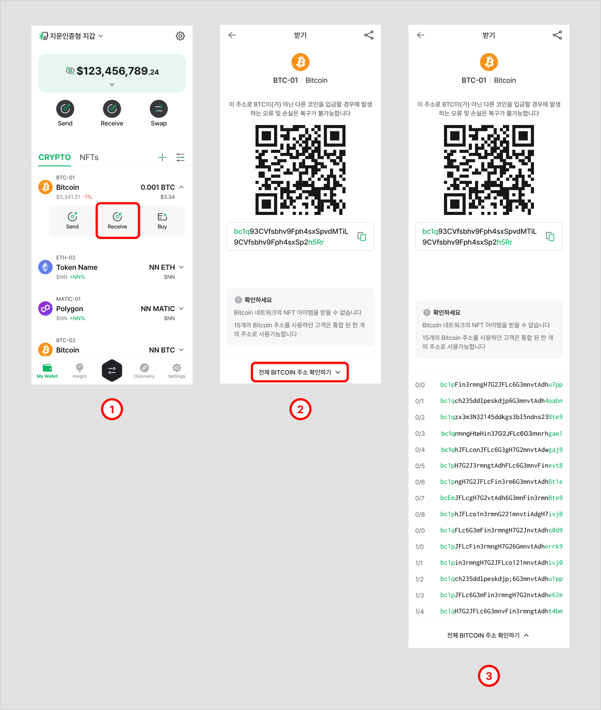
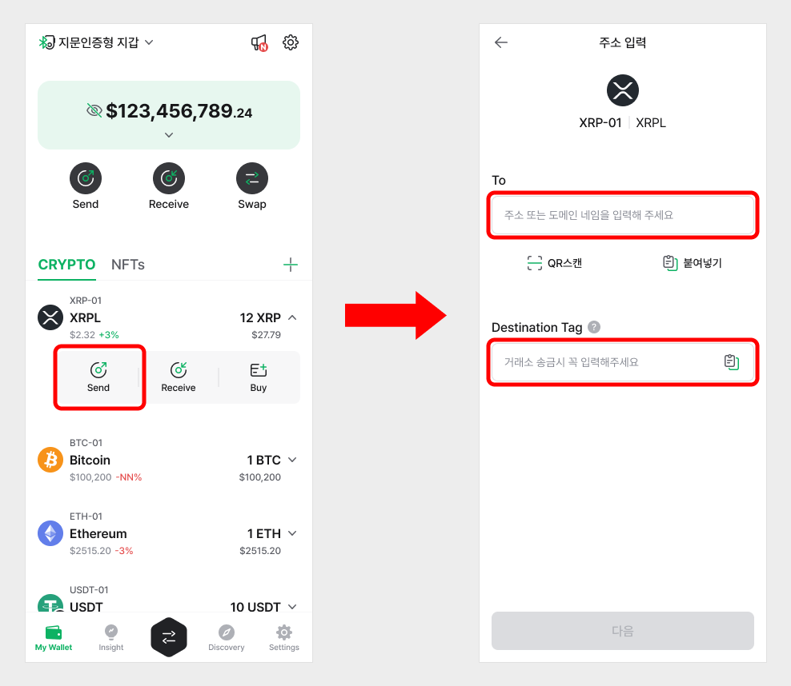

# Recover backup image

## How to recover a backup image to a Backup Card


Before you begin, make sure you have changed the initial PIN on your Backup Card. Your initial PIN is found by scratching off the masking on the card surface.

You can change the initial PIN by selecting '**Change card PIN**' from the Manager tab.


### Changing Backup Card initial PIN

In order to use the Backup Card, the initial PIN must be changed first. If you have not done so already, please follow the guideline below to change the initial PIN.

.png>)

**Step 1)** Go to the **Manager** tab and select '**Change card PIN**'.&#x20;

**Step 2)** Press '**Start**' to begin.

**Step 3)** Find the initial PIN by removing masking on the surface of the card. Enter the 6-digit initial PIN.

**Step 4)** Tag your **Backup Card** wallet.&#x20;

**Step 5)** Enter a new PIN to set to your Backup Card wallet.

**Step 6)** Re-enter the same PIN from **Step 5** above.

**Step 7)** Tag your **Backup Card** wallet.&#x20;

**Step 8)** Press '**OK**' to finish the PIN setup.

### How to recover your backup image on a Backup Card

To recover a backup image,  please have your Backup Card ready.\
Follow the steps carefully as described in the instructions.

**Step 1)** Go to the **Manager** tab and select '**Backup and Recover Card**'.&#x20;

**Step 2)** Select '**Recover backup image**'.

**Step 3) **Press '**Start**' to begin.

**Step 4)** Tag your **Backup Card**.&#x20;

**Step 5)** If the Backup Card is usable for recovery, you will see this screen. Press '**Next**' and continue the setup from **Step 7**. &#x20;

**Step 6)** If the Backup Card is detected as '**Unrecoverable card**' after tagging from **Step 4**, you will need to change the initial PIN on the Backup Card first.

**Step 7)** Paste the encrypted backup image data that you have created. Press '**Next**' to continue.

**Step 8)** Enter the password you have set to the backup image. Press '**Next**' to continue.

**Step 9) **Enter the PIN of your Backup Card wallet.

**Step 10) **Tag your **Backup Card**.

**Step 11)** Press '**Finish**' to complete the process.


Make sure to double-check that the Backup Card has been recovered normally.&#x20;

You can check if the Backup Card is working properly by using '**Scan new card**' function from the **Manager** tab.&#x20;


