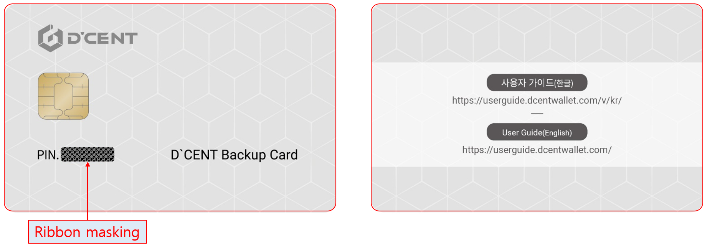
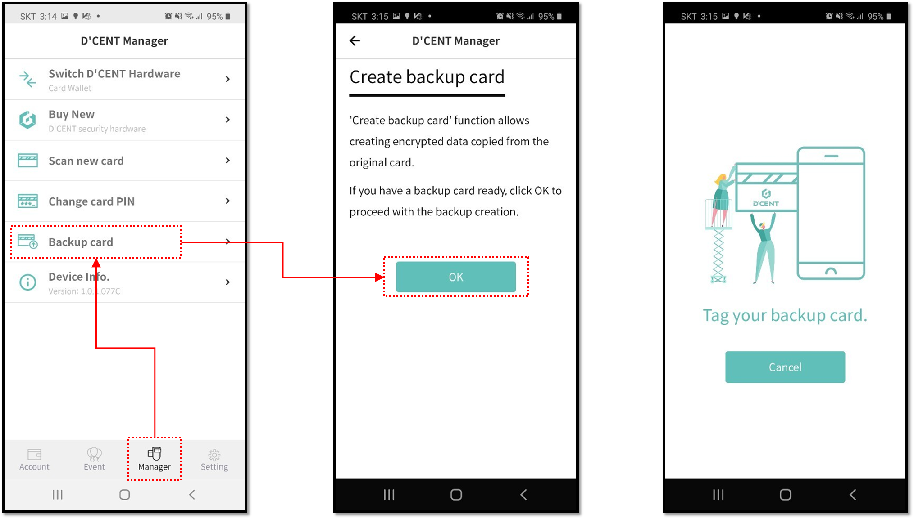
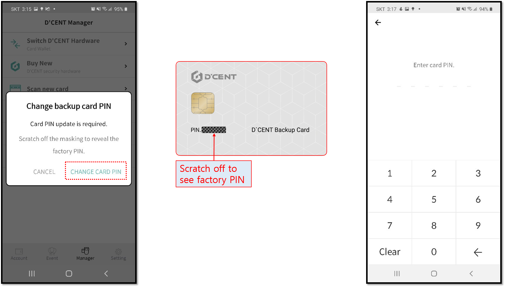
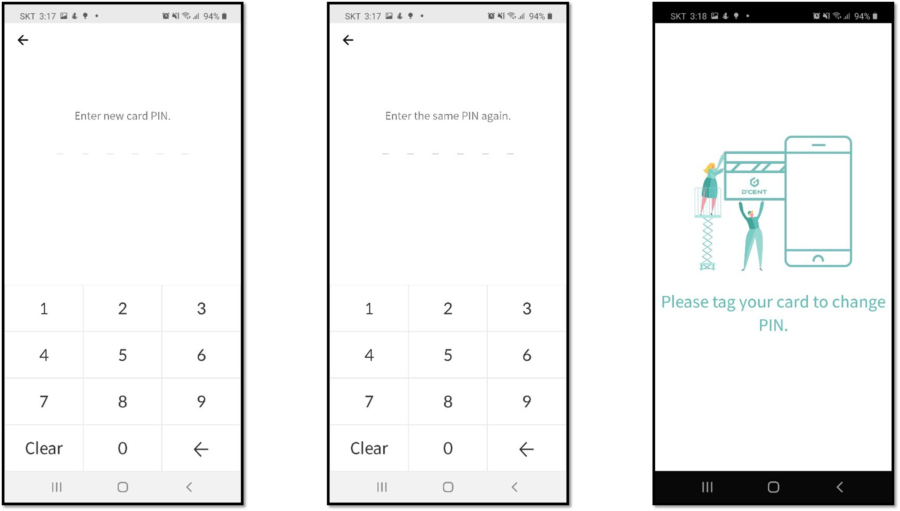
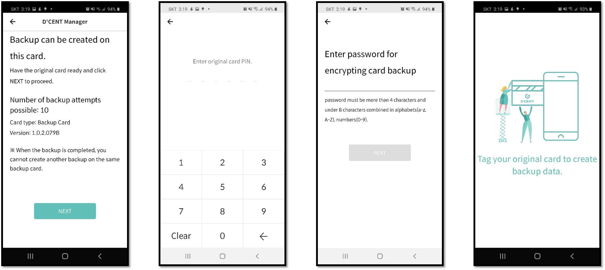
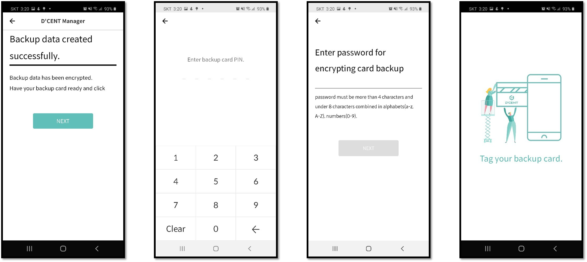
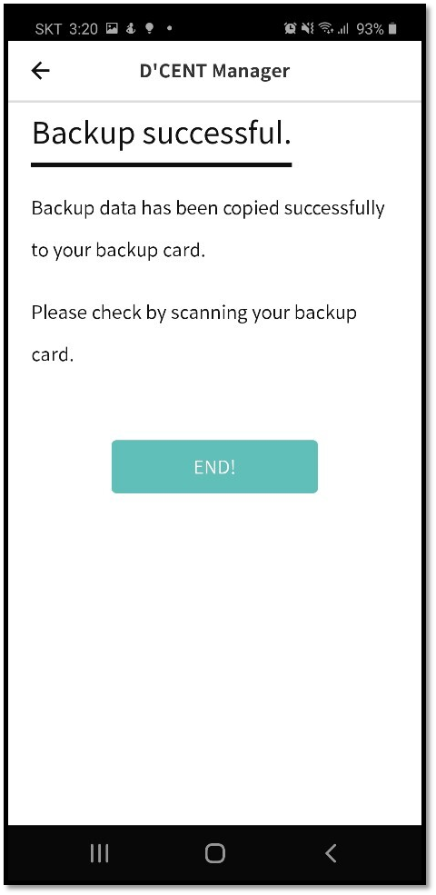

# D'CENT Backup Card Guide \(Old version\)

This is a guide to creating a copy of your original card wallet to a **D'CENT Backup card**.

This guidance is only for old version of Mobile App. If you use the latest version of mobile app, please read the new version of guidance.



## What is a D'CENT Backup card?

D'CENT Backup Card is a hardware wallet with **no data** inside the security chip, which can be used to make a backup copy of your original card type wallet through secure encryption technology. This means that the data from your original card wallet is encrypted with the user's password and can be transferred to the Backup Card to create an exact same copy of your existing wallet.

## How to create a backup copy to a Backup Card

Before you begin the setup, please have your original card wallet and the Backup Card in hand.  
Please follow the steps carefully as described in the instructions.

### Phase 1\) Set up a NEW PIN on your Backup card

Please have your **Backup Card** ready for Phase 1.


If you have already set up a NEW PIN to your Backup Card, you can skip to Phase 2.


Step 1\) From the D'CENT mobile app, go to the **Manager** tab and click on **'Backup Card'**.

Step 2\) Press the **OK** button.

Step 3\) **Tag your Backup Card** against the back of your mobile phone.

Step 4\) Choose **CHANGE CARD PIN**.

Step 5\) On your Backup Card, **scratch off the ribbon masking** to reveal the factory PIN. 

Step 6\) Enter the **6 digit factory PIN** on your mobile app.  

Step 7\) Enter your own **NEW PIN** number. \*\* **NEW PIN number must be treated "PRIVATELY"**.

Step 8\) Re-enter **NEW PIN** number to verify for a match.

Step 9\) **Tag your Backup Card** against the back of your mobile phone to set the NEW PIN to this card.

### Phase 2\) Create an encrypted backup copy of your original card wallet.

In Phase 2, you will need your **original card wallet**.

Step 10\)  Click **NEXT** button.

Step 11\) Enter the **PIN number of your original card wallet**.

Step 12\) Enter a **password** for **encrypting the data** in your original card wallet.

Step 13\) **Tag your original card wallet** against the back of your mobile phone.

### Phase 3\) Finalizing back up process to your Backup Card

For Phase 3, please have your **Backup Card** ready.

Step 14\) Press **NEXT** button.

Step 15\) Enter the **6 digit PIN** number of your **Backup Card**.

Step 16\) Enter the same **password** that was entered to encrypt the card data from **Step 12**.

Step 17\) **Tag your Backup Card** against the back of your mobile phone.

Step 18\) Press **END** button to complete the backup process. Congratulations, you have successfully backed up your original wallet to a D'CENT Backup Card.


Remember to keep your D'CENT Backup Card stored in a safe place.


