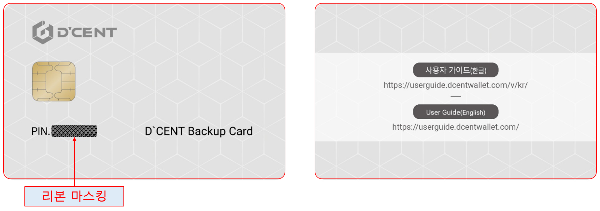
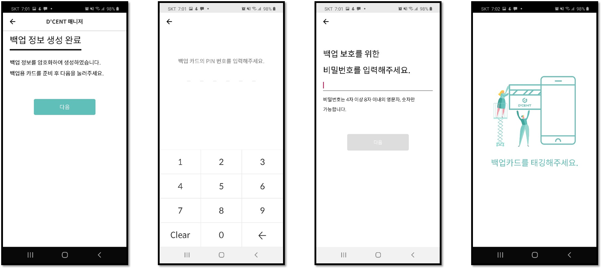

# 디센트 백업카드 사용법 \(구버전\)

현재 사용하시고 계신 카드 타입 콜드월렛의 백업카드를 만드는 방법입니다.

## 디센트 백업용 카드란?

디센트 백업용 카드는 처음 구매시 보안칩 내부에 지갑 정보가 존재하지 않는 하드웨어 지갑으로, 안전한 암호화 기술을 통해 원본 카드 지갑의 백업 사본을 만드는데 사용할 수 있습니다. 이는 원본 카드 지갑의 정보를 사용자의 비밀번호로 암호화하고 백업용 카드로 전송하여 기존의 원본 카드 지갑과 동일한 백업카드를 생성 할 수 있습니다.

## 백업용 카드에 백업 사본을 생성하는 방법

백업카드를 만드시기 전에 사용하고 계신 원본 카드 지갑과 백업용 카드를 준비하십시오. 과정이 조금은 복잡하니 아래 방법을 숙지하시고 한 단계씩 진행을 하시기를 권장합니다.

### Phase 1\)  백업용 카드의 새로운 PIN 설정

Phase 1에서는 **백업용 카드**를 준비해주세요.


백업용 카드에 새로운 PIN이 이미 설정되어 있다면 **Phase 2**에서 시작하시기 바랍니.


1단계\) 디센트 모바일앱 화면 하단에 위치한 **Manager** 를 선택하시고  **카드백업** 메뉴를 선택하세요.

2단계\) 다음 **확인** 버튼을 눌러주세요.

3단계\) 백업용 카드를 스마트폰 뒷면에 **태깅**해 주세요.

4단계\) 백업용 카드의 PIN 번호를 변경하는 과정입니다. **카드 PIN 변경**을 선택하세요.

5단계\) 백업용 카드의 **마스킹된 영역을 긁어 내어** 초기 PIN을 확인합니다.

6단계\) **6자리 PIN 번호**를 모바일앱에 입력해 주세요.

7단계\) 고객님의 새로운 **PIN 번호**를 입력해 주세요. **\*\* 입력하시는 새로운 PIN 번호는 반드시 기억하셔야 되는 PIN 번호이기에 각별한 주의를 부탁드립니다**.

8단계\) 방금 입력한 새로운 PIN 번호를 **다시 한번 입력**해 주세요.

9단계\) 백업용 카드를 사용하시는 모바일폰 뒷면 **태깅**해 주세요.

### Phase 2\) 원본 카드의 암호화된 백업용 사본 생성하기

Phase 2에서는 **원본 카드 지갑**을 준비해주세요.

10단계\) **다음** 버튼을 눌러주세요.

11단계\) 보유하시고 계신 **원본 카드 지갑**의 **PIN 번호**를 입력해 주세요. 

12단계\) 백업되는 정보를 암호화하기 위한 **비밀번호**를 입력해 주세요.

13단계\) 백업을 하기 위해 사용하고 계시는 **원본** **카드 지갑**을 모바일 폰에 **태깅**해 주세요.

### Phase 3\) 백업용 카드에 백업하는 과정을 마무리하기

Phase 3에서는 다시 **백업용 카드**를 준비해주세요.

14단계\) **다음** 버튼을 눌러주세요.

15단계\) 백업용 카드의 **6자리 PIN**을 입력해 주세요.

16단계\) **12단계**에서 정보의 암호화를 위해 입력하신 **동일한 비밀번호**를 입력해 주세요.

17단계\) 백업용 카드를 사용하시는 모바일 폰에 **태깅**해 주세요.

18단계\) **끝** 버튼은 누르시면 백업이 완료가 되었습니다.   
축하드립니다. 원본 카드 지갑과 동일한 백업카드가 생성 되었습니다. 


백업카드는 반드시 안전한 장소에 보관하시기 바랍니다.


