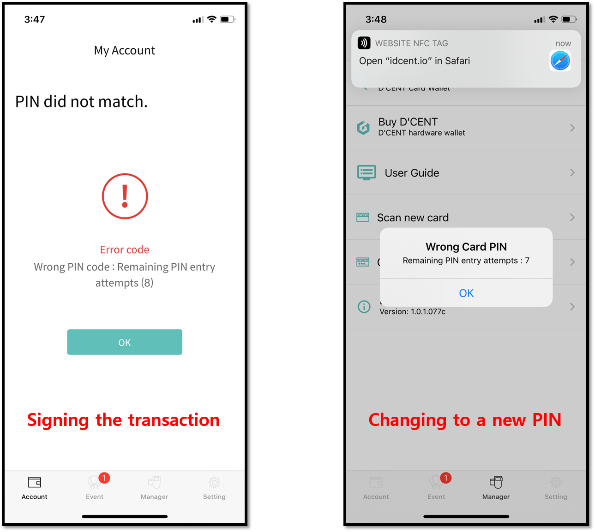

# Caution on using the Card type Wallet

## Permanent blocking of the Card type Wallet

While using the Card type Wallet, you will be asked to provide the authentication PIN to unlock access to the security chip which stores the private keys in encrypted secure storage.

Occasions are the followings:

1\) To sign the transaction as final confirmation when performing the Send transfer.

2\) When changing the current PIN to a new PIN, either during the initial setup or after the setup.


As a security measure, total of 10 attempts are available to enter the correct PIN. 

The security chip on the Card type Wallet keeps track of how many attempts have failed.  
If you fail to enter the correct PIN within the 10 attempts given, the security chip on the Card type Wallet will be blocked permanently, which renders the Card type Wallet no longer usable.   
**This also means that any assets stored on the Card type Wallet is no longer accessible and lost forever.**

Note that if PIN is entered correctly before the Card type Wallet gets blocked, the total attempts possible will be reset to 10 attempts available.  


