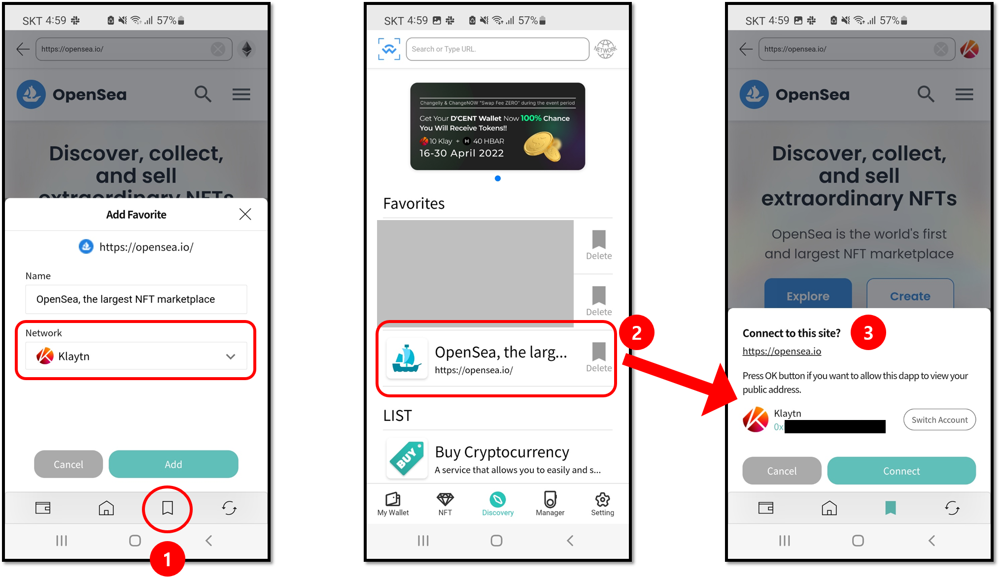

# Step 1: Set up your Backup Card

## Change the factory PIN of the Backup Card

Before the Backup Card can be used, the factory PIN must be changed to your own PIN.


If you want, you can set the new PIN of the Backup Card to the same as the All-in-One Wallet's PIN.&#x20;


<figure><figcaption></figcaption></figure>

**1.** Go to the 'Manager' tab and click on '**Change card PIN**'.&#x20;

**2.** Click on '**Start**' to begin.

<figure><figcaption></figcaption></figure>

**3.** From your Backup Card, find the factory PIN by removing the ribbon masking.

**4.** Enter this **6-digit factory PIN**. (ie: 130478)

**5.** On the back of your phone, **tap the Backup Card** to scan.

<figure><figcaption></figcaption></figure>

**6.** Enter a **new PIN** for your Backup Card. (ie: 123456)

**7.** Enter the **same new PIN**. (ie: 123456)

**8.** On the back of your phone, **tap the Backup Card** to scan.

<figure><figcaption></figcaption></figure>

**9.** Click on '**OK**' to complete.

