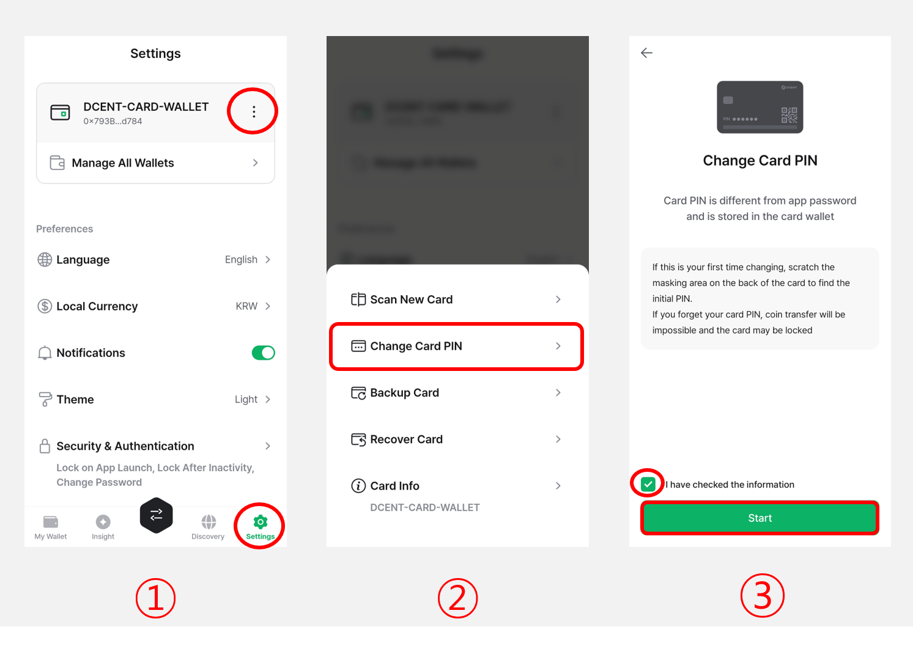
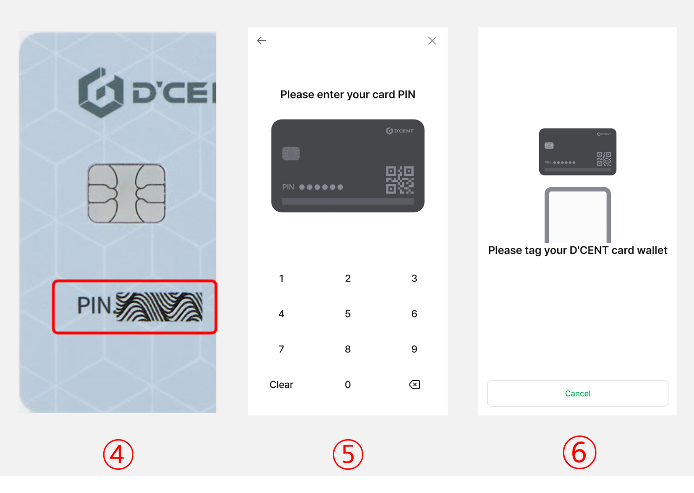

# Step 1: Set up your Backup Card

## Change the factory PIN of the Backup Card

Before the Backup Card can be used, the factory PIN must be changed to your own PIN.


If you want, you can set the new PIN of the Backup Card to the same as the All-in-One Wallet's PIN.&#x20;


<figure><figcaption></figcaption></figure>

**1)** Click the **More (⋮) button** in the **"Settings"** tab.

**2)** Select the **"Change Card PIN"** menu.

**3)** Check **"I have checked the information"**, then click the **"Start"** button.

<figure><figcaption></figcaption></figure>

**4)** From your Backup Card, find the factory PIN by removing the ribbon masking.


**When removing the ribbon masking, please be careful not to use sharp tools as this may damage the card wallet.**


**5)** Enter this **6-digit factory PIN**. (ie: 130478)

**6)** On the back of your phone, **tag the Backup Card** to scan.

<figure><figcaption></figcaption></figure>

**7)** Enter a **new PIN** for your Backup Card. (ie: 123456)

**8)** Enter the **same new PIN**. (ie: 123456)

**9)** On the back of your phone, **tag the Backup Card** to scan.

**10)** Click the **“Confirm”** button to complete the PIN change process.


**The PIN of the Backup Card is different from the 6-digit password used in the D'CENT mobile app.** \
**If confused, it may result in restricted wallet access, so please make sure to remember the PIN you set for your Backup Card.**

