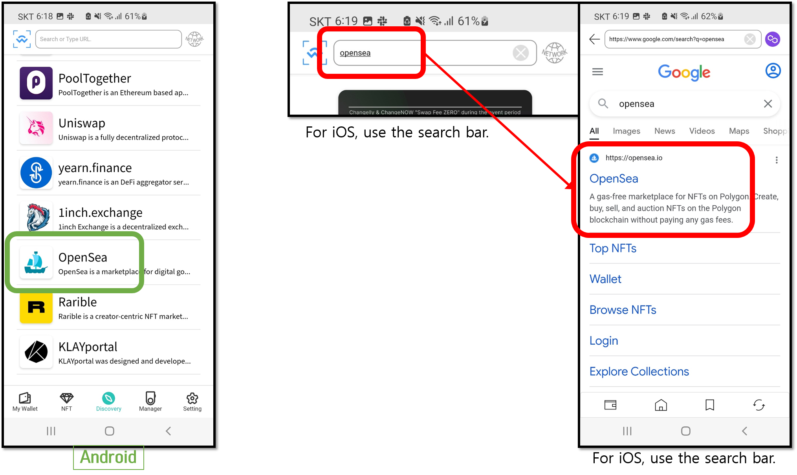

# Step 2: Create backup image

## How to create the backup image of the All-in-One Wallet

To create a backup image,  please have your <mark style="background-color:green;">**All-in-One Wallet**</mark> ready.

<figure><figcaption></figcaption></figure>

**1.** Go to the 'Manager' tab and click on '**Backup and Recover Card**'.&#x20;

**2.** Click on '**Create backup image**'.

**3.** Click on '**Start Backup**'.

<figure><figcaption></figcaption></figure>

**4.** On the back of your phone, **tap the All-in-One Wallet**.&#x20;

**5.** Click on '**Next**' to continue.

**6.** Enter an **encryption password** which will be used to encrypt the backup image data. Re-enter the same encryption password and then click on '**Next**' to continue.


The encryption password is constructed of alphabet and number characters. Make sure to perfectly remember this password. Without it, you will not be able to recover your wallet.


<figure><figcaption></figcaption></figure>

**7.** Enter the **PIN of the All-in-One Wallet**.

**8.** On the back of your phone, **tap the All-in-One Wallet** to scan.

**9.** Click on '**Share backup image**'.&#x20;

<figure><figcaption></figcaption></figure>

**10.** Click on '**Continue**'.

**11.** Click on the '**Copy**' button to copy the encrypted backup image data. Send this data to yourself in a message or by email.


<mark style="color:red;">If you don't have a Backup Card, you</mark> <mark style="color:red;"></mark><mark style="color:red;">**MUST**</mark> <mark style="color:red;"></mark><mark style="color:red;">save this encrypted backup image data in a safe place or send it to yourself in a message or email. You can recover this backup image onto a Backup Card at a later time.</mark> <mark style="color:red;"></mark><mark style="color:red;">**Make sure to perfectly remember the encryption password**</mark> <mark style="color:red;"></mark><mark style="color:red;">which was used to encrypt the backup image. If you forget this encryption password, you will not be able to recover your wallet.</mark>


<mark style="background-color:green;">**Buy a D'CENT Backup Card  👇👇👇**</mark>



