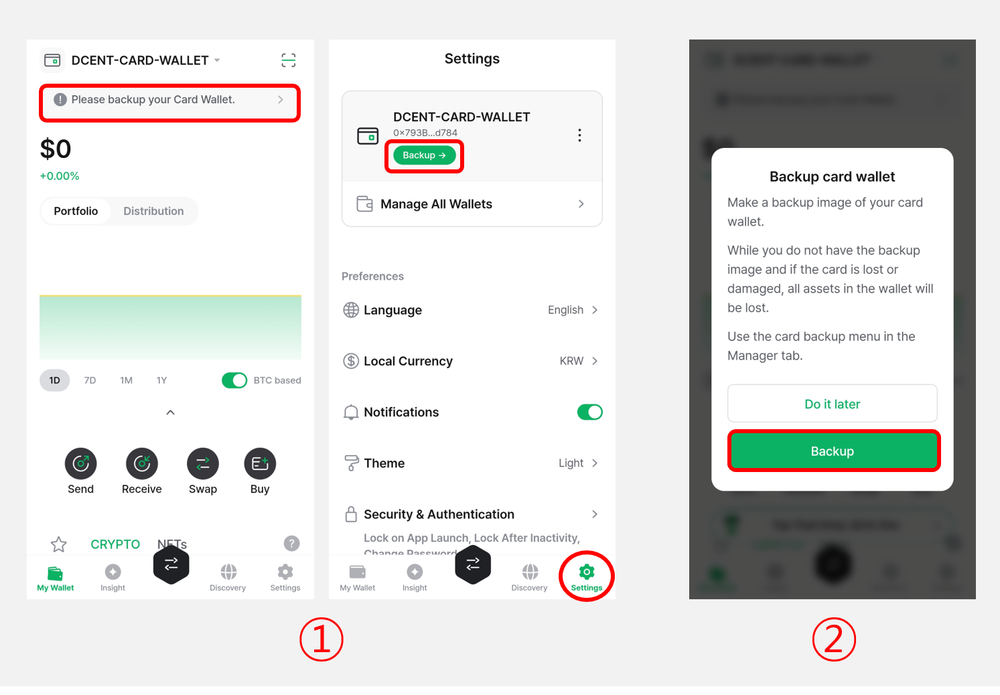
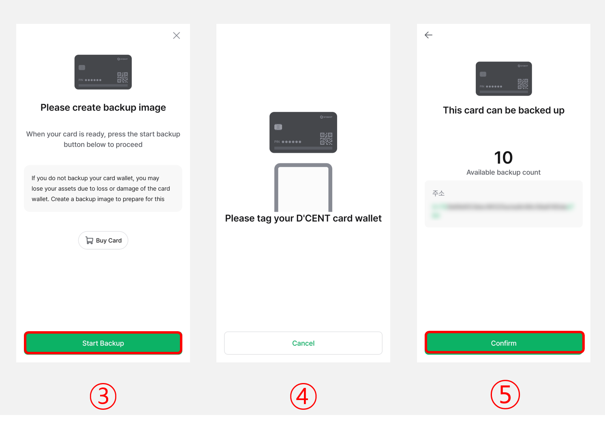

# Step 2: Create backup image


**You&#x20;**<mark style="color:red;">**MUST**</mark>**&#x20;create a backup copy of the All-in-One Wallet before an unfortunate situation happens such as the All-in-One Wallet being stolen, lost, damaged, or card getting blocked.**


## How to create the backup image of the All-in-One Wallet

To create a backup image,  please have your <mark style="background-color:green;">**All-in-One Wallet**</mark> ready.

<figure><figcaption></figcaption></figure>

**1)** Tap the banner at the top of the **"My Wallet"** tab or go to the **"Settings"** tab and select **"Backup"**.

**2)** Tap **"Backup"** to proceed.

<figure><figcaption></figcaption></figure>

**3)** Select **"Start Backup"**.

**4)** Tag the **All-in-One Wallet** to proceed.


Please make sure to <mark style="background-color:red;">**tag the "All-in-One Wallet"**</mark> and not the Backup Card.


**5)** A message **"This card can be backed up"** will appear, along with the number of available backups for your All-in-One Wallet will be displayed.


The **available backup count** indicates how many times you can create a backup image for a single All-in-One Wallet. Each wallet card supports up to **10 backup images**.


<figure><figcaption></figcaption></figure>

**6)** Enter an encryption password to secure the backup image data. Re-enter the same password, then tap **"Next"**.


The encryption password must be **4 to 8 characters long and consist of letters (a–z, A–Z)** and numbers (0–9). Please make sure to **remember it perfectly**, as you **will not be able to recover your wallet without it.**


**7)** Enter the **PIN for the All-in-One Wallet**.&#x20;

**8)** Tag the All-in-One Wallet on the back of your phone to scan. **Make sure to use the All-in-One Wallet, not a backup card.**&#x20;


Pease make sure to <mark style="background-color:red;">**tag the "All-in-One Wallet"**</mark> and not the Backup Card.


<figure><figcaption></figcaption></figure>

**9)** Once the backup image is created, tap the **“Share backup image”** button.

**10)** Tap the **copy** icon or choose an app/channel (such as messaging or email) where the backup image can be safely stored.

**11)** Paste the copied backup image into the selected app or channel and store it securely.


<mark style="color:red;">If you don't have a Backup Card, you</mark> <mark style="color:red;"></mark><mark style="color:red;">**MUST**</mark> <mark style="color:red;"></mark><mark style="color:red;">save this encrypted backup image data in a safe place or send it to yourself in a message or email. You can recover this backup image onto a Backup Card at a later time.</mark> <mark style="color:red;"></mark><mark style="color:red;">**Make sure to perfectly remember the encryption password**</mark> <mark style="color:red;"></mark><mark style="color:red;">which was used to encrypt the backup image. If you forget this encryption password, you will not be able to recover your wallet.</mark>


<mark style="background-color:green;">**Buy a D'CENT Backup Card  👇👇👇**</mark>



